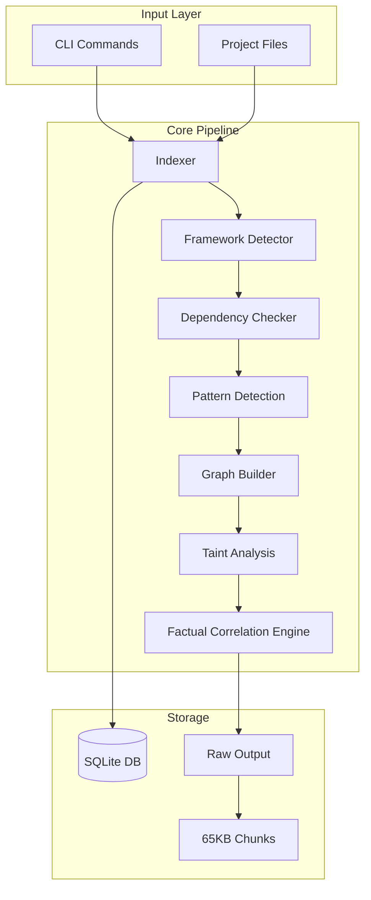
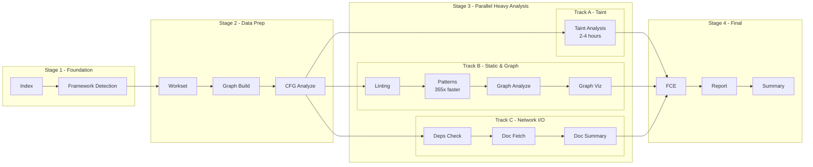
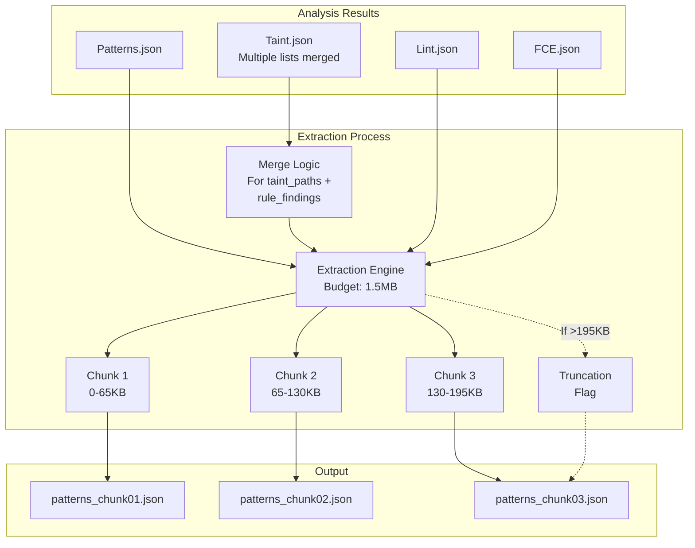
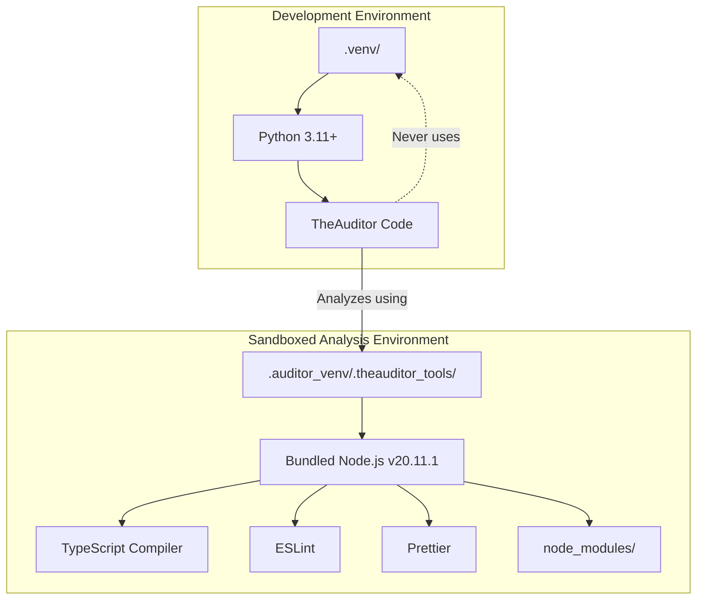
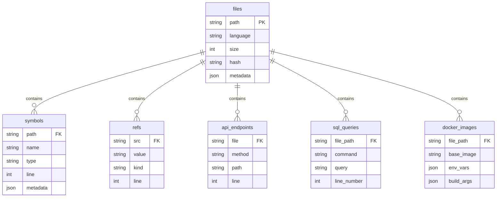
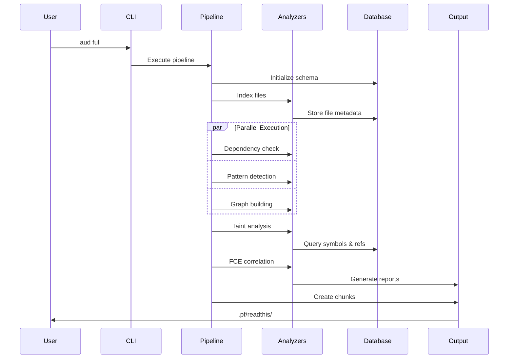

# TheAuditor Architecture

This document provides a comprehensive technical overview of TheAuditor's architecture, design patterns, and implementation details.

## System Overview

TheAuditor is an offline-first, AI-centric SAST (Static Application Security Testing) and code intelligence platform. It orchestrates industry-standard tools to provide ground truth about code quality and security, producing AI-consumable reports optimized for LLM context windows.

### Core Design Principles

1. **Offline-First Operation** - All analysis runs without network access, ensuring data privacy and reproducible results
2. **Dual-Mode Architecture** - Courier Mode preserves raw external tool outputs; Expert Mode applies security expertise objectively
3. **AI-Centric Workflow** - Produces chunks optimized for LLM context windows (65KB by default)
4. **Sandboxed Execution** - Isolated analysis environment prevents cross-contamination
5. **No Fix Generation** - Reports findings without prescribing solutions

## Truth Courier vs Insights: Separation of Concerns

TheAuditor maintains a strict architectural separation between **factual observation** and **optional interpretation**:

### Truth Courier Modules (Core)
These modules are the foundation - they gather and report verifiable facts without judgment:

- **Indexer**: Reports "Function X exists at line Y with Z parameters"
- **Taint Analyzer**: Reports "Data flows from pattern A to pattern B through path C"
- **Impact Analyzer**: Reports "Changing function X affects Y files through Z call chains"
- **Graph Analyzer**: Reports "Module A imports B, B imports C, C imports A (cycle detected)"
- **Pattern Detector**: Reports "Line X matches pattern Y from rule Z"
- **Linters**: Reports "Tool ESLint flagged line X with rule Y"

These modules form the immutable ground truth. They report **what exists**, not what it means.

### Insights Modules (Optional Interpretation Layer)
These are **optional packages** that consume Truth Courier data to add scoring and classification. All insights modules have been consolidated into a single package for better organization:

```
theauditor/insights/
├── __init__.py      # Package exports
├── ml.py           # Machine learning predictions (requires pip install -e ".[ml]")
├── graph.py        # Graph health scoring and recommendations
└── taint.py        # Vulnerability severity classification
```

- **insights/taint.py**: Adds "This flow is XSS with HIGH severity"
- **insights/graph.py**: Adds "Health score: 70/100, Grade: B"
- **insights/ml.py** (requires `pip install -e ".[ml]"`): Adds "80% probability of bugs based on historical patterns"

**Important**: Insights modules are:
- Not installed by default (ML requires explicit opt-in)
- Completely decoupled from core analysis
- Still based on technical patterns, not business logic interpretation
- Designed for teams that want actionable scores alongside raw facts
- All consolidated in `/insights` package for consistency

### The FCE: Factual Correlation Engine
The FCE correlates facts from multiple tools without interpreting them:
- Reports: "Tool A and Tool B both flagged line 100"
- Reports: "Pattern X and Pattern Y co-occur in file Z"
- Never says: "This is bad" or "Fix this way"

## Core Components

### Indexer Package (`theauditor/indexer/`)
The indexer has been refactored from a monolithic 2000+ line file into a modular package structure:

```
theauditor/indexer/
├── __init__.py           # Package initialization and backward compatibility
├── config.py             # Constants, patterns, and configuration
├── database.py           # DatabaseManager class for all DB operations
├── core.py               # FileWalker and ASTCache classes
├── orchestrator.py       # IndexOrchestrator - main coordination logic
└── extractors/
    ├── __init__.py       # BaseExtractor abstract class and registry
    ├── python.py         # Python-specific extraction logic
    ├── javascript.py     # JavaScript/TypeScript extraction
    ├── docker.py         # Docker/docker-compose extraction
    ├── sql.py            # SQL extraction
    └── nginx.py          # Nginx configuration extraction
```

Key features:
- **Dynamic extractor registry** for automatic language detection
- **Batched database operations** (200 records per batch by default)
- **AST caching** for performance optimization
- **Monorepo detection** and intelligent path filtering
- **Parallel JavaScript processing** when semantic parser available

### Pipeline System (`theauditor/pipelines.py`)
Orchestrates comprehensive analysis pipeline in **4-stage optimized structure** (v1.1+):

**Stage 1 - Foundation (Sequential):**
1. Repository indexing - Build manifest and symbol database
2. Framework detection - Identify technologies in use

**Stage 2 - Data Preparation (Sequential) [NEW in v1.1]:**
3. Workset creation - Define analysis scope
4. Graph building - Construct dependency graph
5. CFG analysis - Build control flow graphs

**Stage 3 - Heavy Parallel Analysis (Rebalanced in v1.1):**
- **Track A (Taint Analysis - Isolated):**
  - Taint flow analysis (2-4 hours for large codebases)
- **Track B (Static & Graph Analysis):**
  - Linting
  - Pattern detection (355x faster with AST)
  - Graph analysis
  - Graph visualization
- **Track C (Network I/O):**
  - Dependency checking
  - Documentation fetching
  - Documentation summarization

**Stage 4 - Final Aggregation (Sequential):**
- Factual correlation engine
- Report generation
- Summary creation

**Performance Impact:** 25-40% faster overall execution by isolating the heavy taint analysis and preparing data structures early

### Pattern Detection Engine
- 100+ YAML-defined security patterns in `theauditor/patterns/`
- AST-based matching for Python and JavaScript
- Supports semantic analysis via TypeScript compiler

### Factual Correlation Engine (FCE) (`theauditor/fce.py`)
- **29 advanced correlation rules** in `theauditor/correlations/rules/`
- Detects complex vulnerability patterns across multiple tools
- Categories: Authentication, Injection, Data Exposure, Infrastructure, Code Quality, Framework-Specific

### Taint Analysis Package (`theauditor/taint_analyzer.py`)
A comprehensive taint analysis module that tracks data flow from sources to sinks:

- Tracks data flow from user inputs to dangerous outputs
- Detects SQL injection, XSS, command injection vulnerabilities
- Database-aware analysis using `repo_index.db`
- Supports both assignment-based and direct-use patterns
- Merges findings from multiple detection methods

**Note**: The optional severity scoring for taint analysis is provided by `theauditor/insights/taint.py` (Insights module)

### Graph Analysis (`theauditor/graph/`)
- **builder.py**: Constructs dependency graph from codebase
- **analyzer.py**: Detects cycles, measures complexity, identifies hotspots
- Uses NetworkX for graph algorithms

**Note**: The optional health scoring and recommendations are provided by `theauditor/insights/graph.py` (Insights module)

### Framework Detection (`theauditor/framework_detector.py`)
- Auto-detects Django, Flask, React, Vue, Angular, etc.
- Applies framework-specific rules
- Influences pattern selection and analysis behavior

### Configuration Parsers (`theauditor/parsers/`)
Specialized parsers for configuration file analysis:
- **webpack_config_parser.py**: Webpack configuration analysis
- **compose_parser.py**: Docker Compose file parsing
- **nginx_parser.py**: Nginx configuration parsing
- **dockerfile_parser.py**: Dockerfile security analysis
- **prisma_schema_parser.py**: Prisma ORM schema parsing

These parsers are used by extractors during indexing to extract security-relevant configuration data.

### Refactoring Detection (`theauditor/commands/refactor.py`)
Detects incomplete refactorings and cross-stack inconsistencies:
- Analyzes database migrations to detect schema changes
- Uses impact analysis to trace affected files
- Applies correlation rules from `/correlations/rules/refactoring.yaml`
- Detects API contract mismatches, field migrations, foreign key changes
- Supports auto-detection from migration files or specific change analysis

## System Architecture Diagrams

### High-Level Data Flow



### Parallel Pipeline Execution (v1.1 4-Stage Architecture)



### Data Chunking System

The extraction system (`theauditor/extraction.py`) implements pure courier model chunking:



Key features:
- **Budget system**: 1.5MB total budget for all chunks
- **Smart merging**: Taint analysis merges multiple finding lists (taint_paths, rule_findings, infrastructure)
- **Preservation**: All findings preserved, no filtering or sampling
- **Chunking**: Only chunks files >65KB, copies smaller files as-is

### Dual Environment Architecture



TheAuditor maintains strict separation between:
1. **Primary Environment** (`.venv/`): TheAuditor's Python code and dependencies
2. **Sandboxed Environment** (`.auditor_venv/.theauditor_tools/`): Isolated JS/TS analysis tools

This ensures reproducibility and prevents TheAuditor from analyzing its own analysis tools.

## Database Schema



## Command Flow Sequence



## Output Structure

All results are organized in the `.pf/` directory:

```
.pf/
├── raw/                # Immutable tool outputs (ground truth)
│   ├── eslint.json
│   ├── ruff.json
│   └── ...
├── readthis/           # AI-optimized chunks (<65KB each, max 3 chunks per file)
│   ├── manifest.md     # Repository overview
│   ├── patterns_*.md   # Security findings
│   ├── taint_*.md      # Data-flow issues
│   └── tickets_*.md    # Actionable tasks
├── repo_index.db       # SQLite database of code symbols
├── pipeline.log        # Execution trace
└── findings.json       # Consolidated results
```

### Key Output Files

- **manifest.md**: Complete file inventory with SHA-256 hashes
- **patterns_*.md**: Chunked security findings from 100+ detection rules
- **tickets_*.md**: Prioritized, actionable issues with evidence
- **repo_index.db**: Queryable database of all code symbols and relationships

## Operating Modes

TheAuditor operates in two distinct modes:

### Courier Mode (External Tools)
- Preserves exact outputs from ESLint, Ruff, MyPy, etc.
- No interpretation or filtering
- Complete audit trail from source to finding

### Expert Mode (Internal Engines)
- **Taint Analysis**: Tracks untrusted data through the application
- **Pattern Detection**: YAML-based rules with AST matching
- **Graph Analysis**: Architectural insights and dependency tracking
- **Secret Detection**: Identifies hardcoded credentials and API keys

## CLI Entry Points

- **Main CLI**: `theauditor/cli.py` - Central command router
- **Command modules**: `theauditor/commands/` - One module per command
- **Utilities**: `theauditor/utils/` - Shared functionality
- **Configuration**: `theauditor/config_runtime.py` - Runtime configuration

Each command module follows a standardized structure with:
- `@click.command()` decorator
- `@handle_exceptions` decorator for error handling
- Consistent logging and output formatting

## Performance Optimizations

- **Batched database operations**: 200 records per batch (configurable)
- **Parallel rule execution**: ThreadPoolExecutor with 4 workers
- **AST caching**: Persistent cache for parsed AST trees
- **Incremental analysis**: Workset-based analysis for changed files only
- **Lazy loading**: Patterns and rules loaded on-demand
- **Memory-efficient chunking**: Stream large files instead of loading entirely

## Configuration System

TheAuditor supports runtime configuration via multiple sources (priority order):

1. **Environment variables** (`THEAUDITOR_*` prefix)
2. **`.pf/config.json`** file (project-specific)
3. **Built-in defaults** in `config_runtime.py`

Example configuration:
```bash
export THEAUDITOR_LIMITS_MAX_CHUNKS_PER_FILE=5  # Default: 3
export THEAUDITOR_LIMITS_MAX_CHUNK_SIZE=100000  # Default: 65000
export THEAUDITOR_LIMITS_MAX_FILE_SIZE=5242880  # Default: 2097152
export THEAUDITOR_TIMEOUTS_LINT_TIMEOUT=600     # Default: 300
```

## Advanced Features

### Database-Aware Rules
Specialized analyzers query `repo_index.db` to detect:
- ORM anti-patterns (N+1 queries, missing transactions)
- Docker security misconfigurations
- Nginx configuration issues
- Multi-file correlation patterns

### Holistic Analysis
Project-level analyzers that operate across the entire codebase:
- **Bundle Analyzer**: Correlates package.json, lock files, and imports
- **Source Map Detector**: Scans build directories for exposed maps
- **Framework Detectors**: Identify technology stack automatically

### Incremental Analysis
Workset-based analysis for efficient processing:
- Git diff integration for changed file detection
- Dependency tracking for impact analysis
- Cached results for unchanged files

## Contributing to TheAuditor

### Adding Language Support

TheAuditor's modular architecture makes it straightforward to add new language support:

#### 1. Create an Extractor
Create a new extractor in `theauditor/indexer/extractors/{language}.py`:

```python
from . import BaseExtractor

class {Language}Extractor(BaseExtractor):
    def supported_extensions(self) -> List[str]:
        return ['.ext', '.ext2']
    
    def extract(self, file_info, content, tree=None):
        # Extract symbols, imports, routes, etc.
        return {
            'imports': [],
            'routes': [],
            'symbols': [],
            # ... other extracted data
        }
```

The extractor will be automatically registered via the `BaseExtractor` inheritance.

#### 2. Create Configuration Parser (Optional)
For configuration files, create a parser in `theauditor/parsers/{language}_parser.py`:

```python
class {Language}Parser:
    def parse_file(self, file_path: Path) -> Dict[str, Any]:
        # Parse configuration file
        return parsed_data
```

#### 3. Add Security Patterns
Create YAML patterns in `theauditor/patterns/{language}.yml`:

```yaml
- name: hardcoded-secret-{language}
  pattern: 'api_key\s*=\s*["\'][^"\']+["\']'
  severity: critical
  category: security
  languages: ["{language}"]
  description: "Hardcoded API key in {Language} code"
```

#### 4. Add Framework Detection
Update `theauditor/framework_detector.py` to detect {Language} frameworks.

### Adding New Analyzers

#### Database-Aware Rules
Create analyzers that query `repo_index.db` in `theauditor/rules/{category}/`:

```python
def find_{issue}_patterns(db_path: str) -> List[Dict[str, Any]]:
    conn = sqlite3.connect(db_path)
    # Query and analyze
    return findings
```

#### AST-Based Rules
For semantic analysis, create rules in `theauditor/rules/{framework}/`:

```python
def find_{framework}_issues(tree, file_path) -> List[Dict[str, Any]]:
    # Traverse AST and detect issues
    return findings
```

#### Pattern-Based Rules
Add YAML patterns to `theauditor/patterns/` for regex-based detection.

### Architecture Guidelines

1. **Maintain Truth Courier vs Insights separation** - Core modules report facts, insights add interpretation
2. **Use the extractor registry** - Inherit from `BaseExtractor` for automatic registration
3. **Follow existing patterns** - Look at `python.py` or `javascript.py` extractors as examples
4. **Write comprehensive tests** - Test extractors, parsers, and patterns
5. **Document your additions** - Update this file and CONTRIBUTING.md

For detailed contribution guidelines, see [CONTRIBUTING.md](CONTRIBUTING.md).