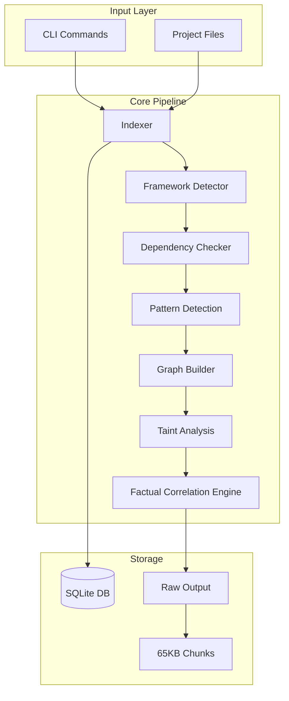
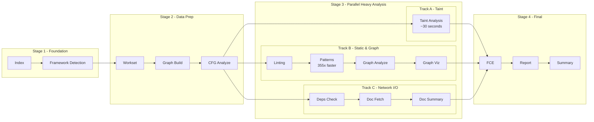
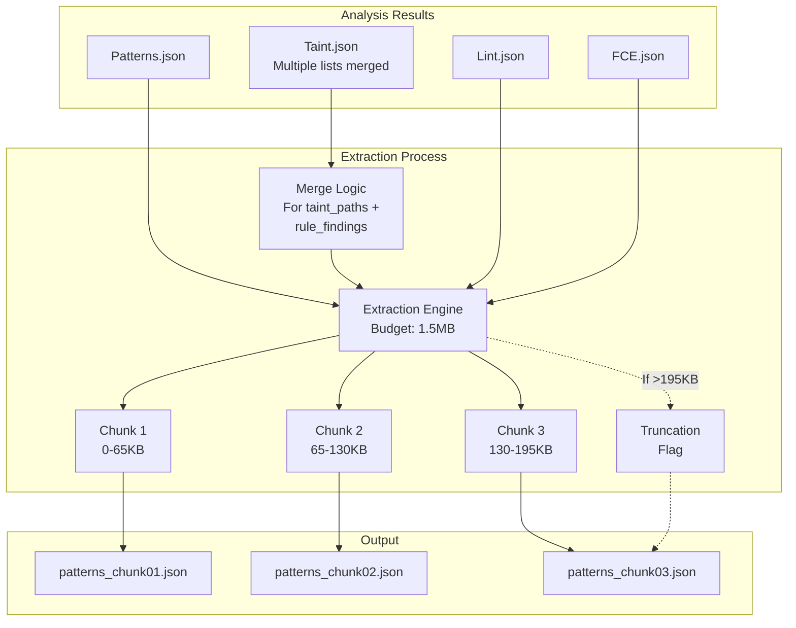
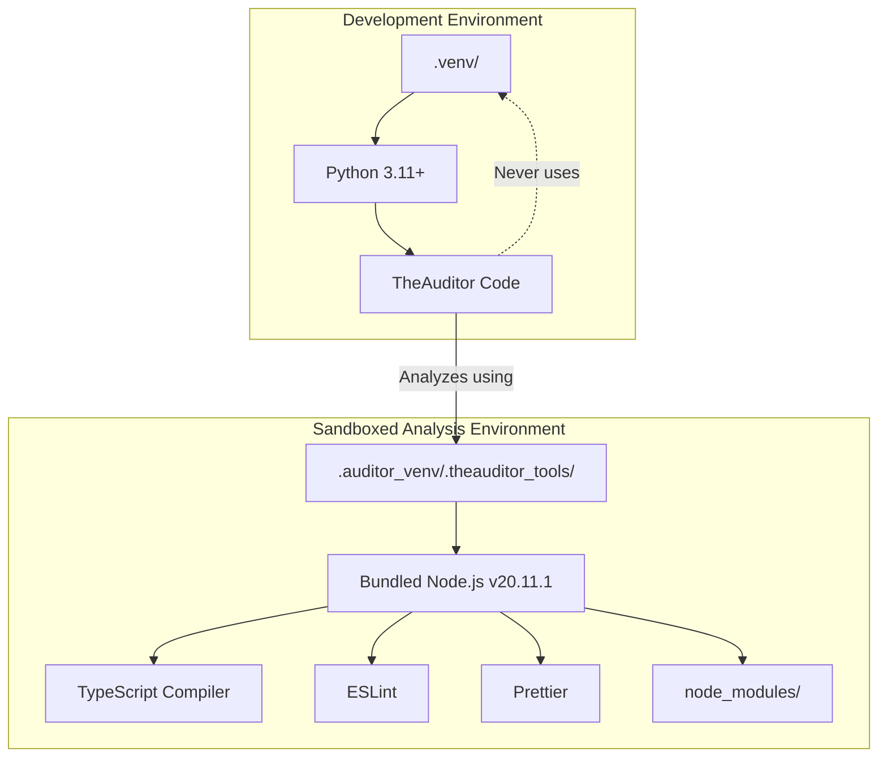
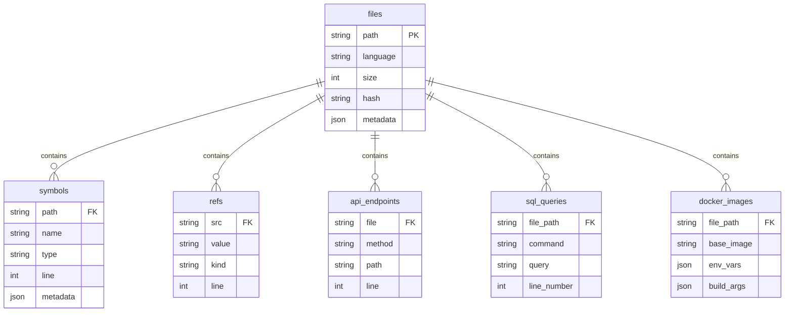
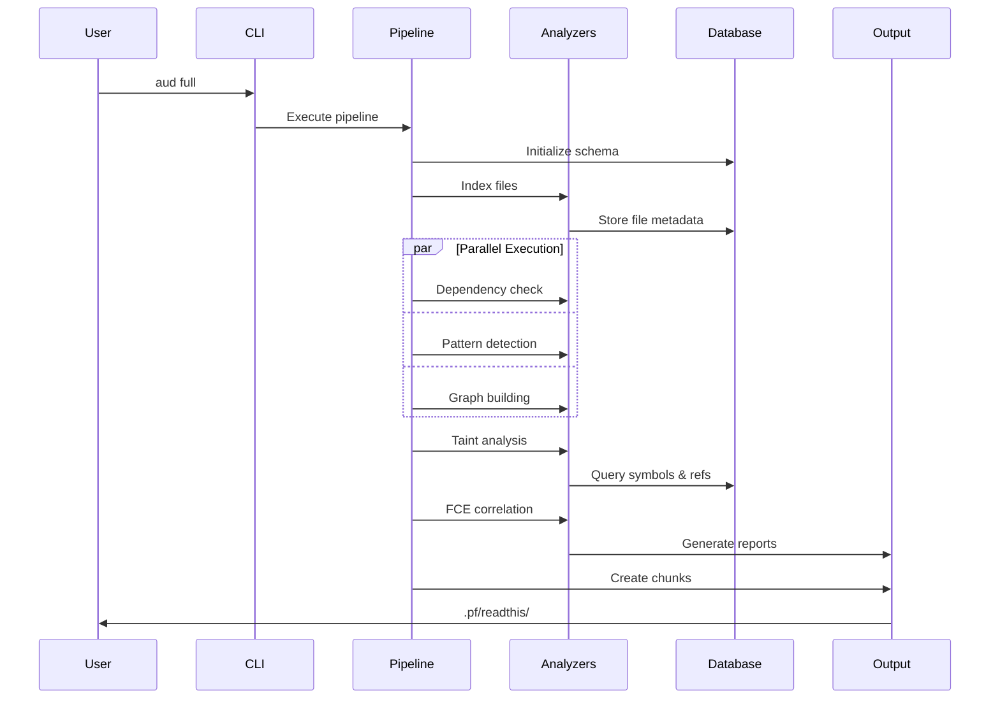

# TheAuditor Architecture

This document provides a comprehensive technical overview of TheAuditor's architecture, design patterns, and implementation details.

## System Overview

TheAuditor is an offline-first, AI-centric SAST (Static Application Security Testing) and code intelligence platform. It orchestrates industry-standard tools to provide ground truth about code quality and security, producing AI-consumable reports optimized for LLM context windows.

With **v1.4.2-RC1** the platform now exposes that ground truth through three dedicated intelligence commands—`aud blueprint`, `aud query`, and `aud context`. They sit directly on top of `repo_index.db`/`graphs.db`, closing the AI code-context gap while preserving the same verifiable facts that power the SAST + code-quality pipeline.

### Core Design Principles

1. **Offline-First Operation** - All analysis runs without network access, ensuring data privacy and reproducible results
2. **Dual-Mode Architecture** - Courier Mode preserves raw external tool outputs; Expert Mode applies security expertise objectively
3. **AI-Centric Workflow** - Produces chunks optimized for LLM context windows (65KB by default)
4. **Sandboxed Execution** - Isolated analysis environment prevents cross-contamination
5. **No Fix Generation** - Reports findings without prescribing solutions

## Truth Courier vs Insights: Separation of Concerns

TheAuditor maintains a strict architectural separation between **factual observation** and **optional interpretation**:

### Truth Courier Modules (Core)
These modules are the foundation - they gather and report verifiable facts without judgment:

- **Indexer**: Reports "Function X exists at line Y with Z parameters"
- **Taint Analyzer**: Reports "Data flows from pattern A to pattern B through path C"
- **Impact Analyzer**: Reports "Changing function X affects Y files through Z call chains"
- **Graph Analyzer**: Reports "Module A imports B, B imports C, C imports A (cycle detected)"
- **Pattern Detector**: Reports "Line X matches pattern Y from rule Z"
- **Linters**: Reports "Tool ESLint flagged line X with rule Y"

These modules form the immutable ground truth. They report **what exists**, not what it means.

### Insights Modules (Optional Interpretation Layer)
These are **optional packages** that consume Truth Courier data to add scoring and classification. All insights modules have been consolidated into a single package for better organization:

```
theauditor/insights/
├── __init__.py              # Package exports
├── ml.py                    # Machine learning predictions (requires pip install -e ".[ml]")
├── graph.py                 # Graph health scoring and recommendations
├── taint.py                 # Vulnerability severity classification
├── impact_analyzer.py       # Change impact assessment and risk scoring
└── semantic_context.py      # User-defined business logic (YAML-based)
```

- **insights/taint.py**: Adds "This flow is XSS with HIGH severity"
- **insights/graph.py**: Adds "Health score: 70/100, Grade: B"
- **insights/ml.py** (requires `pip install -e ".[ml]"`): Adds "80% probability of bugs based on historical patterns"
- **insights/impact_analyzer.py**: Adds "Change affects 47 files with HIGH risk score"
- **insights/semantic_context.py**: Applies user-defined refactoring patterns (e.g., "product.price moved to variant.price")

**Important**: Insights modules are:
- Not installed by default (ML requires explicit opt-in)
- Completely decoupled from core analysis
- Still based on technical patterns, not business logic interpretation
- Designed for teams that want actionable scores alongside raw facts
- All consolidated in `/insights` package for consistency

### Insights Architecture Principles (CRITICAL)

All insights modules **MUST** follow these architectural patterns to maintain system integrity:

#### 1. Database-First Pattern (MANDATORY)

**Rule**: Insights modules query the database, NEVER read source files directly.

**Why**: TheAuditor indexer already extracted all code structure into `repo_index.db`. Reading files duplicates work and violates separation of concerns.

✅ **CORRECT - Database-first:**
```python
# insights/impact_analyzer.py - Frontend-to-backend tracing
cursor.execute("""
    SELECT callee_function, argument_expr
    FROM function_call_args
    WHERE file = ? AND line = ?
    AND callee_function LIKE 'axios.%'
""", (target_file, target_line))
```

❌ **WRONG - File I/O:**
```python
# This violates database-first principle
with open(file_path, 'r') as f:
    lines = f.readlines()
    # ... regex patterns to find API calls
```

**Enforcement**: All insights modules must query existing tables (`function_call_args`, `symbols`, `api_endpoints`, etc.) instead of parsing source code.

#### 2. Zero Fallback Policy (ABSOLUTE)

**Rule**: NO fallback logic, NO alternative code paths, NO graceful degradation. If data is missing, FAIL LOUDLY.

**Why**: TheAuditor regenerates the database FRESH on every `aud full` run. Missing data indicates a pipeline bug that MUST be fixed, not hidden.

✅ **CORRECT - Hard fail:**
```python
# insights/ml.py - Journal data required for training
journal_files = list(history_dir.glob("full/*/journal.ndjson"))
if not journal_files:
    raise FileNotFoundError(
        f"No journal.ndjson files found. "
        "Run 'aud full' to generate journal data before training."
    )
```

❌ **WRONG - Fallback logic:**
```python
# This hides bugs and corrupts ML training data
if not journal_files:
    print("Warning: Using FCE data as fallback")
    fce_files = list(history_dir.glob("full/*/raw/fce.json"))
    # ... process FCE data (SEMANTIC MISMATCH - journal ≠ FCE)
```

**Violation Categories**:
- ❌ Try-except fallbacks (catch exception → use alternative logic)
- ❌ Conditional fallbacks (if X missing, use Y instead)
- ❌ Table existence checks (if table exists then query, else skip)
- ❌ Regex fallbacks (query fails → fall back to regex on source)

**Enforcement**: All insights modules must raise exceptions on missing data with clear remediation messages.

#### 3. Schema Contract Compliance

**Rule**: All database queries MUST use schema contract system for validation.

**Why**: Schema changes (like normalization) break queries that hardcode column names. Schema contract validates queries at runtime.

✅ **CORRECT - Schema-aware:**
```python
# insights/ml.py - Schema validation at module init
from theauditor.indexer.schema import get_table_schema

def validate_ml_schema():
    refs_schema = get_table_schema("refs")
    assert "src" in refs_schema.column_names()
    assert "value" in refs_schema.column_names()
```

✅ **CORRECT - Junction table queries:**
```python
# insights/impact_analyzer.py - Uses normalized schema
cursor.execute("""
    SELECT file, line, method, pattern
    FROM api_endpoints
    WHERE pattern = ? AND method = ?
""")
# Then query junction table for controls
cursor.execute("""
    SELECT control_name
    FROM api_endpoint_controls
    WHERE file = ? AND line = ?
""")
```

❌ **WRONG - Hardcoded removed columns:**
```python
# This queries a column that was removed during normalization
cursor.execute("""
    SELECT file, method, pattern, controls  # ← 'controls' removed!
    FROM api_endpoints
""")
```

**Enforcement**: Query existing schema, never assume column structure.

#### 4. Delegation to Truth Couriers

**Rule**: Insights interpret facts, they don't gather them. Delegate data extraction to core modules.

**Why**: Separation of concerns - indexer extracts, insights interpret.

✅ **CORRECT - Delegates to indexer:**
```python
# insights/graph.py - Uses XGraphAnalyzer (truth courier)
from theauditor.graph.analyzer import XGraphAnalyzer
analyzer = XGraphAnalyzer()
cycles = analyzer.detect_cycles(import_graph)  # Courier provides facts
health_score = _calculate_health(cycles)       # Insight interprets
```

❌ **WRONG - Duplicates courier work:**
```python
# This duplicates what the indexer already did
def _extract_api_calls(file_path):
    with open(file_path) as f:
        content = f.read()
    # ... regex to find axios/fetch calls (indexer already did this!)
```

**Enforcement**: Import and use existing analysis results, don't re-analyze.

#### 5. Real-World Examples from Recent Fixes

**Example 1: impact_analyzer.py - Frontend-to-Backend Tracing**

**Before (BROKEN - 3 violations):**
```python
# ❌ File I/O violation
with open(file_path, 'r') as f:
    lines = f.readlines()

# ❌ Undefined variable bug
if not file_path.exists():  # 'file_path' undefined

# ❌ Schema violation
cursor.execute("""
    SELECT file, method, pattern, controls  # 'controls' column removed
    FROM api_endpoints
""")
```

**After (FIXED - database-first):**
```python
# ✅ Query function_call_args instead of reading files
cursor.execute("""
    SELECT callee_function, argument_expr
    FROM function_call_args
    WHERE file = ? AND line = ?
    AND (callee_function LIKE 'axios.%' OR callee_function = 'fetch')
""")

# ✅ Use normalized schema with junction tables
cursor.execute("""
    SELECT file, line, method, pattern
    FROM api_endpoints
""")
cursor.execute("""
    SELECT control_name
    FROM api_endpoint_controls
    WHERE file = ? AND line = ?
""")
```

**Impact**: 50 lines removed, zero file I/O, schema-compliant.

**Example 2: ml.py - Zero Fallback Policy**

**Before (BROKEN - semantic mismatch):**
```python
# ❌ Fallback hides missing pipeline data
if not journal_files:
    print("Warning: Using FCE data as fallback")
    fce_files = list(history_dir.glob("full/*/raw/fce.json"))
    # Treats FCE findings as journal events (WRONG - different semantics)
    for finding in fce_data['all_findings']:
        stats[file]["touches"] += 1  # FCE findings ≠ journal touches
```

**After (FIXED - hard fail):**
```python
# ✅ Hard fail with clear remediation
if not journal_files:
    raise FileNotFoundError(
        f"No journal.ndjson files found in {history_dir}. "
        "ML model training requires execution history from journal files. "
        "Run 'aud full' at least once to generate journal data."
    )
```

**Impact**: 36 lines removed, prevents ML model corruption, enforces correct pipeline usage.

#### 6. Performance Characteristics

Insights modules leverage indexed database queries:

| Operation | Time | Database Table |
|-----------|------|----------------|
| API call lookup | <10ms | function_call_args (indexed) |
| Symbol resolution | <5ms | symbols (indexed by name) |
| Endpoint matching | <10ms | api_endpoints (indexed by pattern) |
| Control lookup | <5ms | api_endpoint_controls (junction) |
| Historical data | <50ms | journal.ndjson (file I/O acceptable here) |

**No file I/O for code analysis** - all data from `.pf/repo_index.db` with indexed lookups.

#### 7. Testing Requirements

All insights modules must include:
- **Unit tests**: Verify database queries return expected structure
- **Schema validation**: Assert required columns exist
- **Error handling**: Test missing database/table scenarios
- **Integration tests**: Verify with real project data

**Example Test Pattern:**
```python
def test_impact_analyzer_database_first():
    # Verify NO file I/O
    with patch('builtins.open') as mock_open:
        result = trace_frontend_to_backend(cursor, "src/api.ts", 42)
        mock_open.assert_not_called()  # ✅ No file reads

def test_ml_hard_fail_on_missing_journal():
    with pytest.raises(FileNotFoundError, match="journal.ndjson"):
        load_journal_stats(empty_history_dir)  # ✅ Fails loud
```

#### Summary: Insights Architecture Checklist

Before adding new insights modules, verify:
- ✅ Queries database, never reads source files
- ✅ No fallback logic (hard fail on missing data)
- ✅ Uses schema contract for validation
- ✅ Delegates to truth couriers for facts
- ✅ Includes error handling with remediation
- ✅ Has comprehensive tests
- ✅ Documents database tables used
- ✅ Performance: <50ms for indexed queries

### The FCE: Factual Correlation Engine
The FCE correlates facts from multiple tools without interpreting them:
- Reports: "Tool A and Tool B both flagged line 100"
- Reports: "Pattern X and Pattern Y co-occur in file Z"
- Never says: "This is bad" or "Fix this way"

## Core Components

### Indexer Package (`theauditor/indexer/`)
The indexer has been refactored from a monolithic 2000+ line file into a modular package structure:

```
theauditor/indexer/
├── __init__.py           # IndexOrchestrator + backward compatibility
├── config.py             # Constants, patterns, and configuration
├── database.py           # DatabaseManager class for all DB operations
├── core.py               # FileWalker and ASTCache classes
├── metadata_collector.py # Git churn and test coverage analysis
└── extractors/
    ├── __init__.py       # BaseExtractor abstract class and registry
    ├── python.py         # Python-specific extraction logic
    ├── javascript.py     # JavaScript/TypeScript extraction
    ├── docker.py         # Docker/docker-compose extraction
    ├── sql.py            # SQL extraction
    └── generic.py        # Generic extractor (webpack, nginx, compose)
```

#### File Path Responsibility Architecture

**CRITICAL DESIGN PATTERN**: TheAuditor enforces strict separation of concerns for file path management across three architectural layers.

**The Problem This Solves:**
In early iterations, implementations tried to track file paths directly, leading to:
- Architectural violations (implementations tracking file context)
- Database corruption (NULL file paths when keys didn't match)
- Code duplication (file path handling in multiple layers)
- Maintenance nightmares (changing file paths required touching 10+ files)

**The Solution: 3-Layer Architecture**

```
┌─────────────────────────────────────────────────────────────┐
│ LAYER 1: INDEXER (indexer/__init__.py)                      │
│ ─────────────────────────────────────────────────────────── │
│ PROVIDES: file_path (source of truth)                       │
│ CALLS:    extractor.extract(file_info, content, tree)       │
│ RECEIVES: Data WITHOUT file_path keys                       │
│ STORES:   db_manager.add_X(file_path, data['line'], ...)    │
└─────────────────────────────────────────────────────────────┘
                           ↓
┌─────────────────────────────────────────────────────────────┐
│ LAYER 2: EXTRACTOR (indexer/extractors/*.py)                │
│ ─────────────────────────────────────────────────────────── │
│ RECEIVES: file_info dict (contains 'path' key)              │
│ DELEGATES: ast_parser.extract_X(tree)                       │
│ RETURNS:  {'line': 42, 'name': 'foo', ...}                  │
│           NO 'file' or 'file_path' keys                     │
└─────────────────────────────────────────────────────────────┘
                           ↓
┌─────────────────────────────────────────────────────────────┐
│ LAYER 3: IMPLEMENTATION (ast_extractors/*_impl.py)          │
│ ─────────────────────────────────────────────────────────── │
│ RECEIVES: AST tree only (NO file context)                   │
│ EXTRACTS: Data with line numbers and content                │
│ RETURNS:  [{'line': 42, 'name': 'foo', ...}]                │
│ MUST NOT: Include 'file' or 'file_path' in returned dicts   │
└─────────────────────────────────────────────────────────────┘
```

**Real-World Example: Object Literal Extraction**

```python
# LAYER 1: INDEXER provides file_path (indexer/__init__.py:952)
for obj_lit in extracted['object_literals']:
    self.db_manager.add_object_literal(
        file_path,                      # ← From orchestrator (line 564)
        obj_lit['line'],                # ← From implementation
        obj_lit['variable_name'],       # ← From implementation
        obj_lit['property_name'],       # ← From implementation
        obj_lit['property_value'],      # ← From implementation
        obj_lit['property_type'],       # ← From implementation
        obj_lit.get('nested_level', 0), # ← From implementation
        obj_lit.get('in_function', '')  # ← From implementation
    )

# LAYER 2: EXTRACTOR delegates (indexer/extractors/javascript.py:290)
result['object_literals'] = self.ast_parser.extract_object_literals(tree)

# LAYER 3: IMPLEMENTATION returns (ast_extractors/typescript_impl.py:1293)
object_literals.append({
    "line": prop_line,              # ✅ Line number only
    "variable_name": var_name,      # ✅ Data
    "property_name": prop_name,     # ✅ Data
    "property_value": prop_value,   # ✅ Data
    "property_type": prop_type,     # ✅ Data
    "nested_level": 0,              # ✅ Data
    "in_function": in_function      # ✅ Data
    # NO 'file' or 'file_path' key   ✅ Correct architecture
})
```

**Why This Matters:**

1. **Single Source of Truth**: File paths exist in ONE place (indexer orchestrator)
2. **Clear Boundaries**: Each layer has specific responsibilities
3. **Easy Testing**: Implementations can be tested without file system
4. **Maintainability**: Changing file path handling touches ONE file
5. **Type Safety**: Database operations validate complete records

**Violation Detection:**

❌ **WRONG - Implementation tracking files:**
```python
# ast_extractors/typescript_impl.py
return [{
    "file": file_path,    # ❌ ARCHITECTURAL VIOLATION
    "line": 42,
    "name": "foo"
}]
```

❌ **WRONG - Indexer expecting file from implementation:**
```python
# indexer/__init__.py
db_manager.add_object_literal(
    obj_lit['file'],      # ❌ KeyError when 'file' not in dict
    obj_lit['line'],
    ...
)
```

✅ **CORRECT - Implementation returns line only:**
```python
# ast_extractors/typescript_impl.py
return [{
    "line": 42,           # ✅ Line number
    "name": "foo"         # ✅ Data
}]
```

✅ **CORRECT - Indexer provides file_path:**
```python
# indexer/__init__.py (line 952)
db_manager.add_object_literal(
    file_path,            # ✅ From orchestrator context
    obj_lit['line'],      # ✅ From implementation
    ...
)
```

**Enforcement:**

- All `*_impl.py` files have docstring contracts prohibiting file path keys
- Code reviews check for architectural violations
- Database NULL constraints catch missing file paths immediately
- Unit tests verify implementations return correct key structures

Key features:
- **Dynamic extractor registry** for automatic language detection
- **Batched database operations** (200 records per batch by default)
- **AST caching** for performance optimization
- **Monorepo detection** and intelligent path filtering
- **Parallel JavaScript processing** when semantic parser available
- **Dual-pass JSX extraction**: Transformed mode for taint analysis, preserved mode for structural analysis
- **Metadata collection** (`metadata_collector.py`): Git churn analysis (commits, authors, volatility) and test coverage parsing (Python coverage.py, Node.js Istanbul/nyc) for temporal dimension in FCE

### Pipeline System (`theauditor/pipelines.py`)
Orchestrates comprehensive analysis pipeline in **4-stage optimized structure** (v1.1+):

**Stage 1 - Foundation (Sequential):**
1. Repository indexing - Build manifest and symbol database
2. Framework detection - Identify technologies in use

**Stage 2 - Data Preparation (Sequential) [NEW in v1.1]:**
3. Workset creation - Define analysis scope
4. Graph building - Construct dependency graph
5. CFG analysis - Build control flow graphs

**Stage 3 - Heavy Parallel Analysis (Rebalanced in v1.1, Optimized in v1.2):**
- **Track A (Taint Analysis - Isolated):**
  - Taint flow analysis (~30 seconds with v1.2 memory cache, was 2-4 hours)
- **Track B (Static & Graph Analysis):**
  - Linting
  - Pattern detection (355x faster with AST)
  - Graph analysis
  - Graph visualization
- **Track C (Network I/O):**
  - Dependency checking
  - Documentation fetching
  - Documentation summarization

**Stage 4 - Final Aggregation (Sequential):**
- Factual correlation engine
- Report generation
- Summary creation

**Performance Impact:** 480x faster overall on second run (v1.2), 25-40% faster pipeline structure (v1.1)

### Pattern Detection Engine
- **AST-based rules**: 20+ categories in `theauditor/rules/` (auth, SQL injection, XSS, secrets, frameworks, performance, etc.)
- **YAML patterns**: Configuration security in `theauditor/rules/YAML/config_patterns.yml`
- **Dynamic discovery**: Rules orchestrator (`theauditor/rules/orchestrator.py`) auto-discovers all detection rules
- **Coverage**: 100+ security rules across Python, JavaScript, Docker, Nginx, PostgreSQL, and framework-specific patterns
- Supports semantic analysis via TypeScript compiler for type-aware detection

### Factual Correlation Engine (FCE) (`theauditor/fce.py`)
- **30 advanced correlation rules** in `theauditor/correlations/rules/`
- Detects complex vulnerability patterns across multiple tools
- Categories: Authentication, Injection, Data Exposure, Infrastructure, Code Quality, Framework-Specific
- **5 architectural meta-findings**: Correlates security issues with graph hotspots, complexity, churn, and test coverage

### Architectural Intelligence & Query System

**NEW in v1.4.2-RC1**: Blueprint, Query, and Context commands expose the indexed SAST output as an always-on code context fabric.

#### The Problem It Solves

AI assistants waste 5-10k tokens per refactoring iteration reading files to answer:
- "What's the architecture? Where are boundaries?"
- "Who calls this function?"
- "Which endpoints are unprotected?"
- "Where does user data flow?"

TheAuditor already indexes all relationship data during `aud index`. The intelligence layer provides instant access via SQL queries and architectural drill-downs - **zero file reads, <10ms response time**, typically shrinking multi-iteration refactors from ~15k tokens per loop to ~1.5k.

#### Architecture Overview

**Three-Command Architecture:**

```
theauditor/commands/
├── blueprint.py     # Architectural overview (4 drill-downs)
├── query.py         # Code relationship queries (database API)
└── context.py       # Semantic business logic (YAML-based)

theauditor/context/
├── __init__.py      # Shared query engine
├── query.py         # CodeQueryEngine class (8 query methods)
└── formatters.py    # Output formatting (text, json, tree)
```

**1. Blueprint Command (`aud blueprint`)**

Provides architectural overview with 4 surgical drill-downs:
- `--structure`: Scope understanding (monorepo detection, token estimates, migration paths)
- `--graph`: Dependency mapping (gateway files, circular deps, bottlenecks)
- `--security`: Attack surface mapping (unprotected endpoints, auth patterns, SQL risk)
- `--taint`: Data flow mapping (vulnerable flows, sanitization coverage)

Each drill-down shows exact file:line locations with actionable data. No recommendations - just facts.

**2. Query Command (`aud query`)**

Direct database queries for code relationships:
- Symbol lookups with transitive call chains
- File dependency tracing
- API endpoint security coverage
- React component hierarchies
- Data flow queries (via junction tables)

**3. Context Command (`aud context`)**

Applies user-defined business logic via YAML:
- Classifies findings as obsolete/current/transitional
- Tracks refactoring progress
- Maps semantic patterns to code

**Design Principles:**
1. **Database-First**: NO new schema - queries existing tables from `repo_index.db` and `graphs.db`
2. **Zero Inference**: Exact SQL queries with provenance - no guessing, no embeddings
3. **Performance-Obsessed**: Indexed lookups with O(1) hash maps and BFS for transitive queries
4. **Type-Safe Results**: Dataclasses (SymbolInfo, CallSite, Dependency) for structured returns
5. **Format-Agnostic**: Text (human), JSON (AI), tree (visualization) output modes
6. **Truth Courier Mode**: Facts only, no recommendations or prescriptive language

#### Database Schema Used

The query engine leverages existing indexed data:

**repo_index.db (required):**
- `symbols` (33k rows) - Function/class definitions (CRITICAL: uses `path` column, not `file`)
- `symbols_jsx` (8k rows) - JSX component definitions
- `function_call_args` (13k rows) - Function call sites with arguments
- `function_call_args_jsx` (4k rows) - JSX component usages
- `api_endpoints` (185 rows) - REST endpoint handlers
- `react_components` (1k rows) - React component metadata
- `react_hooks` (667 rows) - Hook usage tracking

**graphs.db (optional for dependency queries):**
- `edges` (7.3k rows) - Import and call relationships
- `nodes` (4.8k rows) - File/module nodes

**No schema changes required** - queries run on existing indexed data.

#### Query Methods

The `CodeQueryEngine` class provides 6 query methods:

**1. find_symbol(name, type_filter) → List[SymbolInfo]**
- Exact name match across `symbols` and `symbols_jsx` tables
- Returns: Symbol definitions with file, line, signature, export status
- Performance: <5ms (indexed by name)

**2. get_callers(symbol_name, depth=1) → List[CallSite]**
- BFS traversal for transitive caller discovery
- Queries: `function_call_args` WHERE `callee_function = ?`
- Depth 1-5 supported (default: 1 for direct callers only)
- Performance: <10ms direct, <50ms depth=3 transitive
- Cycle detection: Visited set prevents infinite loops

**3. get_callees(symbol_name) → List[CallSite]**
- What a function calls
- Queries: `function_call_args` WHERE `caller_function LIKE ?`
- Returns: Call sites with arguments and line numbers
- Performance: <10ms

**4. get_file_dependencies(file_path, direction='both') → Dict[str, List[Dependency]]**
- Import relationships from `graphs.db`
- Directions: 'incoming' (dependents), 'outgoing' (dependencies), 'both'
- Queries: `edges` WHERE `graph_type = 'import'`
- Performance: <10ms
- Graceful degradation: Returns error if graphs.db not built

**5. get_api_handlers(route_pattern) → List[Dict]**
- Find REST endpoint implementations
- Queries: `api_endpoints` WHERE `path LIKE ? OR pattern LIKE ?`
- Returns: Method, path, handler function, auth status, file location
- Performance: <5ms

**6. get_component_tree(component_name) → Dict**
- React component hierarchy
- Queries: `react_components`, `react_hooks`, `function_call_args_jsx`
- Returns: Component metadata, hooks used, child components
- Performance: <10ms

#### Transitive Query Algorithm (BFS)

For `get_callers(depth > 1)`, the engine uses Breadth-First Search:

```python
queue = deque([(symbol_name, 0)])
visited = set()

while queue:
    current_symbol, current_depth = queue.popleft()
    if current_depth >= depth:
        continue

    # Query direct callers
    callers = query_function_call_args(current_symbol)

    for caller in callers:
        caller_key = (caller.function, caller.file, caller.line)
        if caller_key not in visited:
            visited.add(caller_key)
            all_callers.append(caller)

            # Add to queue for next level
            if current_depth + 1 < depth:
                queue.append((caller.function, current_depth + 1))
```

**Why BFS?**
- Guarantees shortest path to each caller
- Level-order traversal (depth-aware)
- Cycle detection via visited set
- Memory-efficient (stores only unique caller keys)

#### Output Formatters

Three output modes via `formatters.py`:

**1. Text Format (default)** - Human-readable:
```
Symbol Definitions (1):
  1. authenticateUser
     Type: function
     File: backend/src/auth.ts:42-67
     Signature: (username: string, password: string) => Promise<User>
     Exported: Yes

Callers (3):
  1. backend/src/routes/login.ts:23
     handleLogin -> authenticateUser
     Args: req.body.username, req.body.password
```

**2. JSON Format** - AI-consumable structured data:
```json
{
  "symbol": [{
    "name": "authenticateUser",
    "type": "function",
    "file": "backend/src/auth.ts",
    "line": 42,
    "end_line": 67,
    "signature": "(username: string, password: string) => Promise<User>",
    "is_exported": true
  }],
  "callers": [...]
}
```

**3. Tree Format** - Visual hierarchy (placeholder, falls back to text):
```
└─ authenticateUser
   ├─ handleLogin (backend/src/routes/login.ts:23)
   ├─ validateCredentials (backend/src/middleware/auth.ts:15)
   └─ refreshSession (backend/src/sessions/refresh.ts:8)
```

#### Performance Characteristics

All queries leverage SQLite indexes:

| Query Type | Time | Method |
|------------|------|--------|
| Symbol lookup | <5ms | Indexed by name + type |
| Direct callers | <10ms | Indexed by callee_function |
| Transitive (depth=3) | <50ms | BFS with visited set |
| File dependencies | <10ms | Indexed by source/target + graph_type |
| API handlers | <5ms | Indexed by path pattern |
| Component tree | <10ms | Multiple indexed queries |

**Zero file I/O** - all data from SQLite databases with O(1) hash map lookups internally.

#### CLI Integration

Exposed via three specialized commands:

**Blueprint (Architectural Overview):**
```bash
# Top-level overview
aud blueprint

# Drill-downs for surgical analysis
aud blueprint --structure  # Scope, monorepo, token estimates
aud blueprint --graph      # Gateway files, cycles, bottlenecks
aud blueprint --security   # Unprotected endpoints, auth patterns
aud blueprint --taint      # Vulnerable flows, sanitization gaps

# Export for AI consumption
aud blueprint --all --format json
```

**Query (Code Relationships):**
```bash
# Symbol queries
aud query --symbol authenticateUser --show-callers --depth 3
aud query --symbol handleRequest --show-callees

# File queries
aud query --file src/auth.ts --show-dependents
aud query --file src/utils.ts --show-dependencies

# API queries
aud query --api "/users/:id"
aud query --show-api-coverage  # Security coverage for all endpoints
```

**Context (Semantic Business Logic):**
```bash
# Apply YAML-based refactoring patterns
aud context --file auth_migration.yaml --verbose
```

#### Integration with Existing Systems

The query engine is a **read-only consumer** of indexed data:
- **Indexer**: Populates tables during `aud index`
- **Graph Builder**: Creates edges/nodes during `aud graph build`
- **Query Engine**: Reads data, never writes

**No pipeline changes** - runs independently after indexing completes.

#### Error Handling

**Graceful degradation:**
- Missing `repo_index.db`: Raises FileNotFoundError with remediation
- Missing `graphs.db`: Returns error dict for dependency queries
- Missing tables (e.g., no JSX in Python projects): Silently skipped via try/except
- Empty results: Returns empty list (not an error)

**Helpful error messages:**
```python
# If database not found
FileNotFoundError: "Database not found: .pf/repo_index.db\nRun 'aud index' first to build the database."

# If graphs.db not built
{'error': 'Graph database not found. Run: aud graph build'}
```

#### Example: Token Savings Calculation

**Without query engine (traditional approach):**
```
AI reads auth.ts (500 tokens)
AI reads login.ts (300 tokens)
AI reads middleware/auth.ts (400 tokens)
AI reads sessions/refresh.ts (350 tokens)
Total: 1,550 tokens per iteration
10 iterations: 15,500 tokens
```

**With query engine:**
```
aud context query --symbol authenticateUser --show-callers --depth 2 --format json
Output: 150 tokens (structured call graph)
10 iterations: 1,500 tokens
Savings: 14,000 tokens (90% reduction)
```

#### Future Enhancements

Potential additions (not yet implemented):
- Tree format visualization (currently placeholder)
- Cross-file taint path queries
- SQL query builder for custom queries
- GraphQL schema traversal
- Database migration impact analysis

### Taint Analysis Package (`theauditor/taint/`)
Previously a monolithic file, the taint analysis system has been refactored into a modular package with 11 specialized modules. A backward compatibility shim remains at `theauditor/taint_analyzer.py` for legacy imports.

**Core capabilities:**
- Tracks data flow from user inputs to dangerous outputs
- Detects SQL injection, XSS, command injection, path traversal vulnerabilities
- Database-aware analysis using `repo_index.db`
- Supports both assignment-based and direct-use taint patterns
- Flow-sensitive CFG analysis for path-aware detection
- Inter-procedural tracking across function boundaries
- Language-specific handlers for JavaScript and Python constructs
- v1.2 memory cache: 8,461x speedup (4 hours → 30 seconds)

**Package structure:**
- `core.py`: Main TaintAnalyzer orchestration
- `sources.py`, `config.py`: 650+ source/sink/sanitizer patterns
- `propagation.py`: Worklist-based taint flow algorithm
- `cfg_integration.py`: Flow-sensitive path analysis
- `interprocedural.py`: Cross-function tracking
- `memory_cache.py`: In-memory O(1) lookup cache
- `javascript.py`, `python.py`: Language-specific construct handling
- `insights.py`: Shim to `theauditor/insights/taint.py` for optional severity scoring

### Graph Analysis (`theauditor/graph/`)
- **builder.py**: Constructs dependency graph from codebase
- **analyzer.py**: Detects cycles, measures complexity, identifies hotspots
- **dfg_builder.py**: Builds data flow graphs from indexed assignments and returns
- **store.py**: Persists graphs to `.pf/graphs.db` SQLite database
- Uses NetworkX for graph algorithms

**Graph Types:**
1. **Import Graph** (`graph build`): Module/file import dependencies
2. **Call Graph** (`graph build`): Function call relationships
3. **Data Flow Graph** (`graph build-dfg`): Variable assignment and return value flows

**Note**: The optional health scoring and recommendations are provided by `theauditor/insights/graph.py` (Insights module)

#### Data Flow Graph (DFG) Architecture

The DFG builder constructs graph representations of how data flows through variable assignments and function returns. This enables more accurate inter-procedural taint analysis and data dependency tracking.

**Data Source:**
- `assignment_sources` junction table (42,844 rows in typical project)
- `function_return_sources` junction table (19,313 rows in typical project)
- Both tables populated during indexing (`aud index`)

**Graph Construction:**
```python
# DFGBuilder reads normalized junction tables
builder = DFGBuilder(db_path=".pf/repo_index.db")
graph = builder.build_unified_flow_graph(root=".")

# Graph structure:
{
    "nodes": [
        {"id": "file::function::variable", "file": "...", "type": "variable"},
        {"id": "file::function::return", "file": "...", "type": "return_value"}
    ],
    "edges": [
        {"source": "var1_id", "target": "var2_id", "type": "assignment", "line": 42},
        {"source": "var_id", "target": "return_id", "type": "return", "line": 58}
    ],
    "metadata": {
        "stats": {
            "total_assignments": 42844,
            "assignments_with_sources": 38521,
            "total_nodes": 45892,
            "total_edges": 53768
        }
    }
}
```

**Storage (Dual-Write Pattern):**
1. **Database**: `.pf/graphs.db` via `XGraphStore.save_data_flow_graph()`
   - Nodes table with `graph_type='data_flow'`
   - Edges table with `graph_type='data_flow'`
   - Queryable via SQL for fast lookups

2. **JSON**: `.pf/raw/data_flow_graph.json`
   - Immutable record for human/AI consumption
   - Contains complete graph with metadata

**Pipeline Integration:**
- Runs in Stage 2 (Data Preparation) after `graph build`
- Command: `aud graph build-dfg`
- Prerequisite: `aud index` (to populate junction tables)

**Current Status:**
- ✅ Graph building working (reads junction tables, builds nodes/edges)
- ✅ Dual-write to database + JSON
- ⚠️ Taint analyzer integration pending (future work)

**Future Integration:**
Taint analyzer will use DFG for:
- Inter-procedural flow tracking (follow assignments across functions)
- Return value propagation (track tainted returns to call sites)
- Alias analysis (detect variable aliasing through assignments)
- Faster traversals (pre-built graph vs on-the-fly queries)

### Terraform Analysis (`theauditor/terraform/`)

**Purpose:** Infrastructure as Code (IaC) security analysis for Terraform/HCL configurations.

TheAuditor provides complete Terraform support with database-first architecture and zero fallbacks, enabling security analysis of cloud infrastructure definitions.

**Components:**

1. **HCL Extraction** (`theauditor/ast_extractors/hcl_impl.py`):
   - Tree-sitter-based HCL parsing with precise line numbers
   - Extracts resources, variables, outputs, data sources
   - Graceful fallback to python-hcl2 if tree-sitter unavailable

2. **Terraform Parser** (`theauditor/terraform/parser.py`):
   - Structural parsing using python-hcl2 library
   - Hard fail on malformed HCL (no graceful degradation)
   - Identifies sensitive properties by keyword matching

3. **Terraform Extractor** (`theauditor/indexer/extractors/terraform.py`):
   - Indexer integration for .tf/.tfvars/.tf.json files
   - Dual parser strategy: tree-sitter (preferred) + python-hcl2 (fallback)
   - Populates 5 database tables: terraform_files, terraform_resources, terraform_variables, terraform_outputs, terraform_findings

4. **Provisioning Flow Graph** (`theauditor/terraform/graph.py`):
   - Builds data flow graphs: variable → resource → output
   - Tracks variable references, resource dependencies, output references
   - Writes to graphs.db via XGraphStore.save_custom_graph()
   - Enables blast radius analysis for infrastructure changes

5. **Security Analyzer** (`theauditor/terraform/analyzer.py`):
   - 6 security check categories:
     - Public S3 buckets (ACL analysis, website hosting)
     - Unencrypted storage (RDS, EBS)
     - IAM wildcards (Action=*, Resource=*)
     - Hardcoded secrets (non-variable values)
     - Missing encryption (SNS topics, KMS)
     - Security groups (0.0.0.0/0 ingress rules)
   - Dual-write: terraform_findings + findings_consolidated (FCE integration)
   - Severity filtering: critical/high/medium/low

6. **CLI Commands** (`theauditor/commands/terraform.py`):
   - `aud terraform provision` - Build provisioning flow graph
   - `aud terraform analyze` - Detect security issues
   - `aud terraform report` - Generate report [PHASE 7 - not implemented]
   - Workset support for changed files only

**Database Schema:**

Five new tables in repo_index.db:
- `terraform_files` - File metadata (module_name, stack_name, backend_type)
- `terraform_resources` - Resource blocks with properties, dependencies, public exposure flags
- `terraform_variables` - Variable declarations with types, defaults, sensitivity
- `terraform_outputs` - Output blocks with sensitivity flags
- `terraform_findings` - Security findings with category, severity, remediation

**Architecture Principles:**

1. **Database-First**: All extracted data flows through database tables
2. **Zero Fallbacks**: Hard fail on parse errors, missing data exposes bugs
3. **Dual Parser**: Tree-sitter for line numbers, python-hcl2 for fallback
4. **Graph Integration**: Provisioning graphs stored alongside DFG/import graphs
5. **FCE Correlation**: Findings dual-written for cross-tool correlation

**Workflow:**
```bash
aud index                      # Extract Terraform resources to database
aud terraform provision        # Build provisioning flow graph
aud terraform analyze          # Detect security issues
aud full                       # Includes all Terraform analysis
```

**Typical Output:**
- `.pf/graphs.db` - Provisioning graph (terraform_provisioning type)
- `.pf/raw/terraform_graph.json` - JSON export of graph
- `.pf/raw/terraform_findings.json` - Security findings
- `terraform_findings` table - Queryable findings for FCE

**Performance:**
- Indexing: ~5-10ms per .tf file (tree-sitter)
- Graph building: ~2s for 100 resources
- Security analysis: ~500ms for 100 resources
- All database queries with indexed lookups

**Future Enhancements (Phase 7):**
- Graph-based blast radius calculation
- Module analysis (terraform_modules population)
- Provider analysis (terraform_providers population)
- Data source analysis (terraform_data population)
- .tfvars parsing for variable values
- Stack detection from directory structure

### Framework Detection (`theauditor/framework_detector.py`)
- Auto-detects Django, Flask, React, Vue, Angular, etc.
- Applies framework-specific rules
- Influences pattern selection and analysis behavior

### Configuration Parsers (`theauditor/parsers/`)
Specialized parsers for configuration file analysis:
- **webpack_config_parser.py**: Webpack configuration analysis
- **compose_parser.py**: Docker Compose file parsing
- **nginx_parser.py**: Nginx configuration parsing
- **dockerfile_parser.py**: Dockerfile security analysis
- **prisma_schema_parser.py**: Prisma ORM schema parsing

These parsers are used by extractors during indexing to extract security-relevant configuration data.

### Vulnerability Scanner (`theauditor/vulnerability_scanner.py`)

**OSV-Scanner: Offline-First Vulnerability Detection**

TheAuditor uses a 2-source cross-validation approach for vulnerability detection:
- **npm audit**: Checks npm registry for JavaScript/TypeScript vulnerabilities
- **OSV-Scanner**: Google's official offline vulnerability database scanner (includes PyPI coverage)

**OSV-Scanner Architecture**:
- **Binary Location**: `.auditor_venv/.theauditor_tools/osv-scanner/osv-scanner.exe` (Windows) or `osv-scanner` (Linux/Mac)
- **Database Location**: `.auditor_venv/.theauditor_tools/osv-scanner/db/{ecosystem}/all.zip`
- **Execution Mode**: 100% offline operation (ALWAYS uses `--offline-vulnerabilities` flag)
- **Database Updates**: Via `aud setup-ai --target .` command (one-time download)

**Why Offline-Only Design**:
1. **Feature-Rich Database**: Complete vulnerability data without API limitations
2. **Privacy**: No dependency information sent to external services
3. **Performance**: Local database queries are instant, no rate limits or network delays
4. **Reliability**: Works in air-gapped environments, no network dependencies
5. **Project-Agnostic**: Single database serves all projects (stored in sandbox)

**Database Contents**:
- npm ecosystem vulnerabilities (JavaScript/TypeScript)
- PyPI ecosystem vulnerabilities (Python)
- Cross-referenced with CVE, GHSA, OSV, and other advisory sources
- CWE classifications and severity ratings
- Detailed descriptions, references, and affected version ranges

**Cross-Validation Process**:
```python
# Scanners run independently
npm_findings = _run_npm_audit()      # May hit npm registry (unless --offline)
osv_findings = _run_osv_scanner()    # ALWAYS uses local database

# Cross-reference findings by vulnerability ID
validated = _cross_reference({
    "npm-audit": npm_findings,
    "osv-scanner": osv_findings,
})
# Confidence = number of sources that found the same vulnerability
```

**Key Implementation Detail** (`vulnerability_scanner.py:478-479`):
```python
# ALWAYS use offline database (never hit API)
cmd.append("--offline-vulnerabilities")
```

This ensures OSV-Scanner operates without network access regardless of the `--offline` flag to `aud full`. The offline flag only affects npm audit registry checks.

### Refactoring Detection (`theauditor/commands/refactor.py`)
Detects incomplete refactorings and cross-stack inconsistencies:
- Analyzes database migrations to detect schema changes
- Uses impact analysis to trace affected files
- Applies correlation rules from `/correlations/rules/refactoring.yaml`
- Detects API contract mismatches, field migrations, foreign key changes
- Supports auto-detection from migration files or specific change analysis

## System Architecture Diagrams

### High-Level Data Flow



### Parallel Pipeline Execution (v1.1 4-Stage Architecture)



### Data Chunking System

The extraction system (`theauditor/extraction.py`) implements pure courier model chunking:



Key features:
- **Budget system**: 1.5MB total budget for all chunks
- **Smart merging**: Taint analysis merges multiple finding lists (taint_paths, rule_findings, infrastructure)
- **Preservation**: All findings preserved, no filtering or sampling
- **Chunking**: Only chunks files >65KB, copies smaller files as-is

### Dual Environment Architecture



TheAuditor maintains strict separation between:
1. **Primary Environment** (`.venv/`): TheAuditor's Python code and dependencies
2. **Sandboxed Environment** (`.auditor_venv/.theauditor_tools/`): Isolated JS/TS analysis tools

This ensures reproducibility and prevents TheAuditor from analyzing its own analysis tools.

## Database Schema



## Schema Contract System (v1.1+)

TheAuditor enforces a strict "single source of truth" pattern for database schema management through the schema contract system located in `theauditor/indexer/schema.py`.

### Architecture Overview

The schema contract system provides:
- **Type-safe query building** - Validates column names at runtime before query execution
- **Schema validation** - Ensures database matches schema definitions
- **Code generation** - Generates CREATE TABLE statements from schema definitions
- **Centralized definitions** - All 40+ table schemas in one authoritative location

### TableSchema Class

The `TableSchema` dataclass represents a complete table definition:

```python
@dataclass
class TableSchema:
    name: str
    columns: List[Column]
    indexes: List[Tuple[str, List[str]]] = field(default_factory=list)
    primary_key: Optional[List[str]] = None  # Composite primary keys
    unique_constraints: List[List[str]] = field(default_factory=list)  # UNIQUE constraints
```

**Supported Constraint Types:**
- **Column-level constraints**: NOT NULL, DEFAULT, CHECK, PRIMARY KEY
- **Table-level constraints**: Composite PRIMARY KEY, UNIQUE(col1, col2, ...)
- **Indexes**: Performance optimization via CREATE INDEX statements

**FOREIGN KEY Design Pattern:**
FOREIGN KEY constraints are **intentionally omitted** from TableSchema definitions. This design choice:
- Keeps schema focused on table-level structure (columns, types, indexes)
- Decouples schema from relational integrity
- Avoids circular dependencies between table definitions
- Simplifies schema validation and code generation

Foreign keys are defined exclusively in `database.py` CREATE TABLE statements and are not validated by the schema contract system.

### Usage Examples

**Building Type-Safe Queries:**
```python
from theauditor.indexer.schema import build_query

# Build validated query
query = build_query('variable_usage', ['file', 'line', 'variable_name'])
cursor.execute(query)

# With WHERE clause
query = build_query('sql_queries', where="command != 'UNKNOWN'")
cursor.execute(query)
```

**Schema Validation:**
```python
from theauditor.indexer.schema import validate_all_tables

mismatches = validate_all_tables(cursor)
if mismatches:
    for table, errors in mismatches.items():
        logger.warning(f"Schema mismatch in {table}: {errors}")
```

### Recent Enhancements (v1.1+)

**JWT Patterns Table Synchronization:**
- Added missing `jwt_patterns` table to schema.py TABLES registry
- Complete TableSchema with 6 columns and 3 indexes
- Resolved P0 schema contract violation

**UNIQUE Constraint Support:**
- Extended TableSchema with `unique_constraints` field
- Enables full constraint representation and validation
- Example: `frameworks` table uses `UNIQUE(name, language, path)`
- Supports multiple UNIQUE constraints per table

**Design Pattern Documentation:**
- Codified FOREIGN KEY omission pattern in TableSchema docstring
- Explicit architectural rationale prevents future confusion
- Maintains separation of concerns: structure vs. relationships

### Key Tables

**Core Structure:**
- `files` - File metadata and hashes
- `symbols` - Code symbols (functions, classes, variables)
- `function_call_args` - Function call argument tracking

**Security Analysis:**
- `api_endpoints` - REST endpoint detection with auth flags
- `sql_queries` - SQL query extraction with command classification
- `jwt_patterns` - JWT usage pattern detection
- `variable_usage` - Variable usage tracking for taint analysis

**Data Flow (Taint Critical):**
- `assignments` - Variable assignments
- `function_returns` - Function return statements
- `taint_paths` - Computed taint flow paths

**Framework Detection:**
- `frameworks` - Detected frameworks with UNIQUE constraint
- `framework_safe_sinks` - Framework-specific safe output methods

See `theauditor/indexer/schema.py` for complete table definitions.

## Command Flow Sequence



## Output Structure

All results are organized in the `.pf/` directory:

```
.pf/
├── raw/                # Immutable tool outputs (ground truth)
│   ├── eslint.json
│   ├── ruff.json
│   └── ...
├── readthis/           # AI-optimized chunks (<65KB each, max 3 chunks per file)
│   ├── manifest.md     # Repository overview
│   ├── patterns_*.md   # Security findings
│   ├── taint_*.md      # Data-flow issues
│   └── tickets_*.md    # Actionable tasks
├── repo_index.db       # SQLite database of code symbols
├── pipeline.log        # Execution trace
└── findings.json       # Consolidated results
```

### Key Output Files

- **manifest.md**: Complete file inventory with SHA-256 hashes
- **patterns_*.md**: Chunked security findings from 100+ detection rules
- **tickets_*.md**: Prioritized, actionable issues with evidence
- **repo_index.db**: Queryable database of all code symbols and relationships

## Operating Modes

TheAuditor operates in two distinct modes:

### Courier Mode (External Tools)
- Preserves exact outputs from ESLint, Ruff, MyPy, etc.
- No interpretation or filtering
- Complete audit trail from source to finding

### Expert Mode (Internal Engines)
- **Taint Analysis**: Tracks untrusted data through the application
- **Pattern Detection**: YAML-based rules with AST matching
- **Graph Analysis**: Architectural insights and dependency tracking
- **Secret Detection**: Identifies hardcoded credentials and API keys

## CLI Entry Points

- **Main CLI**: `theauditor/cli.py` - Central command router
- **Command modules**: `theauditor/commands/` - One module per command
- **Utilities**: `theauditor/utils/` - Shared functionality
- **Configuration**: `theauditor/config_runtime.py` - Runtime configuration

Each command module follows a standardized structure with:
- `@click.command()` decorator
- `@handle_exceptions` decorator for error handling
- Consistent logging and output formatting

## Performance Optimizations

### v1.2 Cache Architecture
TheAuditor v1.2 introduces a comprehensive caching system that transforms performance:

**In-Memory Caches:**
- **Taint Analysis Memory Cache** (`theauditor/taint/memory_cache.py`):
  - Pre-computed pattern matching with O(1) lookups
  - Multi-index architecture: by file, by pattern, by type
  - 4GB memory limit with graceful degradation
  - Result: 8,461x speedup (4 hours → 30 seconds)

- **AST Parser LRU Cache** (`theauditor/ast_parser.py`):
  - Increased from 500 to 10,000 entries
  - Content-hash based caching
  - Prevents re-parsing of unchanged files
  - Result: 20x speedup on re-analysis

- **CFG Analysis Cache** (`theauditor/cache/cfg_cache.py`):
  - SQLite-based persistent cache
  - Expanded from 10,000 to 25,000 function entries
  - LRU eviction when limit reached
  - Result: 10x speedup for flow analysis

**Managed Disk Caches:**
- **Graph Cache** (`theauditor/cache/graph_cache.py`):
  - SQLite with 100,000 edge limit
  - 50,000 file state limit
  - Incremental updates for changed files
  - Smart eviction based on file age

- **AST Disk Cache** (`theauditor/cache/ast_cache.py`):
  - JSON file storage with 1GB limit
  - Maximum 20,000 cached files
  - LRU eviction when limits exceeded
  - Prevents disk exhaustion

**Cache Preservation Strategy (v1.2+):**
TheAuditor preserves caches between runs by default to maximize performance:

- **Preserved Caches**:
  - `.pf/.cache/` - AST parsing cache
  - `.pf/context/` - Documentation cache (~1.6MB typical) and summaries

- **Archive Behavior**:
  - By default, `aud full` preserves caches when archiving previous runs
  - Caches are NOT moved to `.pf/history/` directories
  - Result: ~40-90s faster on subsequent runs (docs cache reuse)

- **Force Cache Rebuild**:
  ```bash
  aud full --wipecache  # Delete all caches before analysis
  ```
  - Use this flag for cache corruption recovery
  - Useful when dependency versions change significantly
  - Documentation cache will be rebuilt from npm/PyPI (rate-limited)

- **Implementation**:
  - Archive logic: `theauditor/commands/_archive.py`
  - Cache directory detection via `CACHE_DIRS` constant
  - Metadata tracking in `_metadata.json` files

**Performance Impact**:
- First run: Full analysis (~120s medium project)
- Subsequent runs: ~40-90s faster (cache hits)
- With `--wipecache`: Equivalent to first run

### Core Optimizations
- **Batched database operations**: 200 records per batch (configurable)
- **Parallel rule execution**: ThreadPoolExecutor with 4 workers
- **Incremental analysis**: Workset-based analysis for changed files only
- **Lazy loading**: Patterns and rules loaded on-demand
- **Memory-efficient chunking**: Stream large files instead of loading entirely
- **Pre-computation**: Taint patterns compiled at load time, not search time

## Configuration System

TheAuditor supports runtime configuration via multiple sources (priority order):

1. **Environment variables** (`THEAUDITOR_*` prefix)
2. **`.pf/config.json`** file (project-specific)
3. **Built-in defaults** in `config_runtime.py`

Example configuration:
```bash
export THEAUDITOR_LIMITS_MAX_CHUNKS_PER_FILE=5  # Default: 3
export THEAUDITOR_LIMITS_MAX_CHUNK_SIZE=100000  # Default: 65000
export THEAUDITOR_LIMITS_MAX_FILE_SIZE=5242880  # Default: 2097152
export THEAUDITOR_TIMEOUTS_LINT_TIMEOUT=600     # Default: 300
```

## Advanced Features

### Database-Aware Rules
Specialized analyzers query `repo_index.db` to detect:
- ORM anti-patterns (N+1 queries, missing transactions)
- Docker security misconfigurations
- Nginx configuration issues
- Multi-file correlation patterns

### Holistic Analysis
Project-level analyzers that operate across the entire codebase:
- **Bundle Analyzer**: Correlates package.json, lock files, and imports
- **Source Map Detector**: Scans build directories for exposed maps
- **Framework Detectors**: Identify technology stack automatically

### Incremental Analysis
Workset-based analysis for efficient processing:
- Git diff integration for changed file detection
- Dependency tracking for impact analysis
- Cached results for unchanged files

## Contributing to TheAuditor

### Adding Language Support

TheAuditor's modular architecture makes it straightforward to add new language support:

#### 1. Create an Extractor
Create a new extractor in `theauditor/indexer/extractors/{language}.py`:

```python
from . import BaseExtractor

class {Language}Extractor(BaseExtractor):
    def supported_extensions(self) -> List[str]:
        return ['.ext', '.ext2']
    
    def extract(self, file_info, content, tree=None):
        # Extract symbols, imports, routes, etc.
        return {
            'imports': [],
            'routes': [],
            'symbols': [],
            # ... other extracted data
        }
```

The extractor will be automatically registered via the `BaseExtractor` inheritance.

#### 2. Create Configuration Parser (Optional)
For configuration files, create a parser in `theauditor/parsers/{language}_parser.py`:

```python
class {Language}Parser:
    def parse_file(self, file_path: Path) -> Dict[str, Any]:
        # Parse configuration file
        return parsed_data
```

#### 3. Add Security Patterns
Create YAML patterns in `theauditor/patterns/{language}.yml`:

```yaml
- name: hardcoded-secret-{language}
  pattern: 'api_key\s*=\s*["\'][^"\']+["\']'
  severity: critical
  category: security
  languages: ["{language}"]
  description: "Hardcoded API key in {Language} code"
```

#### 4. Add Framework Detection
Update `theauditor/framework_detector.py` to detect {Language} frameworks.

### Adding New Analyzers

#### Database-Aware Rules
Create analyzers that query `repo_index.db` in `theauditor/rules/{category}/`:

```python
def find_{issue}_patterns(db_path: str) -> List[Dict[str, Any]]:
    conn = sqlite3.connect(db_path)
    # Query and analyze
    return findings
```

#### AST-Based Rules
For semantic analysis, create rules in `theauditor/rules/{framework}/`:

```python
def find_{framework}_issues(tree, file_path) -> List[Dict[str, Any]]:
    # Traverse AST and detect issues
    return findings
```

#### Pattern-Based Rules
Add YAML patterns to `theauditor/patterns/` for regex-based detection.

### Architecture Guidelines

1. **Maintain Truth Courier vs Insights separation** - Core modules report facts, insights add interpretation
2. **Use the extractor registry** - Inherit from `BaseExtractor` for automatic registration
3. **Follow existing patterns** - Look at `python.py` or `javascript.py` extractors as examples
4. **Write comprehensive tests** - Test extractors, parsers, and patterns
5. **Document your additions** - Update this file and CONTRIBUTING.md

For detailed contribution guidelines, see [CONTRIBUTING.md](CONTRIBUTING.md).
