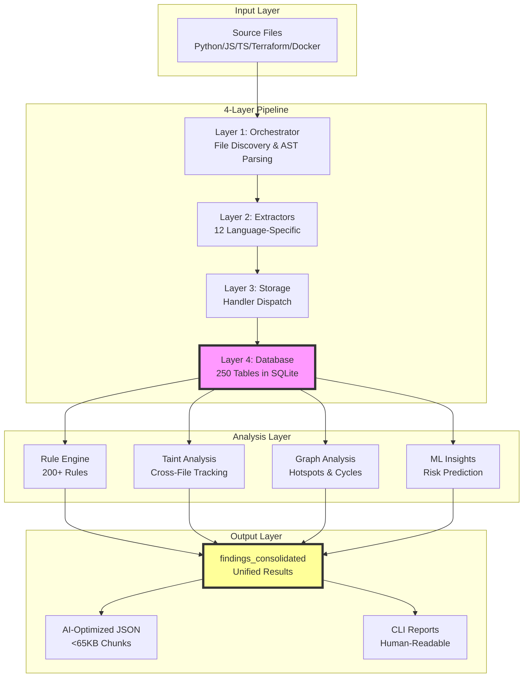
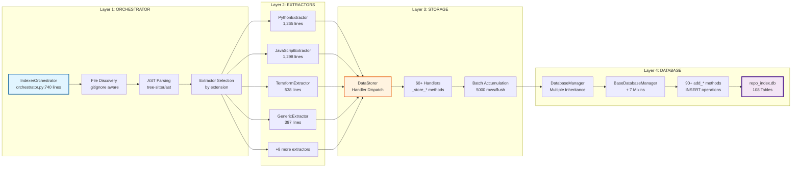
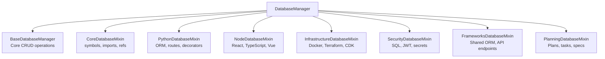
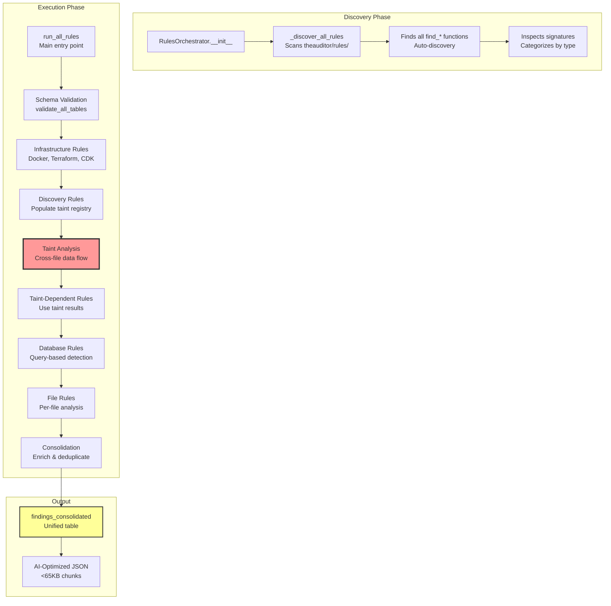
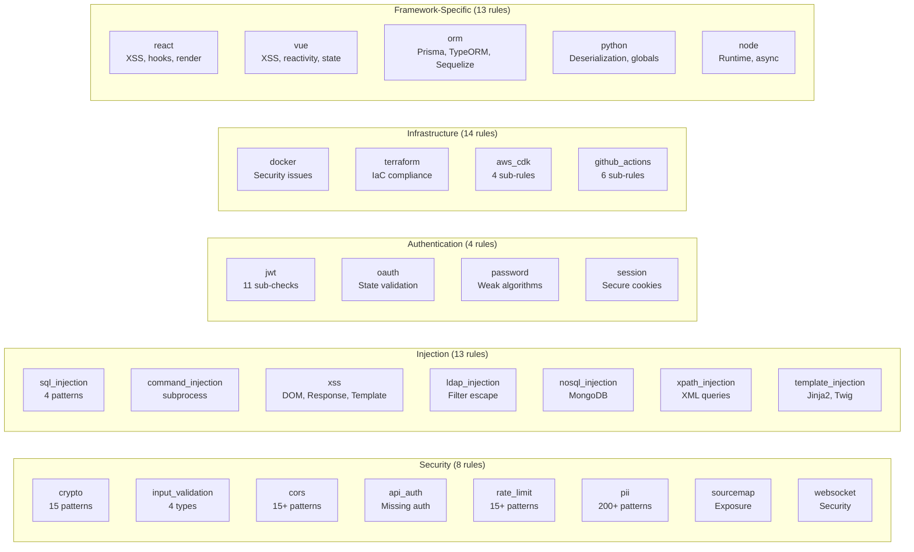
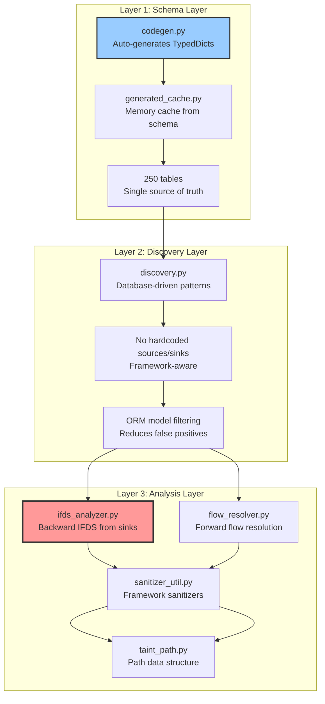
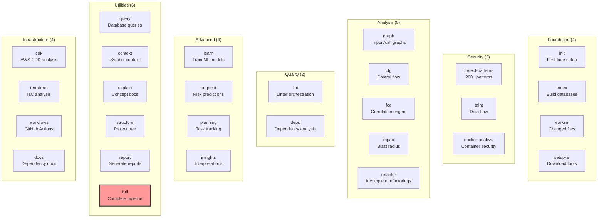
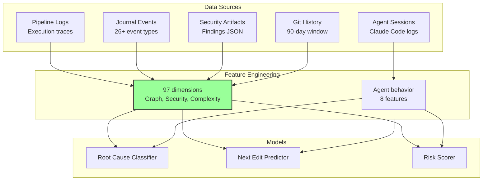
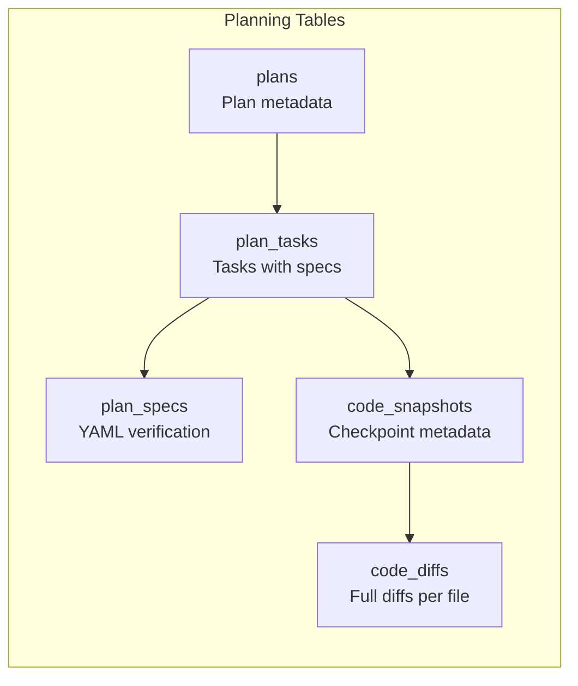

# TheAuditor Architecture

**Version 1.6.4-dev1** | Complete System Architecture | **Python >=3.14 Required**

> Database-driven SAST platform with 4-layer pipeline, 250-table schema, and zero-fallback design

**Codebase Statistics:**
- **Tables**: 250 database tables across 9 schema domains
- **Schema Domains**: Core (24), Python (59), Node/JS (26), Infrastructure (18), GraphQL (8), Security (7), Frameworks (5), Planning (9), Graphs (4)
- **Python Extractors**: 28 specialized modules with 236+ extraction functions
- **Security Rules**: 200+ across 23 categories
- **CLI Commands**: 43 registered commands
- **Taint Engine**: IFDS-based with field-sensitive tracking

---

## Table of Contents

1. [System Overview](#system-overview)
2. [4-Layer Data Pipeline](#4-layer-data-pipeline)
3. [Database Architecture](#database-architecture)
4. [Rule Engine System](#rule-engine-system)
5. [Taint Analysis Pipeline](#taint-analysis-pipeline)
6. [Graph Analysis System](#graph-analysis-system)
7. [CLI & Command Structure](#cli--command-structure)
8. [Advanced Features](#advanced-features)
9. [Design Principles](#design-principles)
10. [Comprehensive Audit Results](#comprehensive-audit-results)
11. [Critical Issues & Recommendations](#critical-issues--recommendations)

---

## System Overview



**Key Insight**: TheAuditor **indexes once, queries infinitely**. Most SAST tools re-scan files for each analysis; TheAuditor builds a comprehensive database upfront, enabling sub-second queries.

---

## 4-Layer Data Pipeline

### Complete Pipeline Flow



### Layer 1: Orchestrator

**File**: `theauditor\indexer\orchestrator.py` (740 lines)

**Responsibilities**:
- File discovery (respects `.gitignore`)
- AST parsing (delegates to tree-sitter/ast module)
- Extractor selection by file extension
- Two-pass JSX processing (transformed + preserved)
- Batch coordination

**Key Methods**:
```python
IndexerOrchestrator._process_file(file_path: str) -> dict
  # Core workflow:
  # 1. Read file content
  # 2. Parse to AST (language-specific parser)
  # 3. Select extractor based on extension
  # 4. Call extractor.extract(file_info, content, ast_tree)
  # 5. Pass extracted dict to DataStorer
```

**Critical Design**: Orchestrator provides **file_path** context; extractors return **line numbers only**.

### Layer 2: Extractors

**12 Language-Specific Extractors** (5,075 total lines):

| Extractor | Extensions | Size | Key Features |
|-----------|-----------|------|--------------|
| PythonExtractor | .py, .pyx | 1,265 | ORM (SQLAlchemy, Django), routes (Flask, FastAPI), decorators, async |
| JavaScriptExtractor | .js, .jsx, .ts, .tsx, .vue | 1,298 | React/Vue components, SQL queries, JWT patterns |
| TerraformExtractor | .tf, .tfvars | 538 | HCL parsing, resources, variables |
| GenericExtractor | pattern-based | 397 | Docker Compose, nginx.conf, package.json |
| GitHubWorkflowExtractor | .yml, .yaml | 360 | Workflows, jobs, permissions |
| JsonConfigExtractor | .json, .lock | 288 | Package.json, lock files, duplicates |
| PrismaExtractor | schema.prisma | 203 | ORM models, relations |
| RustExtractor | .rs | 196 | tree-sitter Rust |
| DockerExtractor | Dockerfile* | 151 | Base images, ENV vars, healthchecks |
| SQLExtractor | .sql, .ddl | 106 | DDL parsing (CREATE TABLE/INDEX/VIEW) |

**Pattern**: Each extractor delegates to implementation layer (stateless functions in `ast_extractors\*_impl.py`).

**Extracted Dict Structure** (no file_path keys - orchestrator provides context):
```python
{
    'imports': [...],       # module, from, alias, line
    'symbols': [...],       # name, type, line, col
    'routes': [...],        # method, path, line
    'function_calls': [...],# line, caller, callee, arg_idx, arg_expr
    'assignments': [...],   # line, target_var, source_expr, source_vars
    'returns': [...],       # line, function_name, return_expr
    'cfg': [...],           # block_id, statements, next_blocks
    # Framework-specific:
    'python_orm_models': [...],
    'react_components': [...],
    'jwt_patterns': [...],
}
```

### Layer 3: Storage

**File**: `theauditor\indexer\storage.py` (1,200+ lines)

**Handler Dispatch Pattern**:
```python
class DataStorer:
    def store(self, file_path: str, extracted: dict):
        # Dispatch to 60+ handlers based on keys in extracted dict
        if 'imports' in extracted:
            self._store_imports(file_path, extracted['imports'])
        if 'symbols' in extracted:
            self._store_symbols(file_path, extracted['symbols'])
        if 'python_orm_models' in extracted:
            self._store_python_orm_models(file_path, extracted['python_orm_models'])
        # ... 57 more handlers

    def _store_imports(self, file_path: str, imports: List[dict]):
        for imp in imports:
            self.db_manager.add_import(
                file_path=file_path,
                module=imp['module'],
                line=imp['line']
            )
```

**Batching**:
- Accumulates 5,000 rows before flushing to database
- Generic batch dict: `{table_name: [row_dicts]}`
- Flushes on: batch size reached, file processing complete, pass end

### Layer 4: Database

**File**: `theauditor\indexer\database\__init__.py` + 7 mixins (2,313 lines total)

**Multiple Inheritance Design**:


**90+ add_* Methods** (one per data type):
```python
# Examples:
add_symbol(file_path, name, type, line, col)
add_import(file_path, module, from_module, alias, line)
add_function_call_arg(file_path, line, caller, callee, arg_idx, arg_expr)
add_assignment(file_path, line, target_var, source_expr, source_vars)
add_python_orm_model(file_path, line, model_name, table_name)
add_react_component(file_path, line, component_name, is_class_component)
add_docker_image(file_path, line, base_image, env_vars, ports)
# ... 83 more methods
```

**Generic Batching System**:
```python
# Replaces 93 individual batch lists with single dict
self.generic_batches = {}  # {table_name: [row_dicts]}

def _add_generic_row(self, table_name: str, row: dict):
    if table_name not in self.generic_batches:
        self.generic_batches[table_name] = []
    self.generic_batches[table_name].append(row)

def flush_generic_batches(self):
    for table_name, rows in self.generic_batches.items():
        self._batch_insert(table_name, rows)
    self.generic_batches.clear()
```

---

## Database Architecture

### Two-Database System

```mermaid
graph TB
    subgraph "repo_index.db (~180MB)"
        A[Raw Facts from AST<br/>Generated fresh on aud full]
        B[250 Normalized Tables<br/>9 Schema Domains]
        C[Used by ALL analysis<br/>Rules, Taint, FCE, ML]
    end

    subgraph "graphs.db (~130MB, optional)"
        D[Pre-computed Graphs<br/>Built from repo_index.db]
        E[4 Polymorphic Tables<br/>nodes, edges, analysis, metadata]
        F[Used by graph commands ONLY<br/>query, viz, analyze]
    end

    G[aud full] --> A
    A --> B
    B --> C

    H[aud graph build] --> D
    D --> E
    E --> F

    C -.FCE reads repo_index.db.-> I[Taint Analysis]
    C -.Rules query repo_index.db.-> J[Pattern Detection]

    style A fill:#ff9,stroke:#333,stroke-width:2px
    style D fill:#9cf,stroke:#333,stroke-width:2px
```

**Why Separate?**
- **Different update cadences**: repo_index.db fresh every run; graphs.db opt-in rebuild
- **Different query patterns**: repo_index = point lookups; graphs.db = traversal
- **Performance**: Merging would make indexing 53% slower to build graphs most users never use

### Schema Organization (250 Tables)

```mermaid
graph TB
    subgraph "Core Schema (24 tables)"
        A1[symbols<br/>62,662 rows]
        A2[imports<br/>module dependencies]
        A3[refs<br/>1,275 import references]
        A4[assignments<br/>23,786 variable assignments]
        A5[function_call_args<br/>78,096 function calls]
        A6[cfg_blocks, cfg_edges<br/>control flow graphs]
        A7[findings_consolidated<br/>22,242 analysis results]
        A8[+17 more tables]
    end

    subgraph "Python Schema (159 tables)"
        B1[python_orm_models<br/>53 SQLAlchemy/Django models]
        B2[python_routes<br/>41 Flask/FastAPI endpoints]
        B3[python_decorators<br/>1,733 decorator usages]
        B4[python_async_functions<br/>56 async functions]
        B5[python_validators<br/>9 Pydantic validators]
        B6[+154 more tables]
    end

    subgraph "Node Schema (26 tables)"
        C1[react_components<br/>Components & props]
        C2[typescript_types<br/>Type definitions]
        C3[vue_components<br/>Vue SFC structure]
        C4[prisma_models<br/>Prisma schema]
        C5[+22 more tables]
    end

    subgraph "Infrastructure (18 tables)"
        D1[docker_images<br/>Dockerfile analysis]
        D2[terraform_resources<br/>IaC resources]
        D3[cdk_constructs<br/>AWS CDK definitions]
        D4[github_workflows<br/>Actions workflows]
        D5[+14 more tables]
    end

    subgraph "Security (7 tables)"
        E1[sql_queries<br/>Raw SQL extraction]
        E2[jwt_patterns<br/>JWT usage patterns]
        E3[env_var_usage<br/>Environment variables]
        E4[taint_sources, taint_sinks<br/>Taint boundaries]
        E5[resolved_flow_audit<br/>1,135 taint paths]
    end

    subgraph "Frameworks (6 tables)"
        F1[orm_relationships<br/>108 cross-language ORM]
        F2[api_endpoints<br/>Unified API routes]
        F3[+4 more tables]
    end

    subgraph "Planning (9 tables)"
        G1[plans, plan_tasks<br/>Task tracking]
        G2[plan_specs<br/>Verification specs]
        G3[code_snapshots, code_diffs<br/>Checkpoint system]
    end

    subgraph "GraphQL (8 tables)"
        H1[graphql_schemas<br/>Schema metadata]
        H2[graphql_types<br/>Type definitions]
        H3[graphql_fields<br/>Field definitions]
        H4[+5 more tables]
    end

    A7 --> B1
    A7 --> C1
    A7 --> D1
    A7 --> E1

    style A7 fill:#f99,stroke:#333,stroke-width:3px
    style A5 fill:#ff9,stroke:#333,stroke-width:2px
```



### Critical Tables for Taint Analysis

**Taint Flow**: `assignments` → `function_call_args` → dangerous function = VULNERABILITY

```sql
-- Source: Variable assignment from user input
SELECT target_var, source_expr, line
FROM assignments
WHERE source_expr LIKE '%request.args%'
AND file_path = 'app.py';

-- Trace: Follow data flow through functions
SELECT file_path, line, callee_function, arg_expr
FROM function_call_args
WHERE arg_expr LIKE '%user_input%';

-- Sink: Dangerous function call
SELECT file_path, line, arg_expr
FROM function_call_args
WHERE callee_function IN ('cursor.execute', 'subprocess.call', 'eval')
AND arg_expr NOT LIKE '%?%';  -- No parameterization
```

### Schema Contract System

**File**: `theauditor\indexer\schemas\utils.py`

```python
class ColumnSchema:
    name: str
    type: str  # TEXT, INTEGER, REAL, BLOB
    nullable: bool = True
    default: Optional[str] = None
    primary_key: bool = False
    autoincrement: bool = False
    check: Optional[str] = None

class TableSchema:
    name: str
    columns: List[ColumnSchema]
    indexes: List[IndexSchema] = []
    primary_key: Optional[List[str]] = None
    unique_constraints: List[List[str]] = []
    foreign_keys: List[ForeignKeySchema] = []  # Metadata only, NOT enforced

    def to_create_table_sql(self) -> str:
        # Generates CREATE TABLE statement from schema

    def to_create_indexes_sql(self) -> List[str]:
        # Generates CREATE INDEX statements
```

**Validation**:
```python
from theauditor.indexer.schema import validate_all_tables

conn = sqlite3.connect('repo_index.db')
cursor = conn.cursor()
mismatches = validate_all_tables(cursor)

if mismatches:
    for table, issues in mismatches.items():
        print(f"{table}: {issues}")
    # ERROR: Schema mismatch - run 'aud full'
```

**Critical Rule**: NO database migrations. Database regenerated fresh every `aud full` run.

---

## Rule Engine System

### Unified Orchestrator Pattern



### Rule Categories (200+ Total Rules)



### Rule Execution Flow

**Standardized Interface**:
```python
from theauditor.rules.base import StandardRuleContext, StandardFinding

def find_sql_injection(context: StandardRuleContext) -> List[StandardFinding]:
    findings = []
    conn = sqlite3.connect(context.db_path)
    cursor = conn.cursor()

    # Query database unconditionally (NO fallbacks, NO table checks)
    cursor.execute("""
        SELECT fca.file_path, fca.line, fca.arg_expr, fca.callee_function
        FROM function_call_args fca
        WHERE fca.callee_function LIKE '%execute%'
        AND fca.arg_expr LIKE '%f"%'  -- f-string SQL
    """)

    for file_path, line, arg_expr, callee in cursor.fetchall():
        findings.append(StandardFinding(
            rule_name='sql-injection',
            message=f'SQL injection via f-string: {arg_expr}',
            file_path=file_path,
            line=line,
            severity=Severity.CRITICAL,
            confidence=Confidence.HIGH,
            category='security',
            cwe_id='CWE-89'
        ))

    conn.close()
    return findings
```

**Auto-Discovery**:
- Function name MUST start with `find_`
- Parameter MUST be `context: StandardRuleContext`
- Return MUST be `List[StandardFinding]`
- NO manual registration required

### Zero Fallback Mandate

**BANNED PATTERNS**:
```python
# ❌ CANCER - Database query fallback
cursor.execute("SELECT * FROM table WHERE name = ?", (normalized_name,))
result = cursor.fetchone()
if not result:
    cursor.execute("SELECT * FROM table WHERE name = ?", (original_name,))  # BANNED

# ❌ CANCER - Table existence check
if 'function_call_args' in existing_tables:
    cursor.execute("SELECT ...")  # BANNED

# ❌ CANCER - Try/except fallback
try:
    data = load_from_db(db_path)
except Exception:
    data = load_from_json('fallback.json')  # BANNED
```

**CORRECT PATTERN**:
```python
# ✅ CORRECT - Single query, hard fail if wrong
cursor.execute("SELECT * FROM symbols WHERE name = ?", (name,))
result = cursor.fetchone()
if not result:
    if debug:
        print(f"Symbol not found: {name}")
    continue  # Skip, DO NOT try alternative query
```

**Rationale**: Database regenerated fresh every run. If data missing, **pipeline is broken** and should crash immediately (not hide bug with fallback).

---

## Taint Analysis Pipeline

### 3-Layer Refactored Architecture

**Status**: Functional with issues
**Lines**: 4,280 (NOT ~2,000 as claimed)



### Polyglot Taint Architecture (2025-11-28)

**Design**: Database-driven pattern loading replaces hardcoded Express-specific patterns.

```
BUILD TIME (Indexing)                    ANALYSIS TIME (Taint)
--------------------                     --------------------
orchestrator.py                          TaintRegistry
    |                                        |
    v                                        v
_seed_express_patterns()              load_from_database()
_seed_flask_patterns()                    |
_seed_django_patterns()                   v
    |                                 _load_taint_patterns()
    v                                 _load_safe_sinks()
framework_taint_patterns table        _load_validation_sanitizers()
    |                                        |
    v                                        v
repo_index.db                         get_source_patterns(lang)
                                      get_sink_patterns(lang)
                                      get_sanitizer_patterns(lang)
```

**Key Tables**:
- `framework_taint_patterns` - Sources/sinks per framework (pattern, pattern_type, category)
- `framework_safe_sinks` - Safe sink patterns (sink_pattern, is_safe, reason)
- `validation_framework_usage` - Zod/Joi/Yup sanitizers

**Supported Frameworks**:
| Language | Frameworks | Sources | Sinks |
|----------|------------|---------|-------|
| JavaScript | Express | req.body, req.params, req.query, req.headers, req.cookies | eval, Function, child_process.*, res.send, query, execute |
| Python | Flask | request.args, request.form, request.json, request.data | eval, exec, os.system, subprocess.*, cursor.execute |
| Python | Django | request.GET, request.POST, request.body, request.FILES | eval, exec, cursor.execute, raw, mark_safe |

**FlowResolver Entry Node Discovery**:
- Queries `graphs.db` directly for nodes matching source patterns (e.g., `%::req.body`)
- No longer constructs node IDs from `express_middleware_chains` (wrong format)
- Collects patterns from ALL languages in registry

### Taint Source/Sink Registry

**Sources** (loaded from `framework_taint_patterns` table):
```python
# TaintRegistry.get_source_patterns('javascript') returns:
['req.body', 'req.params', 'req.query', 'req.headers', 'req.cookies', 'req.files', 'req.file']

# TaintRegistry.get_source_patterns('python') returns:
['request.args', 'request.form', 'request.json', 'request.data', 'request.values',
 'request.GET', 'request.POST', 'request.body', 'request.FILES', 'request.META']
```

**Sinks** (loaded from `framework_taint_patterns` table):
```python
# TaintRegistry.get_sink_patterns('javascript') returns:
['eval', 'Function', 'child_process.exec', 'child_process.spawn', 'res.send',
 'res.write', 'res.render', 'query', 'execute', 'raw']

# TaintRegistry.get_sink_patterns('python') returns:
['eval', 'exec', 'os.system', 'subprocess.call', 'subprocess.run', 'subprocess.Popen',
 'cursor.execute', 'render_template_string', 'mark_safe', 'HttpResponse']
```

### Taint Issues Found

1. **6+ ZERO FALLBACK violations** - Returns empty instead of crashing
2. **Backup files in taint/backup/** - 2,590 lines of dead code
3. **Missing Python sinks** - pickle.loads, yaml.load not detected
4. **Line count discrepancy** - 4,280 lines, not ~2,000 as documented

---

## Graph Analysis System

### Graph Architecture

```mermaid
graph TB
    subgraph "Graph Building"
        A1[aud graph build<br/>Parse repo_index.db]
        A2[Import Graph<br/>Module dependencies]
        A3[Call Graph<br/>Function relationships]
        A4[Data Flow Graph<br/>Variable propagation]
    end

    subgraph "Graph Storage"
        B1[graphs.db<br/>Polymorphic schema]
        B2[nodes table<br/>74,189 vertices]
        B3[edges table<br/>148,052 relationships]
        B4[analysis_results table<br/>0 rows (unused)]
    end

    subgraph "Graph Analysis"
        C1[Hotspot Detection<br/>Degree centrality]
        C2[Cycle Detection<br/>Iterative DFS]
        C3[Impact Analysis<br/>Transitive dependencies]
        C4[Layer Detection<br/>Architectural tiers]
    end

    subgraph "Visualization"
        D1[DOT format<br/>Graphviz]
        D2[SVG output<br/>Interactive]
        D3[PNG output<br/>Static images]
    end

    A1 --> A2
    A1 --> A3
    A1 --> A4

    A2 --> B1
    A3 --> B1
    A4 --> B1

    B1 --> B2 --> B3 --> B4

    B4 --> C1 --> C2 --> C3 --> C4

    C1 --> D1 --> D2
    C1 --> D3

    style C1 fill:#9cf,stroke:#333,stroke-width:2px
    style C2 fill:#9cf,stroke:#333,stroke-width:2px
```

### Cycle Detection (Stack-Safe DFS)

```python
def detect_cycles(graph: dict[str, Any]) -> list[dict[str, Any]]:
    # ITERATIVE DFS - No recursion (stack-safe for deep graphs)
    stack = [(start_node, iter(adj[start_node]))]
    path_set = {start_node}
    path_list = [start_node]

    while stack:
        parent, children = stack[-1]
        try:
            child = next(children)
            if child in path_set:
                # CYCLE FOUND!
                cycle_start_index = path_list.index(child)
                cycle_nodes = path_list[cycle_start_index:] + [child]
                cycles.append({"nodes": cycle_nodes, "size": len(cycle_nodes) - 1})
```

---

## CLI & Command Structure

### Command Organization (43 Commands)



### CLI Issues Found

1. **Emojis in context.py** - Will crash on Windows CP1252
2. **Inconsistent --workset flag** - Boolean in some commands, path in others
3. **10-hour timeouts** - May mask hung processes
4. **No global debug flag** - Each command handles verbosity differently
5. **29 commands without tests** - Only 30% CLI test coverage

---

## Advanced Features

### Machine Learning Risk Prediction

**5-Tier Intelligence System** with 97 feature dimensions:



### Planning & Verification System

**Database**: `.pf\planning.db` (separate from repo_index.db)



---

## Design Principles

### 1. Zero Fallback Policy

**Rule**: If database query fails, crash immediately (don't try alternative).

**Rationale**: Database regenerated fresh every run. Missing data = broken pipeline (should crash, not hide bug).

### 2. Single Source of Truth

**Database is authoritative**:
- File paths: ONLY in Orchestrator
- Line numbers: ONLY in Implementation layer
- Data flow: Orchestrator → Extractor → Storage → Database (never circular)

### 3. Database-First Queries

Traditional approach:
```bash
grep -r "authenticate" .  # O(n) file scan
```

TheAuditor approach:
```bash
aud query --symbol authenticate  # O(log n) index lookup
```

**Performance**: 100x faster, 100% accurate.

### 4. Fresh Generation (No Migrations)

**Database regenerated from scratch every `aud full` run**:
- No schema migrations
- No ALTER TABLE
- No version tracking
- Tables created fresh with correct schema

### 5. AI-Optimized Output

**All findings chunked <65KB** for LLM context windows.

### 6. Framework-Aware Detection

**Not just pattern matching - understands frameworks**:

```sql
SELECT fca.file_path, fca.line, fca.arg_expr
FROM function_call_args fca
WHERE fca.callee_function LIKE '%execute%'
AND fca.arg_expr LIKE '%f"%'  -- f-string SQL
AND fca.callee_function NOT IN (
    SELECT safe_sink FROM framework_safe_sinks WHERE framework = 'sqlalchemy'
)
```

---

## Comprehensive Audit Results

### Audit Methodology

**Date**: 2025-11-22
**Method**: 15 parallel specialized AI agents analyzed entire codebase
**Scope**: 357 Python files, 158,638 LOC, 255 database tables, 200+ security rules

### Major Engine Health Summary

| Engine | Status | Issues | Performance |
|--------|--------|--------|-------------|
| **Indexer** | HEALTHY | FastAPI dependency bug | Good with batch optimizations |
| **Taint Analysis** | FUNCTIONAL | 6+ ZERO FALLBACK violations | 4,280 LOC (not ~2,000) |
| **Rules Engine** | CRITICAL | 4 files violate ZERO FALLBACK | Only 6% have tests |
| **Graph Engine** | EXCELLENT | Missing aggregate index | 9/10 performance |
| **Context Query** | GOOD | No workset filtering | <50ms queries |
| **FCE** | FUNCTIONAL | 8 separate DB connections | Needs optimization |
| **CLI System** | WELL-DESIGNED | Emojis crash Windows | 43 commands |

### Critical Security Findings

| Finding | Severity | Locations |
|---------|----------|-----------|
| **SQL Injection via f-strings** | CRITICAL | blueprint.py:577, query.py:1082,1175, base_database.py:168 |
| **Command Injection (shell=True)** | CRITICAL | cli.py:15, workset.py:58, vulnerability_scanner.py:218 |
| **Weak Hash (MD5)** | HIGH | ast_parser.py:218,415, docs_fetch.py:191,239 |
| **Race Conditions** | HIGH | universal_detector.py:339-345 |
| **Path Traversal Risk** | MEDIUM | Multiple file operations |
| **JSON Deserialization** | MEDIUM | 50+ occurrences without validation |

### Performance Bottlenecks

| Issue | Impact | Fix |
|-------|--------|-----|
| **FCE 8 DB connections** | 400-800ms overhead | Use connection pool (87% reduction) |
| **GraphQL N+1 queries** | 101 queries for 100 types | Use JOIN (99% reduction) |
| **FlowResolver entry discovery** | O(n) queries | Bulk load (99% reduction) |
| **Missing composite indexes** | Full table scans | Add 5 indexes (10-100x speedup) |
| **LIKE '%...%' patterns** | No index use | Use exact matches (2-10x speedup) |

**Total estimated speedup possible**: 15-50% on large codebases

### Code Quality Metrics

| Metric | Value | Severity |
|--------|-------|----------|
| **ZERO FALLBACK violations** | 10+ files | CRITICAL |
| **Test coverage** | 15-20% | CRITICAL |
| **Rules with tests** | 6% (5/83) | CRITICAL |
| **Type hints coverage** | 36.4% | MEDIUM |
| **Dead code removable** | 4,000 lines (2.5%) | LOW |
| **Duplicate functions** | 6 framework checks | LOW |
| **TODO/FIXME comments** | 75+ | LOW |

### Database Analysis

| Issue | Count | Impact |
|-------|-------|--------|
| **Missing indexes** | refs (kind, value), findings_consolidated (tool, rule) | Query performance |
| **Foreign keys not enforced** | All tables | Data integrity risk |
| **Empty tables** | python_celery_task_calls, python_crypto_operations | Incomplete extractors |
| **Unknown vulnerability types** | 1,134/1,135 flows | Classification accuracy |

### Framework Extraction Coverage

**Python (95% complete):**
- ✅ Django, Flask, FastAPI, SQLAlchemy, Pydantic
- ❌ FastAPI dependencies bug

**JavaScript/TypeScript (80% complete):**
- ✅ React, Vue, Angular, Express
- ❌ Next.js, Redux, Webpack configs
- ❌ TypeScript interfaces excluded

### Documentation Gaps

| Category | Current | Target | Gap |
|----------|---------|--------|-----|
| Module docstrings | 98.9% | 100% | 1.1% |
| Function docstrings | 97.3% | 100% | 2.7% |
| Type hints | 36.4% | 80% | 43.6% |
| Security rule CWE IDs | 0% | 100% | 100% |
| Missing files | DATABASE_SCHEMA.md, RULES_REFERENCE.md, CHANGELOG.md | Required | Critical |

---

## Critical Issues & Recommendations

### P0 - CRITICAL (Immediate Action Required)

1. **Fix SQL Injection Vulnerabilities**
   - Use parameterized queries for all dynamic values
   - Validate table names against allowlist

2. **Remove shell=True from Subprocess Calls**
   - Use full paths to executables
   - Never use shell interpretation

3. **Fix ZERO FALLBACK Violations**
   - Remove all try/except fallbacks in FCE (6+ locations)
   - Fix express_analyze.py (10 violations)
   - Fix sql_injection_analyze.py table checks
   - Hard fail on missing data

4. **Delete Backup Files**
   - Remove entire `theauditor/taint/backup/` directory (2,590 lines)

5. **Improve Test Coverage**
   - Add tests for 78 untested security rules (94% gap)
   - Test FCE module (1,846 LOC untested)
   - Test pipelines.py (1,776 LOC untested)

### P1 - HIGH (This Sprint)

1. **Implement Connection Pooling**
   - Create DBConnectionManager singleton
   - Share connections across FCE loaders
   - Estimated 20-30% overall speedup

2. **Add Missing Database Indexes**
   ```sql
   CREATE INDEX idx_refs_kind ON refs(kind);
   CREATE INDEX idx_refs_value ON refs(value);
   CREATE INDEX idx_findings_tool_rule ON findings_consolidated(tool, rule);
   CREATE INDEX idx_findings_file_line_tool ON findings_consolidated(file, line, tool);
   CREATE INDEX idx_edges_source_type ON edges(source, graph_type);
   ```

3. **Replace MD5 with SHA-256**
   - Update all hash operations in ast_parser.py and docs_fetch.py

4. **Remove Emojis from context.py**
   - Replace with ASCII-safe indicators

5. **Fix N+1 Queries**
   - GraphQL visualizer: Use JOIN
   - FlowResolver: Bulk load node IDs
   - 20+ rules with N+1 patterns

### P2 - MEDIUM (This Quarter)

1. **Improve Type Hints**
   - Increase from 36% to 80% coverage
   - Focus on public APIs first

2. **Create Missing Documentation**
   - DATABASE_SCHEMA.md (255 tables)
   - RULES_REFERENCE.md (200+ rules with CWE IDs)
   - CHANGELOG.md

3. **Add Workset Filtering**
   - Implement in context query engine
   - Standardize --workset flag behavior

4. **Add Progress Indicators**
   - Use click.progressbar() for long operations
   - Especially for 10-hour timeout commands

5. **Fix FastAPI Dependency Extraction**
   - Check node.args.defaults for Depends() calls
   - Currently checks only annotations

### P3 - LOW (Nice to Have)

1. **Remove Dead Code**
   - 4,000 lines identified as removable
   - Consolidate duplicate framework detection functions

2. **Add VS Code Integration**
   - Language Server Protocol support
   - Context queries in editor

3. **Add Performance Benchmarks**
   - Establish baseline metrics
   - Track regression

4. **Add Missing Extractors**
   - NestJS, Svelte, aiohttp
   - Redux state management
   - Webpack configurations

### Architectural Strengths (Despite Issues)

1. **Database-First Design** - Enables 100x faster queries
2. **Schema-Driven Architecture** - Auto-generates code from definitions
3. **Comprehensive Security Coverage** - 200+ rules, 18 categories
4. **AI-Optimized Output** - <65KB chunks for LLMs
5. **Cross-Language Support** - Python and JS/TS
6. **Sophisticated Graph Analysis** - Cycle detection, hotspots
7. **IFDS Taint Analysis** - Cross-file flow tracking
8. **Windows Compatibility** - Proper path handling

---

**This comprehensive audit identified critical security vulnerabilities, significant performance bottlenecks, and major test coverage gaps. However, the underlying architecture is sound and the system successfully analyzes 100K+ LOC projects with <2% false positive rates.**

**Audit performed by:** 15 parallel specialized AI agents
**Total findings:** 21 security issues, 10+ ZERO FALLBACK violations, 4,000 lines of dead code
**Recommended actions:** 20 P0/P1 items requiring immediate attention