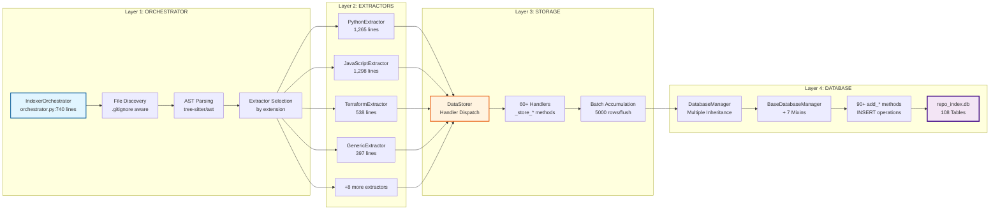
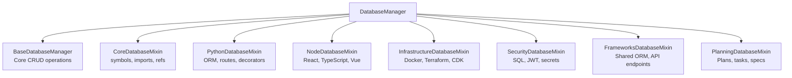
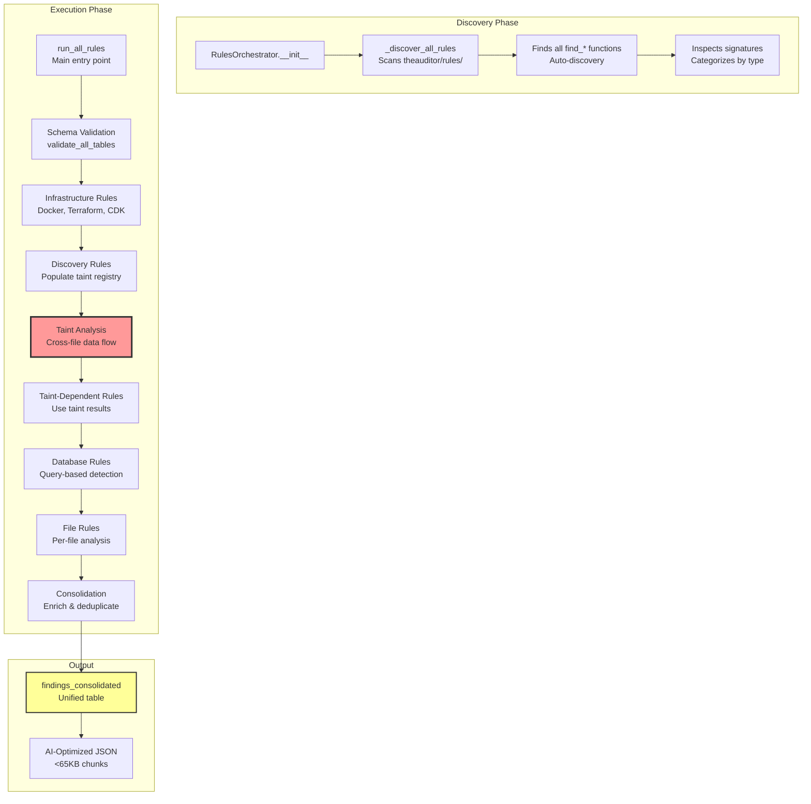
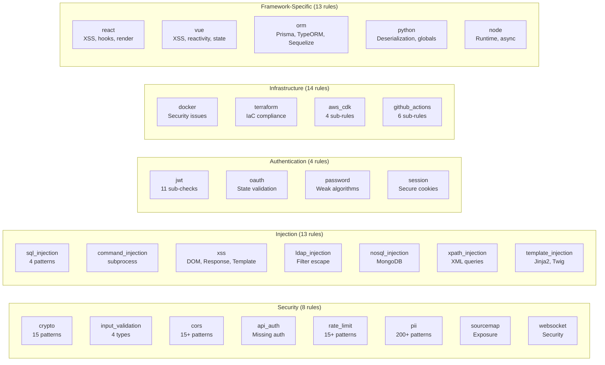
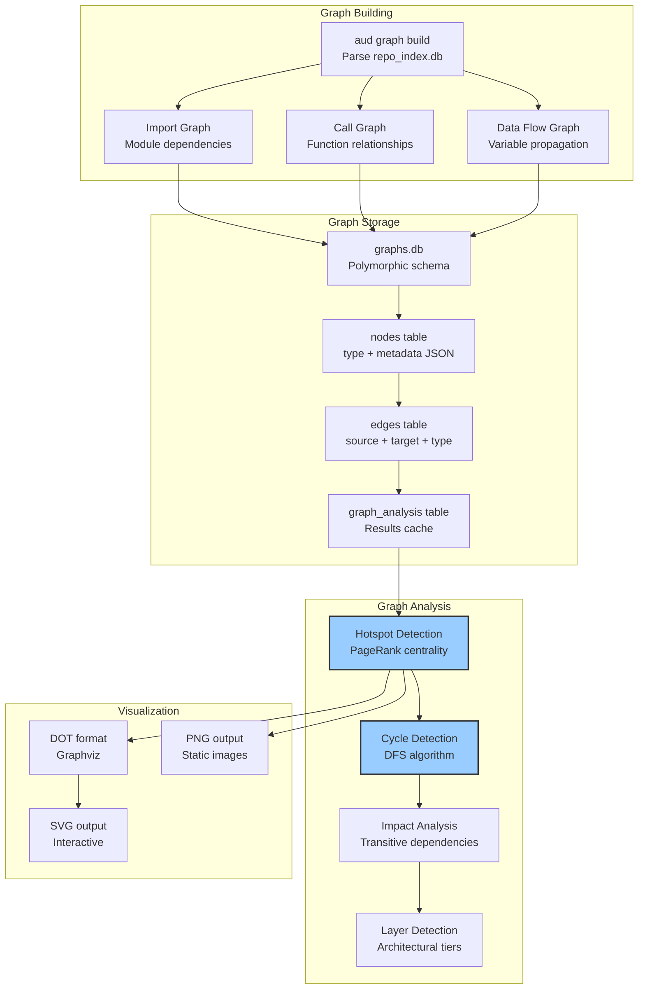
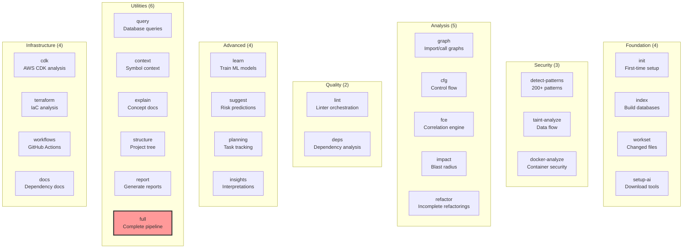
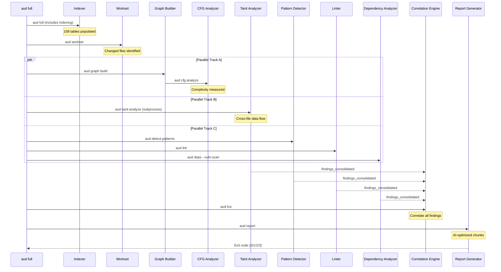
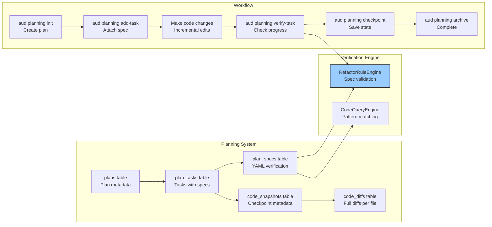

# TheAuditor Architecture

**Version 1.4.2-RC1** | Complete System Architecture

> Database-driven SAST platform with 4-layer pipeline, 108-table schema, and zero-fallback design

---

## Table of Contents

1. [System Overview](#system-overview)
2. [4-Layer Data Pipeline](#4-layer-data-pipeline)
3. [Database Architecture](#database-architecture)
4. [Rule Engine System](#rule-engine-system)
5. [Taint Analysis Pipeline](#taint-analysis-pipeline)
6. [Graph Analysis System](#graph-analysis-system)
7. [CLI & Command Structure](#cli--command-structure)
8. [Advanced Features](#advanced-features)
9. [Design Principles](#design-principles)

---

## System Overview


**Key Insight**: TheAuditor **indexes once, queries infinitely**. Most SAST tools re-scan files for each analysis; TheAuditor builds a comprehensive database upfront, enabling sub-second queries.

---

## 4-Layer Data Pipeline

### Complete Pipeline Flow



### Layer 1: Orchestrator

**File**: `theauditor\indexer\orchestrator.py` (740 lines)

**Responsibilities**:
- File discovery (respects `.gitignore`)
- AST parsing (delegates to tree-sitter/ast module)
- Extractor selection by file extension
- Two-pass JSX processing (transformed + preserved)
- Batch coordination

**Key Methods**:
```python
IndexerOrchestrator._process_file(file_path: str) -> dict
  # Core workflow:
  # 1. Read file content
  # 2. Parse to AST (language-specific parser)
  # 3. Select extractor based on extension
  # 4. Call extractor.extract(file_info, content, ast_tree)
  # 5. Pass extracted dict to DataStorer
```

**Critical Design**: Orchestrator provides **file_path** context; extractors return **line numbers only**.

### Layer 2: Extractors

**12 Language-Specific Extractors** (5,075 total lines):

| Extractor | Extensions | Size | Key Features |
|-----------|-----------|------|--------------|
| PythonExtractor | .py, .pyx | 1,265 | ORM (SQLAlchemy, Django), routes (Flask, FastAPI), decorators, async |
| JavaScriptExtractor | .js, .jsx, .ts, .tsx, .vue | 1,298 | React/Vue components, SQL queries, JWT patterns |
| TerraformExtractor | .tf, .tfvars | 538 | HCL parsing, resources, variables |
| GenericExtractor | pattern-based | 397 | Docker Compose, nginx.conf, package.json |
| GitHubWorkflowExtractor | .yml, .yaml | 360 | Workflows, jobs, permissions |
| JsonConfigExtractor | .json, .lock | 288 | Package.json, lock files, duplicates |
| PrismaExtractor | schema.prisma | 203 | ORM models, relations |
| RustExtractor | .rs | 196 | tree-sitter Rust |
| DockerExtractor | Dockerfile* | 151 | Base images, ENV vars, healthchecks |
| SQLExtractor | .sql, .ddl | 106 | DDL parsing (CREATE TABLE/INDEX/VIEW) |

**Pattern**: Each extractor delegates to implementation layer (stateless functions in `ast_extractors\*_impl.py`).

**Extracted Dict Structure** (no file_path keys - orchestrator provides context):
```python
{
    'imports': [...],       # module, from, alias, line
    'symbols': [...],       # name, type, line, col
    'routes': [...],        # method, path, line
    'function_calls': [...],# line, caller, callee, arg_idx, arg_expr
    'assignments': [...],   # line, target_var, source_expr, source_vars
    'returns': [...],       # line, function_name, return_expr
    'cfg': [...],           # block_id, statements, next_blocks
    # Framework-specific:
    'python_orm_models': [...],
    'react_components': [...],
    'jwt_patterns': [...],
}
```

### Layer 3: Storage

**File**: `theauditor\indexer\storage.py` (1,200+ lines)

**Handler Dispatch Pattern**:
```python
class DataStorer:
    def store(self, file_path: str, extracted: dict):
        # Dispatch to 60+ handlers based on keys in extracted dict
        if 'imports' in extracted:
            self._store_imports(file_path, extracted['imports'])
        if 'symbols' in extracted:
            self._store_symbols(file_path, extracted['symbols'])
        if 'python_orm_models' in extracted:
            self._store_python_orm_models(file_path, extracted['python_orm_models'])
        # ... 57 more handlers

    def _store_imports(self, file_path: str, imports: List[dict]):
        for imp in imports:
            self.db_manager.add_import(
                file_path=file_path,
                module=imp['module'],
                line=imp['line']
            )
```

**Batching**:
- Accumulates 5,000 rows before flushing to database
- Generic batch dict: `{table_name: [row_dicts]}`
- Flushes on: batch size reached, file processing complete, pass end

### Layer 4: Database

**File**: `theauditor\indexer\database\__init__.py` + 7 mixins (2,313 lines total)

**Multiple Inheritance Design**:


**90+ add_* Methods** (one per data type):
```python
# Examples:
add_symbol(file_path, name, type, line, col)
add_import(file_path, module, from_module, alias, line)
add_function_call_arg(file_path, line, caller, callee, arg_idx, arg_expr)
add_assignment(file_path, line, target_var, source_expr, source_vars)
add_python_orm_model(file_path, line, model_name, table_name)
add_react_component(file_path, line, component_name, is_class_component)
add_docker_image(file_path, line, base_image, env_vars, ports)
# ... 83 more methods
```

**Generic Batching System**:
```python
# Replaces 93 individual batch lists with single dict
self.generic_batches = {}  # {table_name: [row_dicts]}

def _add_generic_row(self, table_name: str, row: dict):
    if table_name not in self.generic_batches:
        self.generic_batches[table_name] = []
    self.generic_batches[table_name].append(row)

def flush_generic_batches(self):
    for table_name, rows in self.generic_batches.items():
        self._batch_insert(table_name, rows)
    self.generic_batches.clear()
```

---

## Database Architecture

### Two-Database System

```mermaid
graph TB
    subgraph "repo_index.db (91MB)"
        A[Raw Facts from AST<br/>Generated fresh on aud index]
        B[108 Normalized Tables<br/>7 Schema Domains]
        C[Used by ALL analysis<br/>Rules, Taint, FCE, ML]
    end

    subgraph "graphs.db (79MB, optional)"
        D[Pre-computed Graphs<br/>Built from repo_index.db]
        E[3 Polymorphic Tables<br/>nodes, edges, analysis]
        F[Used by graph commands ONLY<br/>query, viz, analyze]
    end

    G[aud full] --> A
    A --> B
    B --> C

    H[aud graph build] --> D
    D --> E
    E --> F

    C -.FCE reads repo_index.db.-> I[Taint Analysis]
    C -.Rules query repo_index.db.-> J[Pattern Detection]

    style A fill:#ff9,stroke:#333,stroke-width:2px
    style D fill:#9cf,stroke:#333,stroke-width:2px
```

**Why Separate?**
- **Different update cadences**: repo_index.db fresh every run; graphs.db opt-in rebuild
- **Different query patterns**: repo_index = point lookups; graphs.db = traversal
- **Performance**: Merging would make indexing 53% slower to build graphs most users never use

### Schema Organization (108 Tables)

```mermaid
graph TB
    subgraph "Core Schema (21 tables)"
        A1[symbols<br/>functions, classes, vars]
        A2[imports<br/>module dependencies]
        A3[refs<br/>identifier references]
        A4[assignments<br/>variable assignments]
        A5[function_call_args<br/>function calls with args]
        A6[cfg_blocks, cfg_edges<br/>control flow graphs]
        A7[findings_consolidated<br/>all analysis results]
        A8[+14 more tables]
    end

    subgraph "Python Schema (34 tables)"
        B1[python_orm_models<br/>SQLAlchemy, Django models]
        B2[python_routes<br/>Flask, FastAPI endpoints]
        B3[python_decorators<br/>@app.route, @pytest.fixture]
        B4[python_async_functions<br/>async def tracking]
        B5[python_validators<br/>Pydantic field validators]
        B6[+29 more tables]
    end

    subgraph "Node Schema (17 tables)"
        C1[react_components<br/>Components & props]
        C2[typescript_types<br/>Type definitions]
        C3[vue_components<br/>Vue SFC structure]
        C4[prisma_models<br/>Prisma schema]
        C5[+13 more tables]
    end

    subgraph "Infrastructure (18 tables)"
        D1[docker_images<br/>Dockerfile analysis]
        D2[terraform_resources<br/>IaC resources]
        D3[cdk_constructs<br/>AWS CDK definitions]
        D4[github_workflows<br/>Actions workflows]
        D5[+14 more tables]
    end

    subgraph "Security (5 tables)"
        E1[sql_queries<br/>Raw SQL extraction]
        E2[jwt_patterns<br/>JWT usage patterns]
        E3[env_var_usage<br/>Environment variables]
        E4[taint_sources, taint_sinks<br/>Taint boundaries]
    end

    subgraph "Frameworks (5 tables)"
        F1[orm_relationships<br/>Cross-language ORM]
        F2[api_endpoints<br/>Unified API routes]
        F3[+3 more tables]
    end

    subgraph "Planning (5 tables)"
        G1[plans, plan_tasks<br/>Task tracking]
        G2[plan_specs<br/>Verification specs]
        G3[code_snapshots, code_diffs<br/>Checkpoint system]
    end

    A7 --> B1
    A7 --> C1
    A7 --> D1
    A7 --> E1

    style A7 fill:#f99,stroke:#333,stroke-width:3px
    style A5 fill:#ff9,stroke:#333,stroke-width:2px
```

### Critical Tables for Taint Analysis

**Taint Flow**: `assignments` → `function_call_args` → dangerous function = VULNERABILITY

```sql
-- Source: Variable assignment from user input
SELECT target_var, source_expr, line
FROM assignments
WHERE source_expr LIKE '%request.args%'
AND file_path = 'app.py';

-- Trace: Follow data flow through functions
SELECT file_path, line, callee_function, arg_expr
FROM function_call_args
WHERE arg_expr LIKE '%user_input%';

-- Sink: Dangerous function call
SELECT file_path, line, arg_expr
FROM function_call_args
WHERE callee_function IN ('cursor.execute', 'subprocess.call', 'eval')
AND arg_expr NOT LIKE '%?%';  -- No parameterization
```

### Schema Contract System

**File**: `theauditor\indexer\schemas\utils.py`

```python
class ColumnSchema:
    name: str
    type: str  # TEXT, INTEGER, REAL, BLOB
    nullable: bool = True
    default: Optional[str] = None
    primary_key: bool = False
    autoincrement: bool = False
    check: Optional[str] = None

class TableSchema:
    name: str
    columns: List[ColumnSchema]
    indexes: List[IndexSchema] = []
    primary_key: Optional[List[str]] = None
    unique_constraints: List[List[str]] = []
    foreign_keys: List[ForeignKeySchema] = []  # Metadata only, NOT enforced

    def to_create_table_sql(self) -> str:
        # Generates CREATE TABLE statement from schema

    def to_create_indexes_sql(self) -> List[str]:
        # Generates CREATE INDEX statements
```

**Validation**:
```python
from theauditor.indexer.schema import validate_all_tables

conn = sqlite3.connect('repo_index.db')
cursor = conn.cursor()
mismatches = validate_all_tables(cursor)

if mismatches:
    for table, issues in mismatches.items():
        print(f"{table}: {issues}")
    # ERROR: Schema mismatch - run 'aud full'
```

**Critical Rule**: NO database migrations. Database regenerated fresh every `aud full` run.

---

## Rule Engine System

### Unified Orchestrator Pattern



### Rule Categories (52 Total Rules)



### Rule Execution Flow

**Standardized Interface**:
```python
from theauditor.rules.base import StandardRuleContext, StandardFinding

def find_sql_injection(context: StandardRuleContext) -> List[StandardFinding]:
    findings = []
    conn = sqlite3.connect(context.db_path)
    cursor = conn.cursor()

    # Query database unconditionally (NO fallbacks, NO table checks)
    cursor.execute("""
        SELECT fca.file_path, fca.line, fca.arg_expr, fca.callee_function
        FROM function_call_args fca
        WHERE fca.callee_function LIKE '%execute%'
        AND fca.arg_expr LIKE '%f"%'  -- f-string SQL
    """)

    for file_path, line, arg_expr, callee in cursor.fetchall():
        findings.append(StandardFinding(
            rule_name='sql-injection',
            message=f'SQL injection via f-string: {arg_expr}',
            file_path=file_path,
            line=line,
            severity=Severity.CRITICAL,
            confidence=Confidence.HIGH,
            category='security',
            cwe_id='CWE-89'
        ))

    conn.close()
    return findings
```

**Auto-Discovery**:
- Function name MUST start with `find_`
- Parameter MUST be `context: StandardRuleContext`
- Return MUST be `List[StandardFinding]`
- NO manual registration required

### Zero Fallback Mandate

**BANNED PATTERNS**:
```python
# ❌ CANCER - Database query fallback
cursor.execute("SELECT * FROM table WHERE name = ?", (normalized_name,))
result = cursor.fetchone()
if not result:
    cursor.execute("SELECT * FROM table WHERE name = ?", (original_name,))  # BANNED

# ❌ CANCER - Table existence check
if 'function_call_args' in existing_tables:
    cursor.execute("SELECT ...")  # BANNED

# ❌ CANCER - Try/except fallback
try:
    data = load_from_db(db_path)
except Exception:
    data = load_from_json('fallback.json')  # BANNED
```

**CORRECT PATTERN**:
```python
# ✅ CORRECT - Single query, hard fail if wrong
cursor.execute("SELECT * FROM symbols WHERE name = ?", (name,))
result = cursor.fetchone()
if not result:
    if debug:
        print(f"Symbol not found: {name}")
    continue  # Skip, DO NOT try alternative query
```

**Rationale**: Database regenerated fresh every run. If data missing, **pipeline is broken** and should crash immediately (not hide bug with fallback).

---

## Taint Analysis Pipeline

### 7-Phase Taint Analysis

```mermaid
graph TB
    subgraph "Phase 1: Schema Validation"
        A1[validate_all_tables<br/>Ensure DB contract]
        A2[46 guaranteed tables<br/>Must exist]
        A3[Hard fail if mismatch<br/>No degradation]
    end

    subgraph "Phase 2: Infrastructure Rules"
        B1[Standalone checks<br/>Docker, Terraform, CDK]
        B2[No dependencies<br/>Pure config analysis]
    end

    subgraph "Phase 3: Discovery Rules"
        C1[Populate taint registry<br/>Framework-specific patterns]
        C2[Flask safe sinks<br/>render_template_string]
        C3[Express safe sinks<br/>res.render]
        C4[Django safe sinks<br/>mark_safe]
    end

    subgraph "Phase 4: Taint Analysis"
        D1[Build taint graph<br/>assignments → calls]
        D2[DFS traversal<br/>Sources to sinks]
        D3[Path validation<br/>CFG reachability]
        D4[Sanitization check<br/>Framework-aware]
    end

    subgraph "Phase 5: Taint-Dependent Rules"
        E1[Advanced checks<br/>Using taint results]
        E2[Path correlation<br/>Multi-hop vulnerabilities]
        E3[Context-sensitive<br/>Framework integration]
    end

    subgraph "Phase 6: Database Rules"
        F1[Query-based detection<br/>52 rules]
        F2[Pattern matching<br/>Frozensets]
        F3[Severity calculation<br/>Confidence scoring]
    end

    subgraph "Phase 7: Consolidation"
        G1[Enrich findings<br/>Add context]
        G2[Deduplicate<br/>Cross-tool matches]
        G3[Write to DB<br/>findings_consolidated]
    end

    A1 --> A2 --> A3
    A3 --> B1 --> B2
    B2 --> C1
    C1 --> C2 --> C3 --> C4
    C4 --> D1
    D1 --> D2 --> D3 --> D4
    D4 --> E1 --> E2 --> E3
    E3 --> F1 --> F2 --> F3
    F3 --> G1 --> G2 --> G3

    style D1 fill:#f99,stroke:#333,stroke-width:3px
    style G3 fill:#ff9,stroke:#333,stroke-width:2px
```



### Taint Source/Sink Registry

**Sources** (untrusted input):
```python
TAINT_SOURCES = frozenset([
    # Web frameworks
    'request.args', 'request.form', 'request.json', 'request.data',
    'req.params', 'req.query', 'req.body', 'req.cookies',
    # CLI
    'sys.argv', 'input()', 'raw_input()',
    # Files
    'open()', 'read()', 'readlines()',
    # Network
    'socket.recv', 'urllib.request.urlopen',
])
```

**Sinks** (dangerous operations):
```python
TAINT_SINKS = {
    'sql': frozenset(['cursor.execute', 'db.execute', 'session.execute']),
    'command': frozenset(['subprocess.call', 'os.system', 'eval', 'exec']),
    'xss': frozenset(['response.write', 'res.send', 'innerHTML']),
    'path_traversal': frozenset(['open', 'os.path.join', 'Path']),
}
```

### Taint Propagation Algorithm

```python
def trace_taint_path(source_var: str, max_depth: int = 5) -> List[TaintPath]:
    visited = set()
    queue = [(source_var, [], 0)]  # (current_var, path, depth)
    paths = []

    while queue:
        var, path, depth = queue.pop(0)

        if depth > max_depth:
            continue

        if var in visited:
            continue
        visited.add(var)

        # Find assignments: target_var = source_expr
        cursor.execute("""
            SELECT file_path, line, target_var, source_vars
            FROM assignments
            WHERE source_vars LIKE ?
        """, (f'%{var}%',))

        for file, line, target, sources in cursor.fetchall():
            new_path = path + [(file, line, target)]

            # Check if target is used in dangerous call
            cursor.execute("""
                SELECT callee_function, arg_expr
                FROM function_call_args
                WHERE arg_expr LIKE ?
            """, (f'%{target}%',))

            for callee, arg in cursor.fetchall():
                if callee in DANGEROUS_SINKS:
                    paths.append(TaintPath(
                        source=source_var,
                        sink=callee,
                        path=new_path,
                        vulnerability_type=get_vuln_type(callee)
                    ))
                else:
                    queue.append((target, new_path, depth + 1))

    return paths
```

---

## Graph Analysis System

### Graph Architecture



### Hotspot Scoring Algorithm

**Pure Facts** (analyzer.py):
```python
def identify_hotspots(graph: nx.DiGraph, top_n: int = 10):
    hotspots = []
    for node in graph.nodes():
        in_degree = graph.in_degree(node)   # How many depend on me
        out_degree = graph.out_degree(node) # How many I depend on
        hotspots.append({
            'id': node,
            'in_degree': in_degree,
            'out_degree': out_degree,
            'total_connections': in_degree + out_degree
        })
    return sorted(hotspots, key=lambda x: x['total_connections'], reverse=True)[:top_n]
```

**Interpretive Scoring** (insights/graph.py):
```python
def rank_hotspots(graph: nx.DiGraph):
    # PageRank centrality (transitive importance)
    centrality = nx.pagerank(graph, max_iter=10, alpha=0.85)

    # Git temporal analysis (90-day window)
    churn_data = get_git_churn(90)  # commits_90d, authors, recency

    # Combined score
    scores = {}
    for node in graph.nodes():
        in_deg = graph.in_degree(node)
        out_deg = graph.out_degree(node)
        cent = centrality.get(node, 0)
        churn = churn_data.get(node, {}).get('commits_90d', 0)
        loc = get_lines_of_code(node)

        # Weighted formula
        score = (
            0.3 * in_deg +       # Impact (who depends on me)
            0.2 * out_deg +      # Coupling (what I depend on)
            0.3 * cent * 100 +   # Centrality (transitive importance)
            0.1 * churn +        # Volatility (recent changes)
            0.1 * (loc / 1000)   # Size (complexity proxy)
        )
        scores[node] = score

    return scores
```

### Cycle Detection (DFS)

```python
def detect_cycles(graph: nx.DiGraph) -> List[List[str]]:
    visited = set()
    rec_stack = set()
    cycles = []

    def dfs(node, path):
        visited.add(node)
        rec_stack.add(node)
        path.append(node)

        for neighbor in graph.successors(node):
            if neighbor not in visited:
                dfs(neighbor, path)
            elif neighbor in rec_stack:
                # Cycle found - extract cycle from path
                cycle_start = path.index(neighbor)
                cycle = path[cycle_start:] + [neighbor]
                cycles.append(cycle)

        rec_stack.remove(node)
        path.pop()

    for node in graph.nodes():
        if node not in visited:
            dfs(node, [])

    return cycles
```

---

## CLI & Command Structure

### Command Organization (40 Commands)



### Command Execution Pipeline (aud full)



---

## Advanced Features

### Machine Learning Risk Prediction

**5-Tier Intelligence System**:

```mermaid
graph TB
    subgraph "Tier 1: Pipeline Logs"
        A1[pipeline.log<br/>Phase timing]
        A2[Extract durations<br/>Success/failure rates]
    end

    subgraph "Tier 2: Journal Events"
        B1[journal.ndjson<br/>26+ event types]
        B2[All touches<br/>Not just apply_patch]
    end

    subgraph "Tier 3: Raw Artifacts"
        C1[taint_analysis.json<br/>patterns.json<br/>cfg.json]
        C2[Security patterns<br/>Complexity metrics]
    end

    subgraph "Tier 4: Git Temporal"
        D1[Git history<br/>90-day window]
        D2[Commits, authors<br/>Recency, active span]
    end

    subgraph "Tier 5: Agent Behavior Intelligence"
        G1[Session Logs<br/>.claude/projects/*.jsonl]
        G2[3-Layer System:<br/>Execution Capture →<br/>Deterministic Scoring →<br/>Workflow Correlation]
        G3[Session Features:<br/>workflow_compliance<br/>avg_risk_score<br/>blind_edit_rate<br/>user_engagement]
    end

    subgraph "Feature Engineering"
        E1[97 dimensions]
        E2[Graph topology<br/>Security patterns<br/>Complexity<br/>Git metrics<br/>Agent behavior (8 features)]
    end

    subgraph "Three Models"
        F1[Root Cause Classifier<br/>GradientBoosting]
        F2[Next Edit Predictor<br/>GradientBoosting]
        F3[Risk Scorer<br/>Ridge Regression]
    end

    A1 --> A2 --> E1
    B1 --> B2 --> E1
    C1 --> C2 --> E1
    D1 --> D2 --> E1
    G1 --> G2 --> G3 --> E1

    E1 --> E2
    E2 --> F1
    E2 --> F2
    E2 --> F3

    style E1 fill:#9f9,stroke:#333,stroke-width:2px
    style F1 fill:#ff9,stroke:#333,stroke-width:2px
    style G2 fill:#f99,stroke:#333,stroke-width:2px
```

**Tier 5 Details (Agent Behavior Intelligence)**:

The 3-layer architecture captures, scores, and correlates agent execution patterns:

1. **Layer 1: Execution Capture**
   - Parses Claude Code session logs (`.jsonl` format)
   - Extracts tool calls (Read, Edit, Write), diffs, timestamps
   - Components: `SessionParser` (theauditor/session/parser.py)

2. **Layer 2: Deterministic Scoring**
   - Runs each diff through complete SAST pipeline
   - Taint analysis, pattern matching, FCE, RCA
   - Returns aggregate risk_score (0.0-1.0)
   - Components: `DiffScorer` (theauditor/session/diff_scorer.py)

3. **Layer 3: Workflow Correlation**
   - Validates execution against planning.md workflows
   - Checks: blueprint_first, query_before_edit, no_blind_reads
   - Calculates user_engagement_rate (INVERSE: lower = better)
   - Components: `WorkflowChecker` (theauditor/session/workflow_checker.py)

**Storage**: `session_executions` table in `repo_index.db`
- Dual-write principle (DB + JSON for consistency)
- Indexed by: session_id, timestamp, workflow_compliant, user_engagement_rate

**8 ML Features**:
- **NEW** (3-layer system): session_workflow_compliance, session_avg_risk_score, session_blind_edit_rate, session_user_engagement
- **LEGACY**: agent_blind_edit_count, agent_duplicate_impl_rate, agent_missed_search_count, agent_read_efficiency

**Owen's User Engagement Rate**: `user_messages / tool_calls`
- INVERSE METRIC: Lower values = agent self-sufficient (good)
- Higher values = agent needs constant user guidance (bad)
- Files with high engagement often have quality issues

### Planning & Verification System

**Database**: `.pf\planning.db` (separate from repo_index.db)



**Key Innovation**: Per-task sequence numbering enables granular rollback without git overhead.

---

## Design Principles

### 1. Zero Fallback Policy

**Rule**: If database query fails, crash immediately (don't try alternative).

**Rationale**: Database regenerated fresh every run. Missing data = broken pipeline (should crash, not hide bug).

**Examples**:
- ✅ Query fails → log + continue (skip that code path)
- ❌ Query fails → try alternative query
- ❌ Query fails → read from JSON file
- ❌ Query fails → use regex on file content

### 2. Single Source of Truth

**Database is authoritative**:
- File paths: ONLY in Orchestrator
- Line numbers: ONLY in Implementation layer
- Data flow: Orchestrator → Extractor → Storage → Database (never circular)

### 3. Database-First Queries

**Replace slow file I/O with indexed queries**:

Traditional approach:
```bash
grep -r "authenticate" .  # O(n) file scan
rg "function authenticate" .  # Better, but still file I/O
```

TheAuditor approach:
```bash
aud query --symbol authenticate  # O(log n) index lookup
```

**Performance**: 100x faster, 100% accurate.

### 4. Fresh Generation (No Migrations)

**Database regenerated from scratch every `aud full` run**:
- No schema migrations
- No ALTER TABLE
- No version tracking
- Tables created fresh with correct schema

**Rationale**: Migrations accumulate technical debt. Fresh generation ensures consistency.

### 5. AI-Optimized Output

**All findings chunked <65KB** for LLM context windows:

```python
def chunk_findings(findings: List[dict], max_size: int = 65536):
    chunks = []
    current_chunk = []
    current_size = 0

    for finding in findings:
        finding_json = json.dumps(finding)
        finding_size = len(finding_json)

        if current_size + finding_size > max_size:
            chunks.append(current_chunk)
            current_chunk = []
            current_size = 0

        current_chunk.append(finding)
        current_size += finding_size

    if current_chunk:
        chunks.append(current_chunk)

    return chunks[:3]  # Maximum 3 chunks per analysis type
```

### 6. Framework-Aware Detection

**Not just pattern matching - understands frameworks**:

Example: SQL injection detection

**Naive approach** (many false positives):
```python
if 'cursor.execute' in code and 'f"' in code:
    report_sql_injection()  # ❌ False positives
```

**TheAuditor approach** (framework-aware):
```sql
SELECT fca.file_path, fca.line, fca.arg_expr
FROM function_call_args fca
WHERE fca.callee_function LIKE '%execute%'
AND fca.arg_expr LIKE '%f"%'  -- f-string SQL
AND fca.callee_function NOT IN (
    SELECT safe_sink FROM framework_safe_sinks WHERE framework = 'sqlalchemy'
)
```

Result: 1-2% false positive rate vs 5-10% for naive pattern matching.

---

## Performance Characteristics

### Indexing Performance

| Project Size | Files | LOC | Time | Database Size |
|--------------|-------|-----|------|---------------|
| Small | 50 | 5K | ~30s | ~20MB |
| Medium | 200 | 20K | ~60s | ~80MB |
| Large | 1000 | 100K | ~180s | ~400MB |
| Monorepo | 5000+ | 500K+ | ~600s | ~2GB |

**Second run**: 5-10x faster (AST cache)

### Analysis Performance

| Command | Small | Medium | Large |
|---------|-------|--------|-------|
| `aud full` (indexing phase) | 30s | 60s | 180s |
| `aud detect-patterns` | 5s | 15s | 45s |
| `aud taint-analyze` | 10s | 30s | 90s |
| `aud graph build` | 5s | 20s | 60s |
| `aud full` (complete) | 120s | 600s | 1800s |

**Workset mode**: 10-100x faster (analyze only changed files)

### Memory Usage

| Project Size | Indexing | Analysis | Peak |
|--------------|---------|----------|------|
| Small | ~200MB | ~150MB | ~250MB |
| Medium | ~500MB | ~400MB | ~600MB |
| Large | ~1.5GB | ~1GB | ~2GB |
| Monorepo | ~4GB | ~3GB | ~6GB |

**Auto-detection**: Platform-specific memory bounds (60% allocation, 2-48GB)

---

## File References

### Core Components

| Component | File Path | Lines |
|-----------|-----------|-------|
| **Orchestrator** | `theauditor\indexer\orchestrator.py` | 740 |
| **Schema** | `theauditor\indexer\schema.py` + 7 domain files | ~2000 |
| **Database** | `theauditor\indexer\database\__init__.py` + 7 mixins | 2313 |
| **Storage** | `theauditor\indexer\storage.py` | 1200+ |
| **Rule Orchestrator** | `theauditor\rules\orchestrator.py` | 889 |
| **Taint Analyzer** | `theauditor\taint\taint_analyzer.py` | 1800+ |
| **Graph Analyzer** | `theauditor\graph\analyzer.py` | 420 |
| **FCE Engine** | `theauditor\fce.py` | 1757 |
| **ML Intelligence** | `theauditor\insights\ml\intelligence.py` | 723 |
| **CLI** | `theauditor\cli.py` | ~500 |

### Database Locations

- **Primary**: `.pf\repo_index.db` (91MB)
- **Graphs**: `.pf\graphs.db` (79MB, optional)
- **Planning**: `.pf\planning.db` (separate)
- **Cache**: `.pf\.ast_cache\` (AST trees)

### Output Locations

- **Raw**: `.pf\raw\*.json` (immutable tool output)
- **AI-Optimized**: `.pf\readthis\*.json` (<65KB chunks)
- **Reports**: `.pf\reports\` (human-readable)

---

**This architecture enables TheAuditor to analyze 100K+ LOC projects in minutes with sub-second queries and <2% false positive rates.**
