# TheAuditor Architecture Documentation

> Comprehensive system architecture with data flow diagrams for AI assistants and developers.
>
> **Last Updated**: 2025-11-25
> **Version**: 1.6.4-dev1

---

## Table of Contents

1. [High-Level Architecture](#1-high-level-architecture)
2. [Two-Database Philosophy](#2-two-database-philosophy)
3. [AST Parsing Layer](#3-ast-parsing-layer)
4. [Extraction Layer](#4-extraction-layer)
5. [Indexer Layer](#5-indexer-layer)
6. [Storage Layer](#6-storage-layer)
7. [Graph Layer](#7-graph-layer)
8. [Taint Analysis & FCE](#8-taint-analysis--fce)
9. [Rules Engine](#9-rules-engine)
10. [Complete Data Flow Examples](#10-complete-data-flow-examples)
11. [Critical Architectural Rules](#11-critical-architectural-rules)
12. [Key Files Reference](#12-key-files-reference)

---

## 1. High-Level Architecture

TheAuditor is an offline-first, AI-centric SAST platform with a **strict three-phase architecture**:

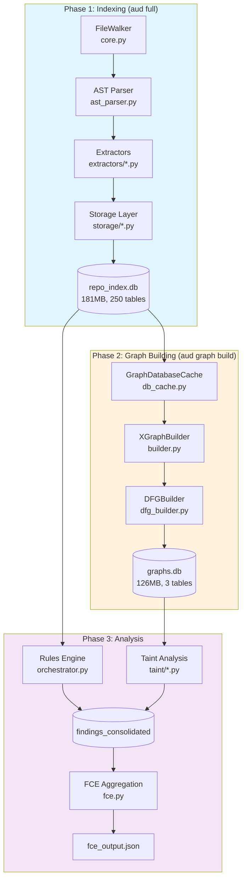

### Architecture Principles

| Principle | Description |
|-----------|-------------|
| **Database-First** | ALL data flows through SQLite. No JSON file fallbacks. |
| **Zero Fallback** | Missing data = crash loudly. No silent degradation. |
| **Language-Specific Excellence** | Each language gets its best parser, not generic solutions. |
| **Facts vs Interpretations** | Raw facts in database, interpretations in .pf/insights/. |

---

## 2. Two-Database Philosophy

### Why Two Databases?

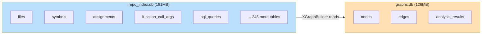

| Database | Purpose | Updated | Used By |
|----------|---------|---------|---------|
| **repo_index.db** | Raw extracted facts from AST | Fresh every `aud full` | Everything (rules, taint, FCE, queries) |
| **graphs.db** | Pre-computed graph structures | `aud graph build` phase | Graph commands, IFDS analyzer |

### Key Insight

FCE reads from **repo_index.db**, NOT graphs.db. The graph database is optional for visualization/exploration only.

---

## 3. AST Parsing Layer

### Parser Selection Strategy

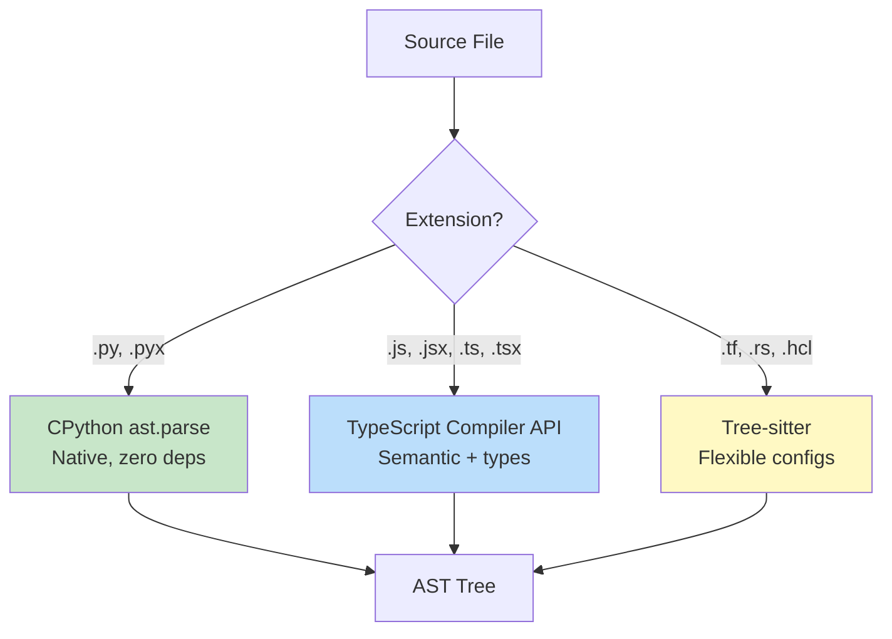

### File: `theauditor/ast_parser.py` (645 lines)

**Why NOT Tree-sitter for Python?**
- Tree-sitter produces different node types (`.type`, `.children`, `.text`)
- Extractors expect CPython types (`ast.Module`, `ast.FunctionDef`, `ast.Name`)
- Silent fallbacks corrupt databases (incident: 2025-10-16)

### AST Output Formats

```python
# Python (CPython ast)
{"type": "python_ast", "tree": <ast.Module>, "content": str}

# JavaScript/TypeScript (Semantic)
{
    "type": "semantic_ast",
    "tree": semantic_result,
    "symbols": [...],
    "extracted_data": {
        "symbols": [...],
        "function_calls": [...],
        "cfg": [...]
    }
}

# Tree-Sitter (HCL, Rust)
{"type": "tree_sitter", "tree": tree_object, "content": str}
```

---

## 4. Extraction Layer

### Extractor Registry Architecture

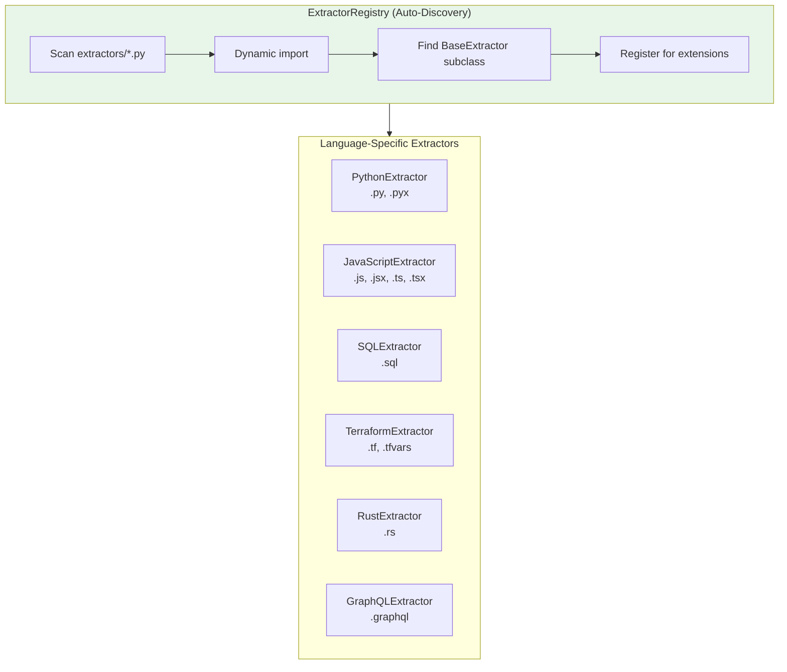

### Python Extraction Path

```mermaid
flowchart LR
    subgraph Python["Python Extraction (263 lines)"]
        AST[CPython AST] --> CTX[FileContext<br/>O(1) NodeIndex]
        CTX --> IMPL[python_impl.py<br/>1,033 lines]
        IMPL --> MODS["Extractor Modules"]
    end

    MODS --> OUT["{'symbols': [...],<br/>'imports': [...],<br/>'assignments': [...],<br/>... 40+ keys}"]

    style Python fill:#c8e6c9
```

**Key Files:**
- `theauditor/indexer/extractors/python.py` (263 lines) - Wrapper
- `theauditor/ast_extractors/python_impl.py` (1,033 lines) - Orchestrator
- `theauditor/ast_extractors/python/utils/context.py` - FileContext

### JavaScript/TypeScript Extraction Path

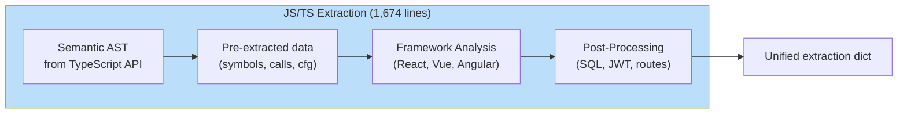

**Three-Phase Architecture:**
1. **Phase 1**: Receive pre-extracted data from TypeScript Compiler API
2. **Phase 2**: Framework analysis (React, Vue, Angular detection)
3. **Phase 3**: Post-processing (SQL patterns, JWT, routes)

### Extraction Output Structure

```python
{
    # Core language (all languages)
    'symbols': [{'name': 'func', 'type': 'function', 'line': 5}],
    'imports': [{'target': 'os', 'type': 'import', 'line': 1}],
    'assignments': [{'target': 'x', 'source': 'y', 'line': 10}],
    'function_calls': [{'callee': 'func', 'args': [...], 'line': 15}],
    'returns': [{'value': 'x', 'line': 20, 'in_function': 'bar'}],
    'cfg': [{'block_id': 1, 'type': 'entry', 'statements': [...]}],

    # Security patterns
    'sql_queries': [{'query': 'SELECT...', 'parameterized': False}],
    'jwt_patterns': [{'pattern': 'jwt.sign', 'line': 40}],

    # Framework-specific
    'routes': [{'method': 'GET', 'pattern': '/', 'handler': 'index'}],
    'react_components': [{'name': 'Button', 'type': 'function'}],
    'python_django_views': [...],

    # Resolution metadata
    'resolved_imports': {'os': 'os', 'django': '/lib/django/__init__.py'}
}
```

---

## 5. Indexer Layer

### Orchestrator Pipeline

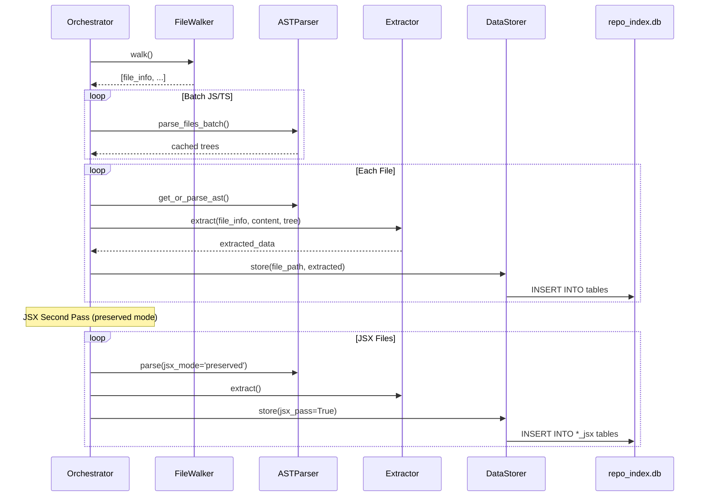

### File: `theauditor/indexer/orchestrator.py` (786 lines)

**Key Methods:**
| Method | Lines | Purpose |
|--------|-------|---------|
| `index()` | 222-613 | Main pipeline entry point |
| `_process_file()` | 615-688 | Single file processing |
| `_select_extractor()` | 724-743 | Route to correct extractor |

### JSX Dual-Pass Architecture

**Problem**: TypeScript compiler only supports ONE JSX mode at a time.

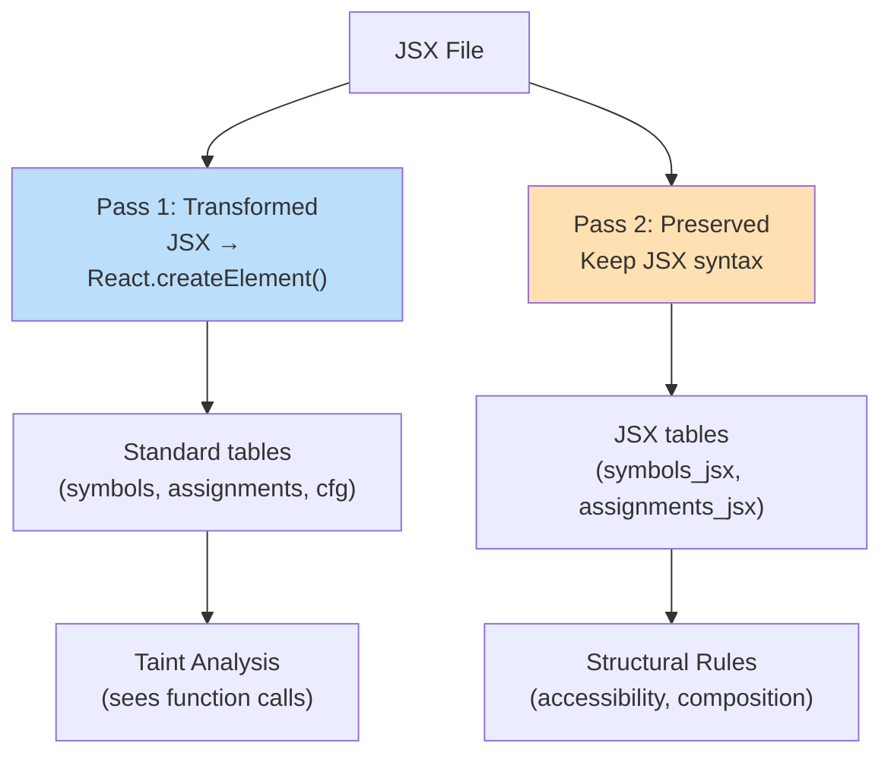

---

## 6. Storage Layer

### Handler Architecture

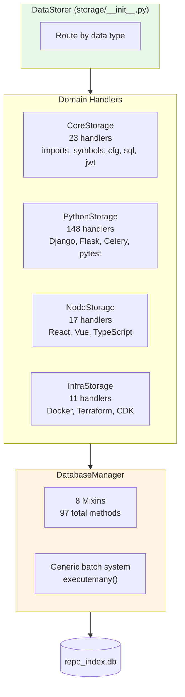

### Schema Organization (250 tables, 8 domains)

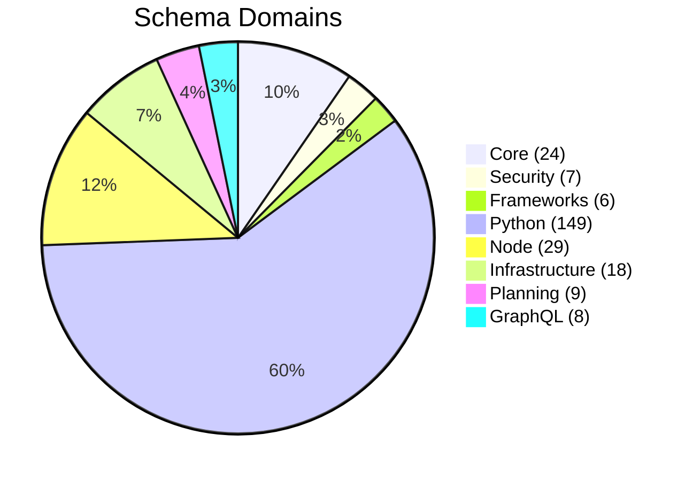

**File: `theauditor/indexer/schema.py` (582 lines)**

### Storage File Sizes

| Module | Lines | Handlers | Purpose |
|--------|-------|----------|---------|
| `core_storage.py` | 641 | 23 | Cross-language patterns |
| `python_storage.py` | 2,486 | 148 | Django, Flask, SQLAlchemy, Celery |
| `node_storage.py` | 354 | 17 | React, Vue, Angular, TypeScript |
| `infrastructure_storage.py` | 229 | 11 | Docker, Terraform, CDK, GitHub Actions |

---

## 7. Graph Layer

### Graph Construction Pipeline

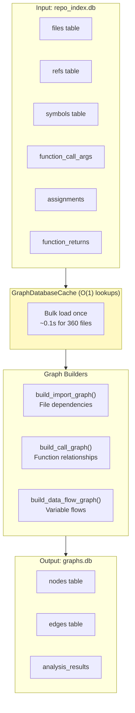

### Graph Schema (Polymorphic Design)

```sql
-- nodes table: All graph node types
CREATE TABLE nodes (
    id TEXT PRIMARY KEY,      -- "file::function" or "module_id"
    file TEXT,
    lang TEXT,                -- 'python', 'typescript', etc.
    loc INTEGER,              -- Lines of code
    churn INTEGER,            -- Git commit count
    type TEXT,                -- 'module', 'function', 'variable'
    graph_type TEXT,          -- 'import', 'call', 'data_flow'
    metadata JSON
);

-- edges table: All relationship types
CREATE TABLE edges (
    id INTEGER PRIMARY KEY,
    source TEXT,              -- Source node ID
    target TEXT,              -- Target node ID
    type TEXT,                -- 'import', 'call', 'assignment', 'return'
    file TEXT,
    line INTEGER,
    graph_type TEXT,
    metadata JSON,
    UNIQUE(source, target, type, graph_type)
);
```

### Data Flow Graph (DFG)

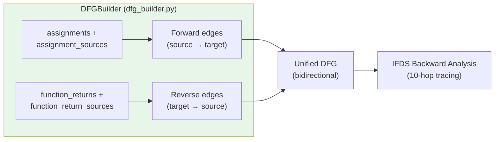

**Key Insight**: Bidirectional edges enable both ancestor and descendant queries for IFDS backward analysis.

**File: `theauditor/graph/dfg_builder.py` (950 lines)**

---

## 8. Taint Analysis & FCE

### Taint Analysis Architecture

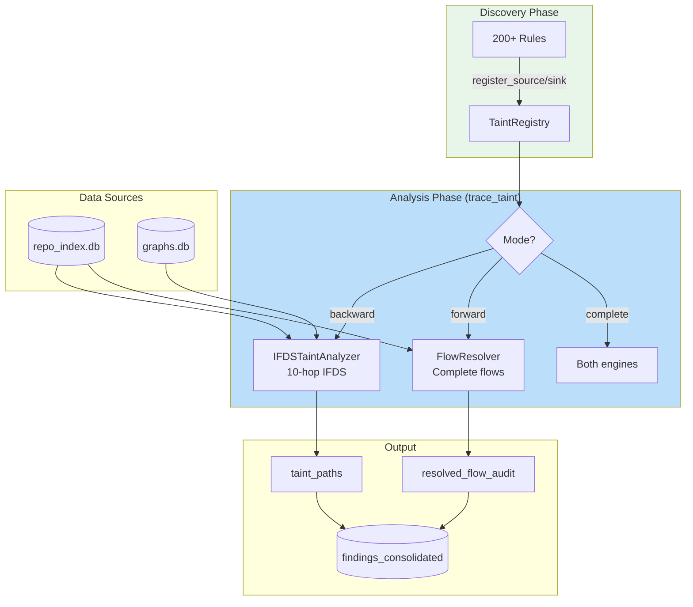

### Taint Directory Structure

```
theauditor/taint/
├── core.py           (921 lines)  - Main orchestrator + TaintRegistry
├── ifds_analyzer.py  (629 lines)  - IFDS backward analysis
├── flow_resolver.py  (777 lines)  - Forward flow resolution
├── discovery.py      (695 lines)  - Database-driven source/sink discovery
├── access_path.py    (246 lines)  - Field-sensitive tracking (k=5)
├── sanitizer_util.py (299 lines)  - Sanitizer detection
└── orm_utils.py      (305 lines)  - ORM-aware taint tracking
```

### FCE Aggregation Pipeline

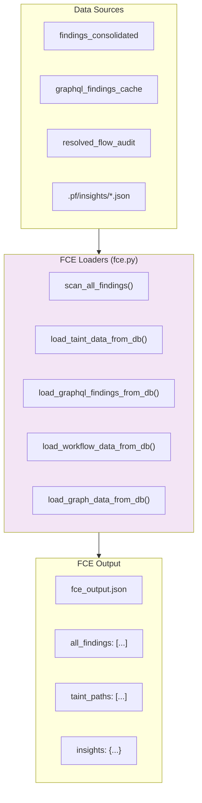

### FCE Performance

| Operation | Time | Reason |
|-----------|------|--------|
| `scan_all_findings()` | 100-500ms | O(log n) indexed SQL |
| Read JSON files (old) | 10-30s | O(n*m) file I/O |
| IFDS backward taint | 5-30s | 10-hop graph traversal |
| FlowResolver forward | 30-120s | Complete codebase traversal |

---

## 9. Rules Engine

### Rule Discovery & Execution

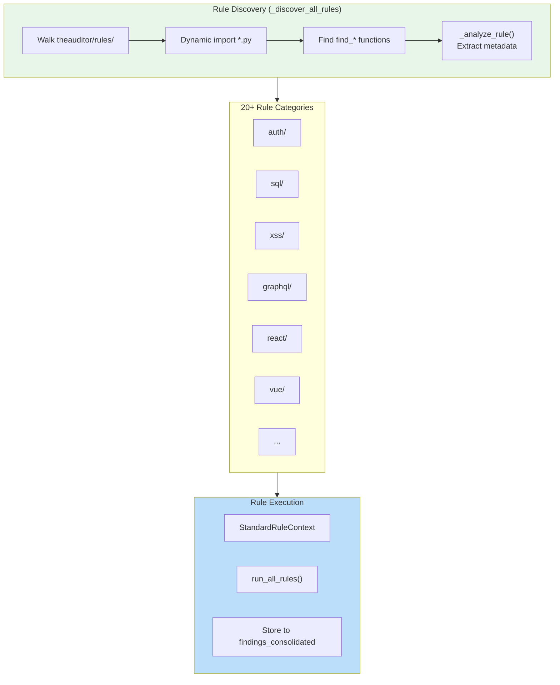

### Rule Types

| Type | Receives | Example |
|------|----------|---------|
| `standalone` | StandardRuleContext | `sql_injection_analyze.py` |
| `discovery` | StandardRuleContext + taint_registry | Framework pattern registration |
| `taint-dependent` | StandardRuleContext + taint_checker | Check if variable is tainted |

### StandardRuleContext (Unified Input)

```python
@dataclass
class StandardRuleContext:
    # Required
    file_path: Path
    content: str
    language: str           # 'python', 'javascript', etc.
    project_path: Path

    # Optional (lazy-loaded)
    ast_wrapper: dict | None
    db_path: str | None
    taint_checker: Callable | None

    # Metadata
    file_hash: str | None
    file_size: int | None
    line_count: int | None

    # Helper methods
    def get_ast(expected_type: str = None) -> Any
    def get_lines() -> list[str]
    def get_snippet(line: int, context: int = 2) -> str
```

---

## 10. Complete Data Flow Examples

### Example 1: Python Import Extraction

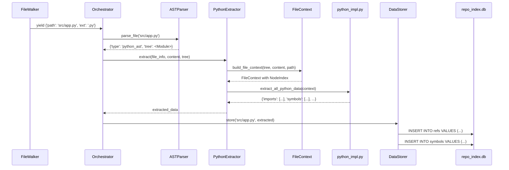

### Example 2: SQL Injection Detection

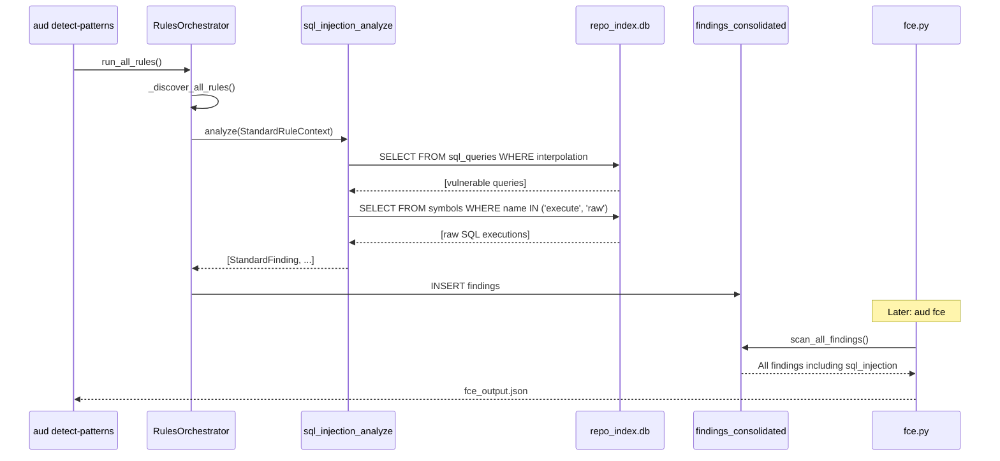

### Example 3: Taint Path Tracing

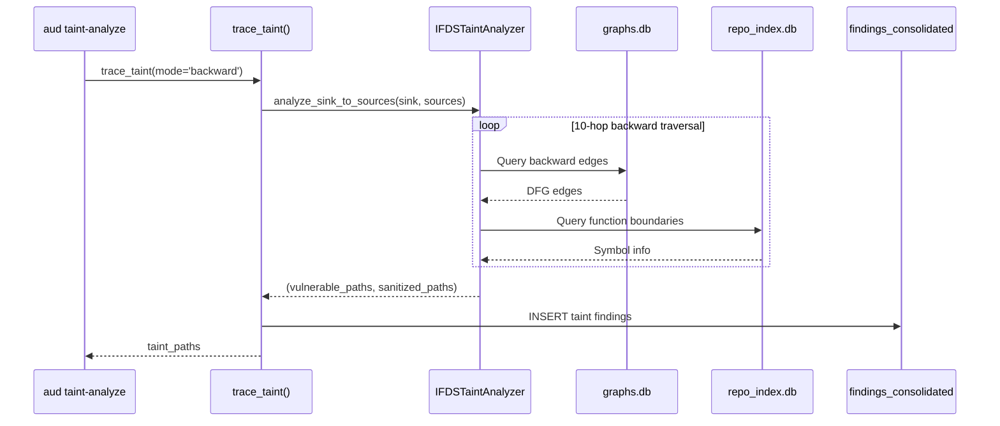

---

## 11. Critical Architectural Rules

### ZERO FALLBACK POLICY

**BANNED FOREVER:**

```python
# 1. Database Query Fallbacks
cursor.execute("SELECT * FROM table WHERE name = ?", (normalized_name,))
result = cursor.fetchone()
if not result:  # <- THIS IS CANCER
    cursor.execute("SELECT * FROM table WHERE name = ?", (original_name,))

# 2. Try-Except Fallbacks
try:
    data = load_from_database()
except Exception:  # <- THIS IS CANCER
    data = load_from_json()

# 3. Table Existence Checks
if 'function_call_args' in existing_tables:  # <- THIS IS CANCER
    cursor.execute("SELECT * FROM function_call_args")
```

**CORRECT Pattern:**

```python
cursor.execute("SELECT path FROM symbols WHERE name = ?", (name,))
result = cursor.fetchone()
if not result:
    if debug:
        print(f"Symbol not found: {name}")  # Expose the bug
    continue  # Skip - DO NOT try alternative query
```

### Other Critical Rules

| Rule | Description |
|------|-------------|
| **No File Paths in Extractors** | Extractors return data WITHOUT file_path. Indexer provides it. |
| **Schema-Driven Everything** | All tables from TABLES registry. No hardcoded CREATE TABLE. |
| **AST-First, String-Fallback** | Use AST for code. String patterns ONLY for config files. |
| **Dual-Pass JSX** | Parse same file twice for data flow AND structure. |

---

## 12. Key Files Reference

### By Layer

| Layer | File | Lines | Purpose |
|-------|------|-------|---------|
| **AST** | `ast_parser.py` | 645 | Language router |
| **Extraction** | `extractors/__init__.py` | 274 | Registry |
| **Extraction** | `extractors/python.py` | 263 | Python wrapper |
| **Extraction** | `extractors/javascript.py` | 1,674 | JS/TS wrapper |
| **Extraction** | `ast_extractors/python_impl.py` | 1,033 | Python orchestrator |
| **Extraction** | `ast_extractors/typescript_impl.py` | 1,334 | TS extraction |
| **Indexer** | `indexer/orchestrator.py` | 786 | Main pipeline |
| **Schema** | `indexer/schema.py` | 581 | Schema registry |
| **Database** | `indexer/database/__init__.py` | 108 | 8 mixin composition |
| **Database** | `indexer/database/base_database.py` | 700 | Core infrastructure |
| **Storage** | `indexer/storage/__init__.py` | 103 | Handler router |
| **Storage** | `indexer/storage/core_storage.py` | 641 | 23 handlers |
| **Graph** | `graph/builder.py` | 1,131 | Import + call graphs |
| **Graph** | `graph/dfg_builder.py` | 950 | Data flow graph |
| **Graph** | `graph/store.py` | 422 | SQLite persistence |
| **Graph** | `graph/analyzer.py` | 485 | Graph algorithms |
| **Taint** | `taint/core.py` | 921 | Orchestrator + registry |
| **Taint** | `taint/ifds_analyzer.py` | 629 | IFDS backward |
| **Taint** | `taint/flow_resolver.py` | 777 | Forward resolution |
| **FCE** | `fce.py` | 1,845 | Aggregation |
| **Rules** | `rules/orchestrator.py` | 944 | Discovery + execution |

### Database Tables (Most Important)

| Table | Database | Purpose |
|-------|----------|---------|
| `files` | repo_index.db | All source files with metadata |
| `symbols` | repo_index.db | Functions, classes, variables |
| `refs` | repo_index.db | Import references |
| `assignments` | repo_index.db | Variable assignments |
| `function_call_args` | repo_index.db | Function calls with arguments |
| `sql_queries` | repo_index.db | SQL query patterns |
| `jwt_patterns` | repo_index.db | JWT security patterns |
| `findings_consolidated` | repo_index.db | ALL rule findings |
| `resolved_flow_audit` | repo_index.db | Complete flow provenance |
| `nodes` | graphs.db | Graph nodes (polymorphic) |
| `edges` | graphs.db | Graph edges (polymorphic) |
| `analysis_results` | graphs.db | Cached analysis (cycles, hotspots) |

---

## Summary Diagram

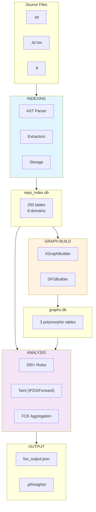

---

**Document End**

*This document is auto-generated from codebase analysis. Keep synchronized with actual implementation.*
