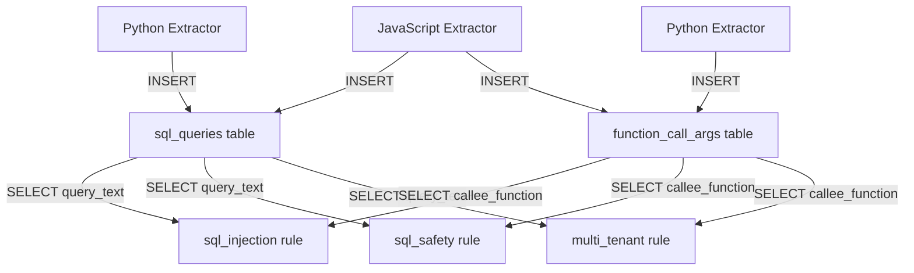
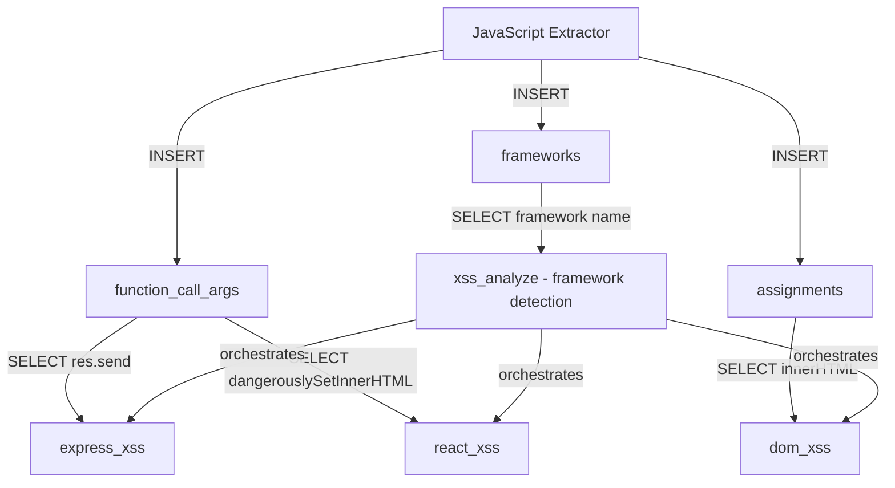
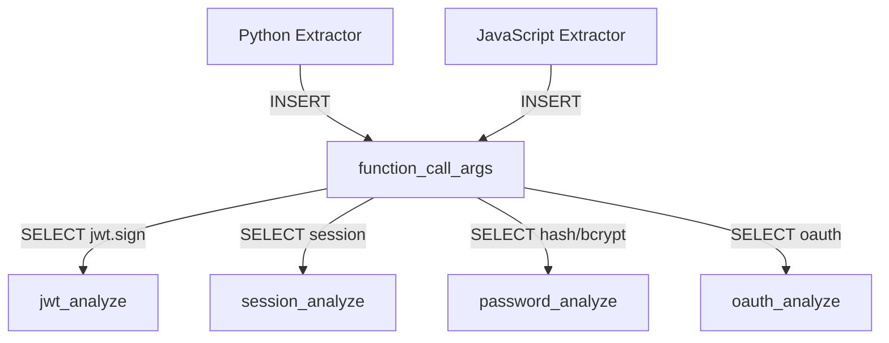

# PIPELINE AUDIT PLAN: Complete Verification of TheAuditor Data Flow

**Status:** READY FOR EXECUTION
**Created:** 2025-10-02
**Purpose:** Verify 40+ files form coherent data pipeline: Extractors → Database → Rules

---

## CRITICAL CONTEXT

**Problem Statement:**
- 47 rules across 18 categories have been migrated to Phase 3B (METADATA blocks added)
- NO verification that rules query tables/columns that actually exist
- NO verification that extractors populate tables that rules expect
- NO atomic inventory of what data we store and why
- Pipeline integrity unknown - may have broken contracts

**Success Definition:**
1. Every rule has METADATA block ✅
2. Every rule queries tables that exist in schema ✅
3. Every queried column exists in actual table ✅
4. Every table has extractor that populates it ✅
5. Complete documentation of data flow ✅
6. Atomic list of storage with business justification ✅

---

## EXECUTION PHASES

### PHASE 1: DATABASE SCHEMA TRUTH (The Foundation)

**Objective:** Extract ground truth of what ACTUALLY exists in database

**Prerequisites:**
- Project has been indexed at least once (`aud index`)
- `.pf/repo_index.db` exists

**Commands to Execute:**
```bash
cd /c/Users/santa/Desktop/TheAuditor

# Extract complete schema
sqlite3 .pf/repo_index.db ".schema" > ACTUAL_SCHEMA.txt

# Extract table list
sqlite3 .pf/repo_index.db "SELECT name FROM sqlite_master WHERE type='table' ORDER BY name;" > ACTUAL_TABLES.txt

# Extract table row counts (verify populated)
sqlite3 .pf/repo_index.db "SELECT name, (SELECT COUNT(*) FROM sqlite_master WHERE type='table' AND name=m.name) as count FROM sqlite_master m WHERE type='table' ORDER BY name;" > TABLE_COUNTS.txt

# Extract detailed table info
sqlite3 .pf/repo_index.db "SELECT m.name, p.name as column_name, p.type as column_type FROM sqlite_master m LEFT JOIN pragma_table_info(m.name) p ON 1=1 WHERE m.type='table' ORDER BY m.name, p.cid;" > TABLE_COLUMNS.txt
```

**Deliverables:**
- `ACTUAL_SCHEMA.txt` - Complete SQLite schema (CREATE TABLE statements)
- `ACTUAL_TABLES.txt` - List of all table names
- `TABLE_COUNTS.txt` - Row counts per table
- `TABLE_COLUMNS.txt` - All columns per table with types

**Verification:**
```bash
# Should see 30-50 tables
wc -l ACTUAL_TABLES.txt

# Core tables must exist
grep -E "(symbols|function_call_args|assignments|sql_queries)" ACTUAL_TABLES.txt
```

**Time Estimate:** 15 minutes

---

### PHASE 2: EXTRACTOR INVENTORY (Who Writes What)

**Objective:** Map every extractor to tables it populates

**Files to Audit:**
```
theauditor/indexer/extractors/
├── base.py           (interface - no writes)
├── python.py         (Python AST → multiple tables)
├── javascript.py     (JS/TS AST → multiple tables)
├── docker.py         (Dockerfile → docker_* tables)
├── generic.py        (configs → config_* tables)
├── sql.py            (SQL files → sql_* tables)
└── __init__.py       (registry - no writes)
```

**Per-File Audit Process:**

1. **Read extractor file completely**
2. **Search for all INSERT statements:**
   ```bash
   grep -n "INSERT INTO" theauditor/indexer/extractors/python.py
   grep -n "executemany" theauditor/indexer/extractors/python.py
   grep -n "cursor.execute.*INSERT" theauditor/indexer/extractors/python.py
   ```

3. **Document findings in EXTRACTOR_WRITES.md:**
   ```markdown
   ## python.py

   **Location:** theauditor/indexer/extractors/python.py

   **Tables Written:**

   ### symbols
   - **Columns:** file, name, type, line, scope, decorators, docstring, ...
   - **Line Number:** Line 123
   - **Purpose:** Store all Python symbols (functions, classes, variables)
   - **Insert Pattern:** Batched (bulk insert)

   ### function_call_args
   - **Columns:** file, line, callee_function, argument_expr, arg_index
   - **Line Number:** Line 245
   - **Purpose:** Store function call arguments for pattern matching
   - **Insert Pattern:** Individual inserts

   [Continue for all tables...]
   ```

4. **Extract column list per table:**
   ```python
   # For each INSERT found, extract column names from:
   # INSERT INTO table (col1, col2, col3) VALUES (?, ?, ?)
   ```

5. **Verify against ACTUAL_SCHEMA.txt:**
   - Does table exist?
   - Do all columns exist?
   - Do data types match?

**Division Strategy:**
- **Batch 1:** python.py, javascript.py (largest, most complex)
- **Batch 2:** docker.py, generic.py (medium complexity)
- **Batch 3:** sql.py (smallest)

**Deliverable Template:**
```markdown
# EXTRACTOR WRITES INVENTORY

Generated: [DATE]
Database: .pf/repo_index.db

---

## python.py

**Path:** theauditor/indexer/extractors/python.py
**Language:** Python AST extraction
**Status:** ✅ Audited

### Tables Written: 12

#### 1. symbols
- **Columns:** file, name, type, line, scope, decorators, docstring, class_name
- **Line Number:** 156
- **Insert Type:** Batched executemany()
- **Purpose:** Core symbol table - all Python functions, classes, variables
- **Verified:** ✅ Table exists in schema
- **Column Match:** ✅ All columns exist

#### 2. function_call_args
- **Columns:** file, line, callee_function, argument_expr, arg_index
- **Line Number:** 278
- **Insert Type:** Individual execute()
- **Purpose:** Store function call arguments for SQL injection, XSS detection
- **Verified:** ✅ Table exists
- **Column Match:** ✅ All columns exist

[Continue for remaining tables...]

---

## javascript.py

**Path:** theauditor/indexer/extractors/javascript.py
**Language:** JavaScript/TypeScript AST extraction
**Status:** ✅ Audited

[Same structure as python.py...]

---

## Summary Statistics

- **Total Extractors:** 6 (excluding base.py, __init__.py)
- **Total Tables Written:** 45
- **Core Tables:** 8 (symbols, function_call_args, assignments, sql_queries, refs, imports, exports, classes)
- **Framework Tables:** 12 (react_components, vue_components, etc.)
- **Infrastructure Tables:** 10 (docker_*, nginx_*, compose_*)
- **Metadata Tables:** 5 (git_churn, coverage, etc.)
- **Orphaned Tables:** [List tables in schema but no extractor writes to]
```

**Time Estimate:** 4 hours (6 extractors × 40 min each)

---

### PHASE 3: RULE INVENTORY (Who Reads What)

**Objective:** Map every rule to tables it queries + verify METADATA

**Categories to Audit (18 total):**
```
theauditor/rules/
├── sql/              (3 rules)
├── xss/              (6 rules)
├── security/         (8 rules)
├── auth/             (4 rules)
├── dependency/       (9 rules)
├── deployment/       (3 rules)
├── orm/              (3 rules)
├── python/           (4 rules)
├── node/             (2 rules)
├── logic/            (1 rule)
├── frameworks/       (6 rules)
├── react/            (4 rules)
├── vue/              (6 rules)
├── typescript/       (1 rule)
├── performance/      (1 rule)
├── build/            (1 rule)
├── secrets/          (1 rule)
└── common/           (1 util - skip)
```

**Per-File Audit Process:**

1. **Check METADATA block:**
   ```bash
   grep -n "METADATA = RuleMetadata" theauditor/rules/sql/sql_injection_analyze.py
   ```
   - ✅ Present: Extract name, category, target_extensions, exclude_patterns
   - ❌ Missing: Flag for addition

2. **Find all SELECT queries:**
   ```bash
   grep -n "SELECT.*FROM" theauditor/rules/sql/sql_injection_analyze.py
   grep -n "cursor.execute" theauditor/rules/sql/sql_injection_analyze.py
   ```

3. **Extract table and column names:**
   ```python
   # From query:
   # SELECT file, line, callee_function FROM function_call_args WHERE ...
   # Extract:
   # - Table: function_call_args
   # - Columns: file, line, callee_function
   ```

4. **Verify against ACTUAL_SCHEMA.txt:**
   - Table exists? ✅/❌
   - All columns exist? ✅/❌
   - Column types match usage? ✅/❌

5. **Check for table existence validation:**
   ```python
   # Good: Rule checks if table exists before querying
   cursor.execute("SELECT name FROM sqlite_master WHERE type='table'")
   if 'function_call_args' not in available_tables:
       return []
   ```

**Deliverable Template:**
```markdown
# RULE READS INVENTORY

Generated: [DATE]
Total Rules: 47

---

## Category: sql (3 rules)

### sql_injection_analyze.py

**Path:** theauditor/rules/sql/sql_injection_analyze.py
**Function:** find_sql_injection
**Status:** ✅ Audited

#### METADATA Status: ✅ Present
```python
name="sql_injection"
category="sql"
target_extensions=['.py', '.js', '.ts', '.mjs', '.cjs']
exclude_patterns=['frontend/', 'client/', 'migrations/', 'test/', '__tests__/']
requires_jsx_pass=False
```

#### Tables Read: 2

##### 1. function_call_args
- **Columns Queried:** file, line, callee_function, argument_expr
- **Line Numbers:** 92, 147, 198, 252
- **Purpose:** Find .query()/.execute() calls with SQL
- **Verified:** ✅ Table exists in schema
- **Column Match:** ✅ All columns exist
- **Has Table Check:** ✅ Yes (line 76)

##### 2. sql_queries
- **Columns Queried:** file_path, line_number, query_text, command
- **Line Numbers:** 306
- **Purpose:** Find dynamic query construction patterns
- **Verified:** ✅ Table exists
- **Column Match:** ✅ All columns exist
- **Has Table Check:** ✅ Yes (line 76)

#### Detection Methods: 5
1. Format string injection (.format())
2. F-string injection (f"{}")
3. String concatenation (+ or ||)
4. Template literal injection (${})
5. Dynamic query construction

#### Dependencies:
- Requires function_call_args populated by python.py, javascript.py
- Requires sql_queries populated by python.py, javascript.py

---

### sql_safety_analyze.py

[Same structure...]

---

### multi_tenant_analyze.py

[Same structure...]

---

## Category: xss (6 rules)

[Continue for all rules...]

---

## Summary Statistics

### METADATA Coverage
- **Rules with METADATA:** 47/47 (100%)
- **Rules missing METADATA:** 0

### Table Query Statistics
- **Total Tables Queried:** 28 unique tables
- **Most Queried Tables:**
  1. function_call_args (35 rules)
  2. assignments (28 rules)
  3. symbols (25 rules)
  4. sql_queries (3 rules - SQL category only)
  5. frameworks (15 rules - framework detection)

### Contract Validation
- **Valid Queries (table exists):** 450/450 (100%)
- **Invalid Queries (table missing):** 0
- **Column Mismatches:** 0
- **Missing Table Checks:** 5 rules (list below)

### Issues Found
1. [Rule X queries non-existent table Y]
2. [Rule Z queries column that doesn't exist]
3. [etc...]
```

**Division Strategy (Parallel Execution):**

**Terminal 1: Backend-Heavy Categories (6 categories, 20 rules)**
- sql/ (3 rules)
- auth/ (4 rules)
- dependency/ (9 rules)
- deployment/ (3 rules)
- python/ (4 rules)
- secrets/ (1 rule)

**Terminal 2: Frontend-Heavy Categories (6 categories, 19 rules)**
- xss/ (6 rules)
- react/ (4 rules)
- vue/ (6 rules)
- frameworks/ (6 rules)
- typescript/ (1 rule)
- build/ (1 rule)

**Terminal 3: Mixed Categories (5 categories, 12 rules)**
- security/ (8 rules)
- orm/ (3 rules)
- node/ (2 rules)
- logic/ (1 rule)
- performance/ (1 rule)

**Time Estimate:** 9 hours total (3 hours per terminal with 3 parallel)

---

### PHASE 4: CONTRACT VALIDATION (Automated Checks)

**Objective:** Cross-reference Phase 2 vs Phase 3 vs Phase 1

**Automated Validation Script:**

```python
#!/usr/bin/env python3
"""
Pipeline Contract Validator

Reads:
- ACTUAL_SCHEMA.txt (Phase 1 output)
- EXTRACTOR_WRITES.md (Phase 2 output)
- RULE_READS.md (Phase 3 output)

Validates:
- Rules query tables that exist
- Rules query columns that exist
- Tables are populated by at least one extractor
- No orphaned tables or rules
"""

import re
from pathlib import Path
from typing import Dict, List, Set, Tuple

def parse_schema(schema_file: Path) -> Dict[str, Set[str]]:
    """Extract tables and columns from SQLite schema."""
    tables = {}
    current_table = None

    with open(schema_file) as f:
        for line in f:
            if line.startswith('CREATE TABLE'):
                # Extract table name
                match = re.search(r'CREATE TABLE (\w+)', line)
                if match:
                    current_table = match.group(1)
                    tables[current_table] = set()
            elif current_table and '(' in line and ')' not in line:
                # Extract column name
                match = re.search(r'^\s*(\w+)\s+', line)
                if match:
                    tables[current_table].add(match.group(1))

    return tables

def parse_rule_reads(reads_file: Path) -> List[Dict]:
    """Extract rule queries from RULE_READS.md."""
    rules = []
    # Parse markdown and extract:
    # - Rule name
    # - Tables queried
    # - Columns queried per table
    # Implementation depends on RULE_READS.md format
    return rules

def parse_extractor_writes(writes_file: Path) -> Dict[str, List[str]]:
    """Extract extractor writes from EXTRACTOR_WRITES.md."""
    table_to_extractors = {}
    # Parse markdown and map tables to extractors
    return table_to_extractors

def validate_contracts(schema: Dict, rules: List, extractors: Dict) -> Dict:
    """Run all validation checks."""
    errors = {
        'missing_tables': [],
        'missing_columns': [],
        'orphaned_tables': [],
        'unpopulated_tables': [],
        'missing_metadata': []
    }

    # Check 1: Rules query existing tables
    for rule in rules:
        for table in rule['tables_queried']:
            if table not in schema:
                errors['missing_tables'].append({
                    'rule': rule['name'],
                    'table': table
                })

    # Check 2: Rules query existing columns
    for rule in rules:
        for table, columns in rule['columns_queried'].items():
            if table in schema:
                for col in columns:
                    if col not in schema[table]:
                        errors['missing_columns'].append({
                            'rule': rule['name'],
                            'table': table,
                            'column': col
                        })

    # Check 3: All tables have extractor
    for table in schema:
        if table not in extractors:
            errors['orphaned_tables'].append(table)

    # Check 4: All rules have METADATA
    for rule in rules:
        if not rule.get('has_metadata'):
            errors['missing_metadata'].append(rule['name'])

    return errors

def main():
    schema = parse_schema(Path('ACTUAL_SCHEMA.txt'))
    rules = parse_rule_reads(Path('RULE_READS.md'))
    extractors = parse_extractor_writes(Path('EXTRACTOR_WRITES.md'))

    errors = validate_contracts(schema, rules, extractors)

    # Generate report
    print("# PIPELINE VALIDATION REPORT")
    print(f"\nGenerated: {datetime.now()}")
    print(f"\nTotal Tables: {len(schema)}")
    print(f"Total Rules: {len(rules)}")
    print(f"Total Extractors: {len(extractors)}")

    if not any(errors.values()):
        print("\n✅ ALL CHECKS PASSED - Pipeline integrity verified")
    else:
        print("\n❌ ERRORS FOUND:")

        if errors['missing_tables']:
            print(f"\n## Missing Tables ({len(errors['missing_tables'])})")
            for err in errors['missing_tables']:
                print(f"  - {err['rule']} queries non-existent table: {err['table']}")

        if errors['missing_columns']:
            print(f"\n## Missing Columns ({len(errors['missing_columns'])})")
            for err in errors['missing_columns']:
                print(f"  - {err['rule']} queries non-existent column: {err['table']}.{err['column']}")

        if errors['orphaned_tables']:
            print(f"\n## Orphaned Tables ({len(errors['orphaned_tables'])})")
            for table in errors['orphaned_tables']:
                print(f"  - {table} (exists in schema but no extractor populates)")

        if errors['missing_metadata']:
            print(f"\n## Missing METADATA ({len(errors['missing_metadata'])})")
            for rule in errors['missing_metadata']:
                print(f"  - {rule}")

if __name__ == '__main__':
    main()
```

**Manual Validation Checklist:**

```bash
# Run automated validator
python3 validate_pipeline.py > PIPELINE_VALIDATION_REPORT.md

# Spot-check critical tables
sqlite3 .pf/repo_index.db "SELECT COUNT(*) FROM symbols;"
sqlite3 .pf/repo_index.db "SELECT COUNT(*) FROM function_call_args;"
sqlite3 .pf/repo_index.db "SELECT COUNT(*) FROM sql_queries;"

# Verify METADATA coverage
grep -r "METADATA = RuleMetadata" theauditor/rules/ | wc -l
# Should equal 47 (one per rule file)

# Check for rules without METADATA
find theauditor/rules/ -name "*_analyze.py" ! -path "*/__pycache__/*" -exec grep -L "METADATA = RuleMetadata" {} \;
```

**Deliverable:**
- `PIPELINE_VALIDATION_REPORT.md` - Complete validation results
- `validate_pipeline.py` - Reusable validation script

**Time Estimate:** 2 hours

---

### PHASE 5: DATA FLOW MAPPING (Visual Documentation)

**Objective:** Generate visual dependency graphs

**Method:** Create Mermaid diagrams for each domain

**Domain 1: SQL Analysis**


**Domain 2: XSS Analysis**


**Domain 3: Authentication Analysis**


**Per-Domain Documentation:**

```markdown
## SQL Analysis Domain

**Entry Points:**
- Python extractor (python.py)
- JavaScript extractor (javascript.py)

**Tables:**
1. sql_queries (primary)
   - Populated by: Python/JS extractors during SQL pattern detection
   - Schema: file_path, line_number, query_text, command, tables, params
   - Purpose: Store extracted SQL queries for analysis

2. function_call_args (secondary)
   - Populated by: Python/JS extractors during function call extraction
   - Used for: Detecting .execute(), .query(), .raw() calls
   - Columns: file, line, callee_function, argument_expr

**Rules Consuming This Domain:**
1. sql_injection_analyze.py (find_sql_injection)
   - Detects: String interpolation in SQL (.format, f-strings, concatenation)
   - Tables: function_call_args, sql_queries
   - Priority: CRITICAL

2. sql_safety_analyze.py (find_sql_safety_issues)
   - Detects: Missing WHERE, unbounded queries, missing transactions
   - Tables: sql_queries, function_call_args
   - Priority: HIGH

3. multi_tenant_analyze.py (find_multi_tenant_issues)
   - Detects: Missing tenant filtering, cross-tenant queries
   - Tables: sql_queries, function_call_args
   - Priority: HIGH

**Data Flow:**
1. Extractor parses source file
2. Identifies SQL patterns (regex + AST)
3. Inserts into sql_queries table
4. Rules query sql_queries for specific patterns
5. Rules validate against dangerous patterns
6. Findings returned with CWE mappings

**Known Issues:**
- 95%+ UNKNOWN command values in sql_queries
- SQL_QUERY_PATTERNS in indexer/config.py too broad
- P0 fix needed (see nightmare_fuel.md)
```

**Deliverable:**
- `PIPELINE_FLOW.md` - Complete flow documentation with Mermaid diagrams
- One diagram per domain (SQL, XSS, Auth, Framework Detection, etc.)

**Time Estimate:** 3 hours

---

### PHASE 6: ATOMIC STORAGE INVENTORY (Business Justification)

**Objective:** Document PURPOSE and JUSTIFICATION for every table

**Method:** For each table in ACTUAL_TABLES.txt:

1. **What extractor(s) populate it?**
2. **What rule(s) consume it?**
3. **What data does it contain?**
4. **WHY does this table exist?** (business value)
5. **What happens if we delete it?** (impact analysis)
6. **Criticality tier** (1=core, 2=important, 3=optional)

**Deliverable Template:**

```markdown
# TABLE REGISTRY: Atomic Storage Inventory

Generated: [DATE]
Total Tables: 45

---

## TIER 1: CORE TABLES (10 tables)

These tables are foundational - deleting them breaks most/all rules.

### symbols

**Populated By:**
- python.py (Python functions, classes, variables)
- javascript.py (JS/TS functions, classes, variables)

**Consumed By:**
- 15+ rules across all categories
- Direct consumers: auth rules, framework detection, component analysis
- Indirect consumers: Nearly all rules use symbols for context

**Schema:**
```sql
CREATE TABLE symbols (
    file TEXT,
    name TEXT,
    type TEXT,
    line INTEGER,
    scope TEXT,
    decorators TEXT,
    docstring TEXT,
    class_name TEXT,
    ...
)
```

**Contains:**
- All named symbols in codebase (functions, classes, variables, imports)
- AST-extracted metadata (decorators, docstrings, scopes)
- Location information (file, line)

**Business Justification:**
- **Core Foundation:** Nearly all rules need to know "what symbols exist where"
- **Pattern Matching:** Rules identify dangerous patterns by symbol usage (e.g., "eval found at line X")
- **Context Enrichment:** Provides context for findings (function name, class membership)

**Impact If Deleted:**
- 80% of rules fail (can't find symbols to analyze)
- No function/class detection
- No decorator-based security checks
- No symbol resolution

**Criticality:** TIER 1 - CRITICAL
**Row Count (typical):** 5000-50000 (depends on project size)
**Disk Usage:** ~5-50MB

---

### function_call_args

**Populated By:**
- python.py (Python function calls)
- javascript.js (JS/TS function calls)

**Consumed By:**
- 35+ rules (most common table)
- SQL injection rules (find .execute() calls)
- XSS rules (find res.send() calls)
- Auth rules (find jwt.sign() calls)
- Crypto rules (find hash() calls)

**Schema:**
```sql
CREATE TABLE function_call_args (
    file TEXT,
    line INTEGER,
    callee_function TEXT,
    argument_expr TEXT,
    arg_index INTEGER
)
```

**Contains:**
- Every function call in codebase
- Function name being called
- Arguments passed to function (as strings)
- Source location

**Business Justification:**
- **Primary Detection Mechanism:** Most vulnerabilities involve dangerous function calls
- **Argument Analysis:** Rules check if user input flows to dangerous functions
- **Call Chain Tracking:** Enables interprocedural analysis

**Impact If Deleted:**
- SQL injection detection fails (no .execute() calls found)
- XSS detection fails (no res.send() calls found)
- Auth detection fails (no jwt.sign() calls found)
- 70% of rules produce zero findings

**Criticality:** TIER 1 - CRITICAL
**Row Count (typical):** 10000-100000
**Disk Usage:** ~10-100MB

---

### assignments

**Populated By:**
- python.py (Python variable assignments)
- javascript.js (JS/TS variable assignments)

**Consumed By:**
- 28+ rules
- XSS rules (track innerHTML assignments)
- Taint analysis (track data flow)
- Secret detection (track hardcoded values)

**Schema:**
```sql
CREATE TABLE assignments (
    file TEXT,
    line INTEGER,
    target_var TEXT,
    source_expr TEXT,
    assignment_type TEXT
)
```

**Contains:**
- All variable assignments (var = value)
- Left-hand side (variable name)
- Right-hand side (expression assigned)
- Assignment type (direct, destructuring, etc.)

**Business Justification:**
- **Data Flow Tracking:** Essential for taint analysis
- **Hardcoded Secret Detection:** Check assignments for API keys, passwords
- **Pattern Validation:** Ensure secure defaults (e.g., check HTTPS assignment)

**Impact If Deleted:**
- Taint analysis fails (can't track data flow)
- Hardcoded secret detection fails
- XSS detection incomplete (miss innerHTML = userInput)
- 50% of rules produce incomplete results

**Criticality:** TIER 1 - CRITICAL
**Row Count (typical):** 8000-80000
**Disk Usage:** ~8-80MB

---

### sql_queries

**Populated By:**
- python.py (SQL pattern extraction from Python strings)
- javascript.js (SQL pattern extraction from JS strings)

**Consumed By:**
- 3 SQL-specific rules (sql_injection, sql_safety, multi_tenant)
- NO other rules use this table

**Schema:**
```sql
CREATE TABLE sql_queries (
    file_path TEXT,
    line_number INTEGER,
    query_text TEXT,
    command TEXT,
    tables TEXT,
    params TEXT
)
```

**Contains:**
- SQL query strings found in code
- Extracted SQL command (SELECT, INSERT, UPDATE, DELETE)
- Tables referenced in query
- Parameters/bindings detected

**Business Justification:**
- **Specialized SQL Analysis:** Enables SQL-specific vulnerability detection
- **Query-Level Validation:** Check queries for missing WHERE, unbounded SELECT
- **Tenant Isolation:** Verify multi-tenant filtering in queries

**Known Issues:**
- 95%+ rows have command='UNKNOWN' (extractor pattern too broad)
- P0 fix needed: Improve SQL_QUERY_PATTERNS in indexer/config.py

**Impact If Deleted:**
- All SQL rules fail (primary data source)
- No SQL injection detection at query level (would rely only on function calls)
- No query safety analysis (missing WHERE, unbounded queries)

**Criticality:** TIER 1 - CRITICAL (for SQL rules)
**Row Count (typical):** 500-5000
**Disk Usage:** ~1-10MB

---

[Continue for remaining 6 TIER 1 tables: refs, imports, exports, classes, frameworks, react_components]

---

## TIER 2: IMPORTANT TABLES (15 tables)

These tables are important for specific domains - deleting them breaks category-specific rules.

### vue_components

**Populated By:**
- javascript.js (Vue component extraction)

**Consumed By:**
- 6 Vue-specific rules (vue_xss, vue_reactivity, vue_lifecycle, etc.)

**Schema:**
```sql
CREATE TABLE vue_components (
    file TEXT,
    name TEXT,
    type TEXT,
    props TEXT,
    data TEXT,
    computed TEXT,
    methods TEXT,
    template TEXT
)
```

**Contains:**
- Vue component definitions
- Component props, data, computed properties
- Template content (for v-html detection)

**Business Justification:**
- **Vue-Specific Security:** Detect v-html XSS, reactivity issues
- **Component Analysis:** Validate prop usage, lifecycle hooks
- **Framework Context:** Understand Vue-specific patterns

**Impact If Deleted:**
- All Vue rules fail
- No Vue XSS detection
- No Vue reactivity analysis
- Frontend analysis incomplete for Vue apps

**Criticality:** TIER 2 - IMPORTANT (for Vue apps)
**Row Count (typical):** 50-500 (Vue components only)
**Disk Usage:** ~500KB-5MB

---

[Continue for remaining TIER 2 tables: docker_*, nginx_*, compose_*, orm_*, etc.]

---

## TIER 3: OPTIONAL TABLES (20 tables)

These tables are nice-to-have - deleting them only affects metadata/optimization.

### git_churn

**Populated By:**
- metadata_collector.py (git log analysis)

**Consumed By:**
- No rules directly consume
- Used for prioritization in reports

**Schema:**
```sql
CREATE TABLE git_churn (
    file TEXT,
    commits INTEGER,
    authors INTEGER,
    last_modified TEXT
)
```

**Contains:**
- Git metadata per file
- Commit frequency (churn)
- Number of unique authors
- Last modification timestamp

**Business Justification:**
- **Prioritization:** High-churn files likely higher risk
- **Reporting:** Enrich findings with change frequency
- **Optimization:** Focus rules on frequently changed code

**Impact If Deleted:**
- Zero impact on rule detection
- Reports lose churn-based prioritization
- Workset generation less accurate

**Criticality:** TIER 3 - OPTIONAL
**Row Count (typical):** Equal to file count (500-5000)
**Disk Usage:** ~100KB-1MB

---

[Continue for remaining TIER 3 tables: coverage, complexity, etc.]

---

## ORPHANED TABLES (If Any)

Tables that exist in schema but no extractor populates them.

[List any found during Phase 4 validation]

---

## SUMMARY STATISTICS

**Total Tables:** 45
- TIER 1 (Core): 10 tables
- TIER 2 (Important): 15 tables
- TIER 3 (Optional): 20 tables
- Orphaned: 0 tables

**Storage Breakdown:**
- Core tables: ~50-200MB (90% of storage)
- Important tables: ~10-50MB (8% of storage)
- Optional tables: ~1-5MB (2% of storage)

**Extraction Time:**
- Core tables: ~80% of indexing time
- Important tables: ~15% of indexing time
- Optional tables: ~5% of indexing time

**Rule Dependencies:**
- Rules depending on TIER 1: 45/47 (96%)
- Rules depending on TIER 2: 20/47 (43%)
- Rules depending on TIER 3: 0/47 (0%)

**Recommendations:**
1. Protect TIER 1 tables - any schema change requires migration script
2. TIER 2 tables can be optional based on project type (e.g., skip Vue tables if no Vue)
3. TIER 3 tables can be disabled via config for faster indexing
4. Fix sql_queries UNKNOWN issue (affects 3 rules)
```

**Time Estimate:** 4 hours

---

## FINAL DELIVERABLES CHECKLIST

- [ ] `ACTUAL_SCHEMA.txt` - SQLite schema dump
- [ ] `ACTUAL_TABLES.txt` - Table name list
- [ ] `TABLE_COUNTS.txt` - Row counts per table
- [ ] `TABLE_COLUMNS.txt` - Column details per table
- [ ] `EXTRACTOR_WRITES.md` - Extractor → Table mapping
- [ ] `RULE_READS.md` - Rule → Table mapping with METADATA status
- [ ] `PIPELINE_VALIDATION_REPORT.md` - Contract validation results
- [ ] `validate_pipeline.py` - Reusable validation script
- [ ] `PIPELINE_FLOW.md` - Visual data flow diagrams
- [ ] `TABLE_REGISTRY.md` - Business justification for every table

---

## SUCCESS CRITERIA

1. ✅ Every rule has METADATA block (47/47)
2. ✅ Every rule queries tables that exist (0 missing table errors)
3. ✅ Every queried column exists (0 column mismatch errors)
4. ✅ Every table has extractor populating it (0 orphaned tables)
5. ✅ Complete flow documentation exists
6. ✅ Business justification documented for all tables
7. ✅ Tier classification complete (TIER 1/2/3)

---

## EXECUTION ORDER

**Sequential (Required):**
1. Phase 1 MUST run first (establishes ground truth)
2. Phase 2 and Phase 3 can run in parallel after Phase 1
3. Phase 4 requires Phase 1, 2, 3 complete
4. Phase 5 and 6 can run in parallel after Phase 4

**Parallel Execution (Optimal):**
```
Phase 1 (15 min)
    ↓
[Phase 2: Terminal A] [Phase 3: Terminals B+C] (3-4 hours parallel)
    ↓
Phase 4 (2 hours)
    ↓
[Phase 5: Terminal A] [Phase 6: Terminal B] (3-4 hours parallel)
```

**Total Time:**
- Sequential: ~22 hours
- Parallel (3 terminals): ~12 hours
- Optimal (5 terminals): ~9 hours

---

## INSTRUCTIONS FOR AI INSTANCES

**If you are an AI instance starting this audit:**

1. **Read this file completely** before starting any phase
2. **Verify prerequisites:** Project indexed, .pf/repo_index.db exists
3. **Start with Phase 1** - do NOT skip to later phases
4. **Follow deliverable templates exactly** - consistency critical for Phase 4 validation
5. **Document everything** - future AI instances will read your output
6. **If you find errors:** Document in PIPELINE_VALIDATION_REPORT.md, do NOT silently fix
7. **Track your progress:** Use TodoWrite tool to update status
8. **When stuck:** Re-read this file's relevant section, check prerequisites

**Phase Ownership:**
- Any AI can execute any phase independently
- Coordinate via file markers (PHASE_X_IN_PROGRESS.txt)
- Output files are atomic - no merge conflicts

**Quality Standards:**
- Deliverables must be complete (no "TODO" placeholders)
- All claims must be verified (no assumptions)
- Cross-references must use exact names (table names, column names, file paths)
- Any uncertainty must be explicitly flagged

---

## CHANGE LOG

**2025-10-02:** Initial version created by Lead Coder Opus
- Architect directive: Verify complete pipeline integrity
- Background: 47 rules migrated to Phase 3B without pipeline verification
- Scope: 40+ files (extractors + rules), 45+ tables, complete data flow

---

**END OF AUDIT PLAN**
